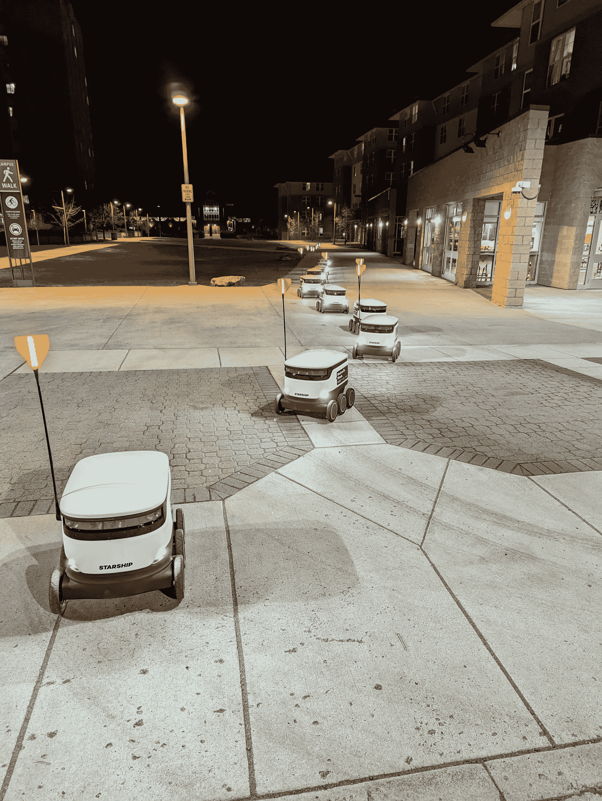

# 黑客日链接:2022 年 4 月 10 日

> 原文：<https://hackaday.com/2022/04/10/hackaday-links-april-10-2022/>

去三角洲的路上发生了一件有趣的事。那是在火星的 Jezero 陨石坑上的一个，因为*坚忍号*漫游者可能已经[捕捉到了降落伞](https://futurism.com/the-byte/nasa-rover-parachute-martian-desert)的一瞥，它在一年多前帮助将它送到了红色星球。让火星车安全着陆火星表面是[一项极其复杂的任务](https://hackaday.com/2021/02/08/getting-ready-for-mars-the-seven-minutes-of-terror/)，它完全自主的事实更让人印象深刻。在“天空起重机”展开将火星车降落到地表之前，降落伞就被丢弃了，降落伞减缓了载着火星车的下降速度。降落伞飘到了离着陆区一公里多一点的表面[。美国宇航局还没有确认在原始图像](https://spaceflightnow.com/2021/03/05/mars-reconnaissance-orbiter-camera-spots-perseverance-rover-after-landing/#:~:text=Its%20wreckage%20was%20located%20to,the%20way%20to%20the%20surface.)[中看到的是降落伞；事实上，他们甚至还没有承认图片中那个明显不是石头的白色大东西。也许他们会保留最终的判断，直到他们得到*独创性*直升机的飞越，这是目前降落在离下降阶段坠毁的地方不太远。我们很想看看那些残骸的照片。](https://mars.nasa.gov/mars2020/multimedia/raw-images/ZR0_0401_0702535082_292ECM_N0191126ZCAM05100_1100LMJ)

我们最近在 3D 打印金属上进行了一次闲聊，奥古斯丁·克鲁兹谈到了他试图建造一台负担得起的电子束烧结打印机。聊天很棒，现在奥古斯丁取得了一系列值得一看的进展。电子束烧结背后的想法很简单——它基本上是阴极射线管后面的电子枪和偏转线圈的加强版，它向一层精细的金属粉末轰击，将其一层一层地烧结在一起。然而，细节，如在真空中工作，精确地沉积一层新的粉末，以及精确地控制光束功率和位置，都不是微不足道的。看看奥古斯丁在[他的 Hackaday.io 项目](https://hackaday.io/project/183736-3d-metal-printer)上的进展。

你觉得自己是个无趣的人吗？你很有可能没有——看起来成为一个令人厌烦的人就像有口臭一样，因为很难判断你是否有口臭。但是根据一项新的研究，无趣的人不仅是可以量化的，而且关于他们的刻板印象都是真实的——或者至少是一致的。不过，这种方法似乎有点主观——参与者被要求对一个无聊的人进行简要描述，其中包括美国前副总统阿尔·戈尔，因为他的“演讲非常单调”和“没有感情”然后，他们为这些刻板乏味的人想象个性特征、爱好和职业，想出像长篇故事、地理藏宝和会计这样的东西。在这一点上，我们感觉受到了个人攻击，所以没有继续读下去，但我们得到的信息似乎是，虽然每个人对某人来说都很无聊，但你真的必须努力让每个人都觉得无聊。

如果你听了 Hackaday 播客，当然会立刻让你失去无聊人群的资格，你会知道“那是什么声音？”segment，播放一些与技术相关的声音的短片，如果你能识别它，财富和名声就在等着你。好吧，如果你不能得到足够的东西，那就去濒危声音博物馆吧，它试图在我们的听觉遗产消失之前保护它。到目前为止，该网站只有少量的声音，包括 AIM 消息警报，旧的诺基亚铃声，Windows 95 启动，软盘驱动器寻道，以及磁带插入任天堂 NES 的声音，以及连接器上的强制吹气。我们可以想到成千上万更值得保存的声音，虽然我们看不到一种贡献声音的方式，但如果你能想到任何东西，也许值得联系所有者。

最后，我跟你分享下面这张照片，是我儿子发的，他目前在爱达荷大学学习，在他试图被绑架前拍的:

谢天谢地，他设法避开了移动缓慢的虫群，成功逃脱。我数了数图片中的 13 个[星际飞船送货机器人](https://hackaday.com/2019/02/11/automate-the-freight-amazon-tackles-the-last-mile-problem/)，谁知道它们在做什么。他们今晚会回基地吗？去参加全体会议？或者他们在罢工，在纠察线上工作？很难说，但对这些东西来说，这是很有趣的行为。