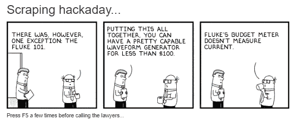

# 黑客日链接:2019 年 8 月 11 日

> 原文：<https://hackaday.com/2019/08/11/hackaday-links-august-11-2019/>

等到这篇文章出版的时候，27 级防御状态将会成为历史。但是 badgelife 还在继续，如果能有一种方法来跟踪所有提供的徽章就好了。马丁·勒贝尔带着 DEF CON 27 badgelife 追踪器接受了挑战。他从三月份开始就一直在跟踪这个场景，目前有超过 170 个徽章，代币和低劣的附加产品上市。必须抓住他们！

不错的玩笑，路透社。我们发现了这个关于美国联邦航空局批准超视距无人机操作的故事。这篇文章配有熟悉的微笑亚马逊标志，让读者相信亚马逊 Prime Air 无人机舰队肯定会很快在美国各地装载 Huggies 和 Tide Pods 的货物，让天空变暗。原来，报道的测试是由阿拉斯加大学费尔班克斯沿着最后一个边境州的输油管道进行的，旨在探索石油行业的医疗交付和管道监控。唯一提到亚马逊的是，该公司报告称，他们将在“几个月内”在美国开始无人机送货。没错。

想知道如何将你的小工具推向市场吗？在所有的测试和符合性需求之间，这可能是一个真正的苦差事。Nathaniel 向我们透露了他的朋友 Skippy 写的一个方便的指南,该指南列出了将产品推向市场所需的机构和法规的字母表——CE、RoHS、WEEE、LVD、RED、EMC 的 CE。处理好所有的文书工作，你最终会得到一个博士学位并且一切顺利。

周日，一位法国冒险家在气垫滑板上首次横渡了英吉利海峡。是的，我们知道它不是一个“实际的”悬浮滑板，但它是我们目前能够接触到的最接近物理学的东西，并且作为一个由装满燃料的背包提供动力的独立喷气发动机，它相当不错。报道称，他仅用了 20 分钟就完成了 22 英里(35 公里)的横渡。

 
上周，我们和[这位讨人喜欢的 Hackaday-Dilbert 混搭者](http://dullbits.com/)在 Hackaday 写作团队的秘密地下巢穴度过了一段美好时光。向下滚动到页面上的第二项，你会看到似乎是一个标准的三面板呆伯特带；仔细观察就会发现，这段文字已经被从一篇黑客文章中随机抓取的短语所取代。它看起来就像一个呆伯特带，有时文字甚至对艺术有意义。我们很想看看这个小宝石背后的代码。每次页面加载时都会更新，所以玩得开心点。

当然，前面提到的秘密总部正是你所想象的——一个黑暗的房间，一排排显示器滚动着绿色文本，每个显示器上都有一个穿着黑色连帽衫的作家在疯狂地记录黑客的黑色艺术。全球设计公司 IDEO 的“开放式创新实践”OpenIDEO 已经[发出了一个挑战](https://www.openideo.com/challenge-briefs/cybersecurity-visuals)“为网络安全重新设想一种更具吸引力和相关性的视觉语言。”换句话说，不再有滚动随机代码，不再有帽衫。对于网络安全，你有更好、更温和的视觉隐喻吗？你可能会因为“以一种容易理解和令人信服的方式表达网络安全领域的不同术语和想法”而获得一些相当不错的奖项。