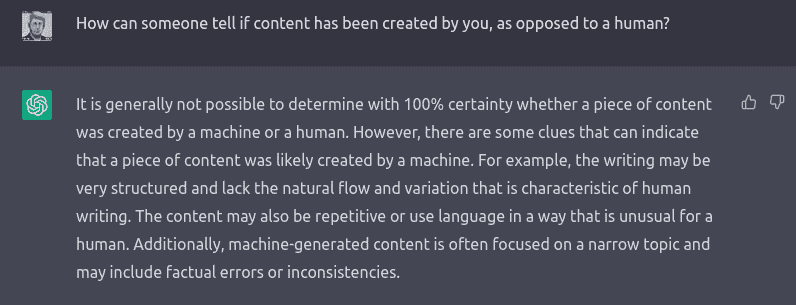

# 黑客日链接:2022 年 12 月 11 日

> 原文：<https://hackaday.com/2022/12/11/hackaday-links-december-11-2022/>

"他们铺了乐园，建了一个停车场。"这可能有点扯远了，尤其是当问题中的“天堂”在新泽西州的时候，但是有一个正在进行中的动作要重新开发原来的“大爆炸天线”的网站，这让一些人非常不安。自 1959 年由贝尔实验室在新泽西州霍尔姆德尔的一座山顶上建造以来，该天线就被简称为“喇叭天线”，它最初是为研究长距离微波通信而设计的。但在 1964 年，贝尔实验室的研究人员阿诺·彭齐亚斯和罗伯特·威尔逊利用天线意外发现了宇宙大爆炸的微波残余，即宇宙背景辐射，从而在科学史上赢得了一席之地。到目前为止，镇委员会采取的唯一行动是授权进行一项研究，探讨是否应该重新开发该地点。但事实上，该网站是蒙茅斯县的最高点之一，可以一览曼哈顿的美景，这让一些人想知道该网站到底有什么可利用的。[一份拯救天线的请愿书](https://actionnetwork.org/petitions/save-big-bang-antenna)目前有大约 3400 个签名，所以你可能想去看看——毕竟，直到它消失了，你才知道你得到了什么。

伊莱扎又骑马了？也许有一点，至少从目前对 ChatGPT 的迷恋来看。人工智能聊天机器人于 11 月 30 日上线，发布了一个免费使用的“研究版本”，至少目前是这样。人们用它做各种事情，从帮助解决编码问题到写诗，结果好坏参半。一位匿名的 Hackaday 作者甚至用 ChatGPT 在 Reddit 上“以 Hackaday 的风格”写了一篇关于特定项目的文章。别紧张，它没有发表——我们只是在内部看了一下。虽然表面上看起来很有说服力，但就该项目的事实和细节而言，这篇文章是一派胡言。不过，我们可能对此有点偏见。我们还在 *IEEE Spectrum* 上看到了[对 ChatGPT](https://spectrum.ieee.org/chatbot-chatgpt-interview) 的“采访”，据称该采访捕捉了向聊天机器人提出的问题的答案。老实说，这读起来有点像《2001:太空漫游》中对 HAL 9000 的采访。

同样在 ChatGPT 新闻中，看起来 chatbot 对于栈溢出这样的问题变得有点太健谈了。该平台对 ChatGPT 生成的内容挥舞了禁令之锤，这显然已经成为人们填充统计数据的一种流行方式。SO 的 ban 被描述为“临时的”，它是基于这样一个事实，即尽管 ChatGPT 生成的答案通常在事实上是不正确的，但它们看起来非常合法。老实说，我们不确定这与人类生成的答案到底有什么不同，或者 SO 的 mods 将如何区分这种不同。因此，我们自然要求 ChatGPT 澄清:

感觉好点了吗？

最后，[几周前](https://hackaday.com/2022/11/20/hackaday-links-november-20-2022/)我们特别推出了一个非常有趣的 100 万瓦调频超级塔的深度视频之旅。从强硬的同轴电缆到高塔庞大的组合机队中使用的巨大铜管，这其中有很多吸引眼球的东西。现在，杰夫·格尔林和他的父亲[发布了一个后续视频](https://youtu.be/wJ-XqQchwEw)，其中有关于“100 万瓦”这个数字的更多细节。这些细节肯定会让任何射频发烧友感到有趣，因为如果出现问题，那么多射频可以做些什么有点可怕。

 [https://www.youtube.com/embed/wJ-XqQchwEw?version=3&rel=1&showsearch=0&showinfo=1&iv_load_policy=1&fs=1&hl=en-US&autohide=2&wmode=transparent](https://www.youtube.com/embed/wJ-XqQchwEw?version=3&rel=1&showsearch=0&showinfo=1&iv_load_policy=1&fs=1&hl=en-US&autohide=2&wmode=transparent)

