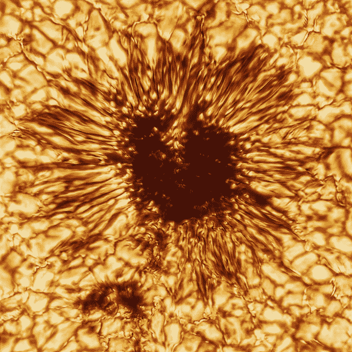

# 黑客日链接:2020 年 12 月 13 日

> 原文：<https://hackaday.com/2020/12/13/hackaday-links-december-13-2020/>

 这几天我们的太阳变得有点活跃，并给了我们也许是[有史以来最好的屏保图像](https://www.sciencealert.com/the-world-s-largest-solar-observatory-just-released-its-first-picture-of-a-sunspot)。这张令人难以置信的详细的太阳黑子照片实际上是由丹尼尔·井上太阳望远镜在 1 月份拍摄的，这是一台 4 米长的自适应光学仪器，可以从近红外到可见光波长对太阳进行成像，并分辨出 20 公里的表面细节。这张照片有着明显的“索伦之眼”外观，显示了黑暗黑子周围的大量对流单体；伴随的动画展示了等离子体沿着导致太阳黑子形成的扭曲磁力线的运动。观看它很有趣，思考捕捉它的技术更有趣。

随着围绕 GitHub 关闭 youtube-dl DCMA 的争议在开源社区的脑海中再次浮现，GitHub Universe 2020 有了一个关于维护开源软件项目的有趣讨论,值得一看。他们专注于 youtube-dl 维护者在保持工具工作时面临的挑战，以及他们的努力对依赖他们的人和团体的影响。为了强调这一点，他们特别提到了人权观察的一名研究人员，她在工作中依赖于 youtube-dl，并明确表示，要跟上不断破坏 youtube-dl 等开源工具的所有 API 变化，维护者的角色就变得更加重要。

说到 GitHub，这里有一个令人恐惧又令人着迷的新工具: [Depix](https://github.com/beurtschipper/Depix) ，密码去像素化器。开发人员 Sipke Mellema 注意到他的公司经常在文档中使用像素化来隐藏密码，他想知道是否可以取消这一过程。[他写了一篇文章](https://www.linkedin.com/pulse/recovering-passwords-from-pixelized-screenshots-sipke-mellema/)描述了使用线性盒过滤器的像素化过程和他攻击它的方法，其中包括以与原始文档相同的字体、文本大小和颜色生成 De Bruijn 序列，并将该序列的截图和像素化密码输入到工具中。我们怀疑它只对混淆密码的子集有效，但它仍然非常聪明。

这是基督降临节日历的季节，QEMU 的人们已经发布了他们的。打开日历上的 24 扇门，你会得到一个可下载的 QEMU 磁盘映像，它实现了一些有趣的东西。扫雷舰，一个可以装进开机程序的光线追踪器，当然还有康威的《生命游戏》。第三天的 GW-BASIC 图片引起了我们的注意——勾起了一些回忆。

对于任何看过皮克斯电影并想知道所有动画实际上是如何工作的人来说，这里有一个用数学制作艺术的伟大课程。该视频由 Inigo Quilez 制作，讲述了使用光线行进 SDF 或带符号距离函数渲染图像的基础知识。一开始，这看起来有点像[画一只猫头鹰](https://www.reddit.com/r/funny/comments/eccj2/how_to_draw_an_owl/)，但是他对所涉及的数学以及动画的每个元素是如何只是另一个公式的描述是令人着迷的。此外，还有一个实时渲染工具，你可以在那里检查代码并编辑它。唉，我的改变只是让事情变得更糟，但它仍然很有趣，也很有教育意义。休息之后请看视频！

 [https://www.youtube.com/embed/8--5LwHRhjk?version=3&rel=1&showsearch=0&showinfo=1&iv_load_policy=1&fs=1&hl=en-US&autohide=2&wmode=transparent](https://www.youtube.com/embed/8--5LwHRhjk?version=3&rel=1&showsearch=0&showinfo=1&iv_load_policy=1&fs=1&hl=en-US&autohide=2&wmode=transparent)

