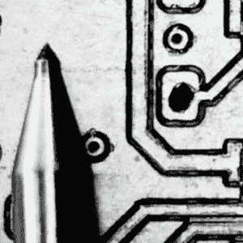

# Hackaday 让我买的！

> 原文：<https://hackaday.com/2020/07/11/hackaday-made-me-buy-it/>

阅读 Hackaday 很棒！你从观察其他人的工作中获得了如此多有用的提示，这真的改变了我的黑客方式，尤其是考虑到我在过去的 15 年里一直在阅读 Hackaday。同行之间自由分享的想法是免费和开源硬件社区的精华。但也有不好的一面:我要去采购数控机床。

这一切都始于[Robin]关于他独特的 PCB DIY 程序的精彩视频和网站教程。你看，我喜欢在家做 PCB，因为我不怕化学，[用擀面杖和熨斗](https://hackaday.com/2016/09/12/take-your-pcbs-from-good-to-great-toner-transfer/)练习，超级不耐烦。如果我今天能完成一块板，我不会等一个星期，即使这意味着我要工作一个小时。

 除此之外，他还掌握了一种很棒的技术，使用一支划线笔和一个设计巧妙的配准底座，这使他可以很容易地制作几乎完美对齐的双面电路板，分辨率接近蚀刻。能够制作简单的双面板，钻孔，使铣削有吸引力，但 v-cutter 铣削板的低分辨率一直是我的绊脚石。如果这些都没了，也许是时候认真审视一下了。

见鬼，对于我想用数控铣床做的事情来说，制作 PCB 真的只是冰山一角。目前，我用 x-y 工作台和钻床做危险的金属加工，其中一些可能有一天会让我进医院。但是如果我有一个磨，我会做各种有趣的木工活，谁知道还会做什么。我缺乏与磨机打交道的经验，但巧合的是，我们本周刚刚就机床的 Linux 进行了一次[黑客聊天](https://hackaday.io/event/173261-linux-in-the-machine-shop-hack-chat)。你看到了吗？这都是针对我的阴谋。

剩下的唯一问题是我应该得到什么。我正在看 CNCs 的滚珠丝杠 3040 系列，可能会升级主轴。我想把它磨成铝，但并不真的需要钢。你怎么想呢?

This article is part of the Hackaday.com newsletter, delivered every seven days for each of the last 200+ weeks. It also includes our favorite articles from the last seven days that you can see on [the web version of the newsletter](https://mailchi.mp/hackaday.com/hackaday-newsletter-649368). Want this type of article to hit your inbox every Friday morning? [You should sign up](http://eepurl.com/gTMxQf)!