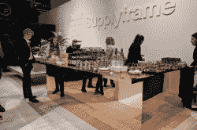

# 电子展上的黑客日聚会:周四

> 原文：<https://hackaday.com/2018/11/13/hackaday-meetup-at-electronica-thursday/>

Hackaday 的母公司 Supplyframe 本周在慕尼黑电子展——C5-223 展位。周四 16:00-18:00，他们将为 Hackaday 社区的所有人举办 Hackaday Happy Hour，提供啤酒和咖啡吧。他们希望看到你，听到你在做什么，无论是白天的工作还是晚上的工作。

 如果你错过了 Supercon 的#badgelife 展览，那就在这里的 Electronica。还会有一些你可能听说过的神秘立方体。理查德·霍本和波格丹一世·罗苏将演唱新节拍的 DJ。停下来和[Sophi Kravitz]、[Majenta Strongheart]、[Alek Bradic]以及 Supplyframe 团队的其他人打招呼。

Hackaday 自己的[埃利奥特·威廉姆斯]也将在周三下午的电子博览会上亮相。他不能承诺免费啤酒，但如果你想和埃利奥特一起逛电子展，请在周三 14:30 在 Supplyframe 展台见面。