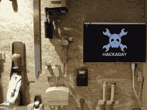

# 黑客日播客 101:激光和铣削绝对一切

> 原文：<https://hackaday.com/2021/01/15/hackaday-podcast-101-lasering-and-milling-absolutely-everything/>

Hackaday 的编辑迈克·斯奇斯和埃利奥特·威廉姆斯讨论了过去一周我们最喜欢的黑客。我们无意中选择了一个主题，因为大多数项目都使用激光，并且是关于机械加工的。我们首先使用一种非常强大的激光，可以直接蚀刻电路板，但后来被一种更强大的激光超越，这种激光使用一种化学方法来蚀刻玻璃。我们看看如何混合您自己的火箭发动机，引导您自己的激光标签，并进入嵌入式开发的构建工具的兔子洞。这一集在我们讨论 NVMe 到底是什么以及硬件黑客会把它带到哪里时结束。

[//html5-player.libsyn.com/embed/episode/id/17561489/height/90/theme/custom/thumbnail/yes/direction/backward/render-playlist/no/custom-color/000000/](//html5-player.libsyn.com/embed/episode/id/17561489/height/90/theme/custom/thumbnail/yes/direction/backward/render-playlist/no/custom-color/000000/)

如果你想继续，看看下面的链接，一如既往，在评论中告诉我们你对这一集的看法！

[直接下载](https://traffic.libsyn.com/secure/hackaday/Hackaday_Podcast-Ep101.mp3)(约 65 MB)

### 关注 Hackaday 播客的地方:

*   [谷歌播客](https://podcasts.google.com/feed/aHR0cDovL2ZlZWRzLnNvdW5kY2xvdWQuY29tL3VzZXJzL3NvdW5kY2xvdWQ6dXNlcnM6OTM5MTM0NzIvc291bmRzLnJzcw)
*   [iTunes](https://itunes.apple.com/us/podcast/hackaday-podcast/id1447409683)
*   [Spotify](https://open.spotify.com/show/3NRV0mhZa8xeRT0EyLPaIp)
*   [装订机](https://www.stitcher.com/podcast/hackaday-podcast)
*   [RSS](http://hackaday.libsyn.com/rss)

## 第 101 集节目笔记:

#### 本周新: 

*   埃利奥特建立了一个车间屏幕(有点)
*   [便携式电脑](https://hackaday.io/project/19583-luggable-pc)

#### 本周有趣的黑客:

*   [激光爆破出高质量的印刷电路板](https://hackaday.com/2021/01/11/laser-blasts-out-high-quality-pcbs/)
*   [立磨完成废料场车床建造](https://hackaday.com/2021/01/12/vertical-mill-completes-scrapyard-lathe-build/)
    *   [用工业废料制造车床——YouTube](https://www.youtube.com/watch?v=Lzytexbrdlg)
*   [DIY 激光标签系统配备了所有的铃铛和哨子](https://hackaday.com/2021/01/07/diy-laser-tag-system-comes-with-all-the-bells-and-whistles/)
*   [用激光微加工玻璃——非常非常慢](https://hackaday.com/2021/01/09/micromachining-glass-with-a-laser-very-very-slowly/)
    *   [速度为 15,000 FPS 的单槽端铣刀:DATRON 十字切割机–YouTube](https://www.youtube.com/watch?v=eW-_h6JjirU)
    *   ImageJ:科学图像分析的开放平台
*   [TabFS 让你的浏览器成为一个文件系统](https://hackaday.com/2021/01/11/tabfs-makes-your-browser-a-file-system/)
*   [这不是火箭科学——等等，也许是](https://hackaday.com/2021/01/13/it-isnt-rocket-science-wait-maybe-it-is/)

#### 快速破解:

*   迈克的选择:
    *   [ESP8266 插座是一个卡扣式、对试验板友好的奇迹](https://hackaday.com/2021/01/10/esp8266-socket-is-a-snap-fit-breadboard-friendly-wonder/)
    *   [复古终端给你的桌面带来一些风格](https://hackaday.com/2021/01/11/retro-terminals-bring-some-style-to-your-desktop/)
    *   [老款 Kindle 显示 HDMI 视频，最终](https://hackaday.com/2021/01/08/old-kindle-shows-hdmi-video-eventually/)
*   埃利奥特的选择:
    *   [用 DIY 塑料闪烁体可视化电离辐射](https://hackaday.com/2021/01/12/visualizing-ionizing-radiation-with-diy-plastic-scintillators/)
    *   [五轴 3D 打印让世界变平](https://hackaday.com/2021/01/12/3d-printing-in-five-axes-makes-the-world-flat/)
    *   [山寨 Kapton 差点沉没 DIY 柔性 PCB 项目](https://hackaday.com/2021/01/10/knockoff-kapton-nearly-sinks-diy-flex-pcb-project/)

#### 不能错过的文章:

*   [NVMe 模糊了记忆和存储的界限](https://hackaday.com/2021/01/13/nvme-blurs-the-lines-between-memory-and-storage/)
    *   [你的处理器总线上有些东西:入侵 ISA 和 PCI 的乐趣](https://hackaday.com/2021/01/06/you-got-something-on-your-processor-bus-the-joys-of-hacking-isa-and-pci/)
*   [连环乌贼之死:什么时候放弃？](https://hackaday.com/2021/01/12/death-of-the-serial-squid-when-do-you-give-up/)