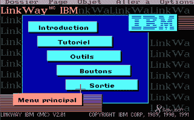

# Hackaday 播客 181:火山坚果的 3D 打印，Hackaday 书架和谜题机器人

> 原文：<https://hackaday.com/2022/08/12/hackaday-podcast-181-3d-printing-with-volcano-nuts-the-hackaday-bookshelf-and-a-puzzlebot/>

本周，主编埃利奥特·威廉姆斯和作业编辑克里斯蒂娜·帕诺斯在一个秘密地点会面，谈论我们对过去一周精选的黑客的看法。我们开始讨论全新的[网络平台竞赛](https://hackaday.com/2022/08/08/load-your-icebreakers-the-2022-cyberdeck-contest-is-here/)，这是第一次，但肯定不会是最后一次。在其他比赛新闻中，[我们最近宣布了 Hackaday 奖的 Hack it Back Challenge](https://hackaday.com/2022/08/09/2022-hackaday-prize-congratulations-to-the-winners-of-the-hack-it-back-challenge/) 的获胜者，该奖项涵盖了从人体抓取到 rad resto-mods 和 resto-recreations 的所有领域。

IBM’s Linkway, French edition. Très tubulaire, non?

本周获得 wow factor 最高荣誉的是[Stuff Here]的拼图机器人。这个怪物目前可以处理小型激光切割拼图，但一旦所有的工程碎片都聚集在一起，注定要解决一个全白 5000 块的噩梦。

然后我们去了一趟拉链城，那里的塑料是绿色的♻，电线很漂亮，我们从远处欣赏火山坚果，并短暂地考虑了一台加热区长度可编程的 3D 打印机的想法。

最后，我们来看看一个创造性的破坏性机器人，它类似于一台无用的机器，畅谈你应该读的书，并围绕边玩边学的话题跳舞。

[//html5-player.libsyn.com/embed/episode/id/24034863/height/90/theme/custom/thumbnail/yes/direction/backward/render-playlist/no/custom-color/000000/](//html5-player.libsyn.com/embed/episode/id/24034863/height/90/theme/custom/thumbnail/yes/direction/backward/render-playlist/no/custom-color/000000/)

[直接下载。](https://traffic.libsyn.com/secure/hackaday/Hackaday_Podcast-Ep181.mp3)

如果你想继续关注，请点击下面的链接，并一如既往地在评论中告诉我们你对这一集的看法！

Where to Follow Hackaday Podcast

### 关注 Hackaday 播客的地方:

*   [谷歌播客](https://podcasts.google.com/feed/aHR0cDovL2ZlZWRzLnNvdW5kY2xvdWQuY29tL3VzZXJzL3NvdW5kY2xvdWQ6dXNlcnM6OTM5MTM0NzIvc291bmRzLnJzcw)
*   [iTunes](https://itunes.apple.com/us/podcast/hackaday-podcast/id1447409683)
*   [Spotify](https://open.spotify.com/show/3NRV0mhZa8xeRT0EyLPaIp)
*   [装订机](https://www.stitcher.com/podcast/hackaday-podcast)
*   [RSS](http://hackaday.libsyn.com/rss)

## 第 181 集节目预告:

#### 新闻:

*   [装载你的破冰船，2022 年赛博甲板大赛现在开始](https://hackaday.com/2022/08/08/load-your-icebreakers-the-2022-cyberdeck-contest-is-here/)
*   [2022 年黑客日大奖:祝贺 Hack It Back 挑战赛的获胜者](https://hackaday.com/2022/08/09/2022-hackaday-prize-congratulations-to-the-winners-of-the-hack-it-back-challenge/)

#### 那是什么声音？

*   如果你知道那是什么声音，[你应该填写这里的表格](https://docs.google.com/forms/d/e/1FAIpQLSdr_-dS4cRNQ9T3mZ5kzt3wsN-O_jtzCUHKwiafvODBG1-9Nw/viewform?usp=sf_link)来赢取一件 t 恤！

#### 本周有趣的黑客:

*   [太阳能飞机也许能持续一整夜](https://hackaday.com/2022/08/06/solar-plane-might-be-able-to-last-through-the-night/)
    *   游丝秃鹰
    *   [太阳动力 2 号(HB-SIB)太阳能飞机](https://www.aerospace-technology.com/projects/solar-impulse-2-hb-sib-solar-airplane/)
*   [拼图被打败](https://hackaday.com/2022/08/04/jigsaw-puzzles-are-defeated/)
    *   [远心镜头–维基百科](https://en.wikipedia.org/wiki/Telecentric_lens)
*   [学生竞赛徽章印有定制硅胶](https://hackaday.com/2022/08/09/student-competition-badge-bears-custom-silicon/)
*   [欢迎来到拉链城](https://hackaday.com/2022/08/05/welcome-to-ziptie-city/)
*   [想要更快的挤压却没有火山？坚果！](https://hackaday.com/2022/08/07/want-faster-extrusion-but-dont-have-a-volcano-nuts/)
*   [将 80 年代的打字机转换成 Linux 终端](https://hackaday.com/2022/08/04/converting-an-80s-typewriter-into-a-linux-terminal/)

#### 快速破解:

*   埃利奥特的选择:
    *   [MCH2022 徽章 CTF 解决了，有很多值得学习的地方](https://hackaday.com/2022/08/07/mch2022-badge-ctf-solved-with-plenty-to-learn-from/)
    *   [应该用 555 或者 276 个](https://hackaday.com/2022/08/10/shouldve-used-a-555-or-276-of-them/)
    *   [机器人重复重新排列回合中的残局](https://hackaday.com/2022/08/07/robot-repeatedly-rearranges-remnants-in-the-round/)
*   克里斯蒂娜的选择:

    *   [Stewart Platform 挥舞着神奇的手指按摩你的头皮](https://hackaday.com/2022/08/04/stewart-platform-wields-magic-fingers-to-massage-your-scalp/)
    *   [3D 打印编织机带回一些历史](https://hackaday.com/2022/08/04/3d-printed-braiding-machine-brings-back-some-history/)
    *   【2022 年黑客日奖:拯救世界，一次一杯啤酒

#### 不能错过的文章:

*   [你应该读的书:硬件黑客手册](https://hackaday.com/2022/08/05/books-you-should-read-the-hardware-hackers-handbook/)
    *   [你应该读的书](https://hackaday.com/series_of_posts/books-you-should-read/)
    *   [摸索未来:施乐如何发明了第一台个人电脑，然后又被忽视了(图书，1999)【WorldCat.org】](https://www.worldcat.org/title/fumbling-the-future-how-xerox-invented-then-ignored-the-first-personal-computer/oclc/182874372&referer=brief_results)
*   [边玩边学](https://hackaday.com/2022/08/06/learning-by-playing/)
    *   [回顾:链接方式](https://www.atarimagazines.com/compute/issue112/Link_Way.php)