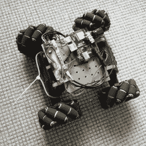

# Hackaday 播客 104:美味的人工智能、DVD 扫描显微镜和电池友好型微控制器设计

> 原文：<https://hackaday.com/2021/02/05/hackaday-podcast-ep-104-delicous-ai-dvd-scanning-microscope-and-battery-friendly-microcontroller-designs/>

《黑客日报》的编辑埃利奥特·威廉姆斯和迈克·斯奇斯转动硬件黑客辉煌之轮。我们着迷于寻找日产 Xterra 信息娱乐系统的根外壳，并迷恋上了使用激光束和 DVD 驱动器精确定位的扫描显微镜。我们推测人工智能在烹饪艺术中的未来。本周，我们发现了一种聪明的方法来监测公共设施的使用情况，同时每年只需更换一次传感器的电池。

[//html5-player.libsyn.com/embed/episode/id/17833445/height/90/theme/custom/thumbnail/yes/direction/backward/render-playlist/no/custom-color/000000/](//html5-player.libsyn.com/embed/episode/id/17833445/height/90/theme/custom/thumbnail/yes/direction/backward/render-playlist/no/custom-color/000000/)

如果你想继续，看看下面的链接，一如既往，在评论中告诉我们你对这一集的看法！

[直接下载](https://traffic.libsyn.com/secure/hackaday/Hackaday_Podcast-Ep104.mp3)(约 65 MB)

### 关注 Hackaday 播客的地方:

*   [谷歌播客](https://podcasts.google.com/feed/aHR0cDovL2ZlZWRzLnNvdW5kY2xvdWQuY29tL3VzZXJzL3NvdW5kY2xvdWQ6dXNlcnM6OTM5MTM0NzIvc291bmRzLnJzcw)
*   [iTunes](https://itunes.apple.com/us/podcast/hackaday-podcast/id1447409683)
*   [Spotify](https://open.spotify.com/show/3NRV0mhZa8xeRT0EyLPaIp)
*   [装订机](https://www.stitcher.com/podcast/hackaday-podcast)
*   [RSS](http://hackaday.libsyn.com/rss)

## 第 104 集节目说明:

####  本周新:

*   埃利奥特在研究一辆装有机械轮子的漫游者

#### 本周有趣的黑客:

*   [日产放弃 Root Shell 感谢被黑的 USB 驱动器](https://hackaday.com/2021/01/30/nissan-gives-up-root-shell-thanks-to-hacked-usb-drive/)
    *   [32C3:柴油门——在大众的 ECU 内](https://hackaday.com/2015/12/31/32c3-dieselgate-inside-the-vws-ecu/)
*   [DVD 光学镜为这台扫描激光显微镜提供动力](https://hackaday.com/2021/02/02/dvd-optics-power-this-scanning-laser-microscope/)
    *   [走上精密激光 PCB 曝光机的漫漫长路](https://hackaday.com/2016/04/06/take-the-long-road-to-a-precise-laser-pcb-exposer/)
*   [年轻人的 ESP32 点唱机使用 RFID 对歌曲进行排队](https://hackaday.com/2021/02/02/youngsters-esp32-jukebox-uses-rfid-to-queue-tunes/)
*   [巨型 DIY 鼠标释放球](https://hackaday.com/2021/01/29/giant-diy-mouse-sets-the-ball-free/)
*   [旧煤气表通过 ESP8266 变得智能](https://hackaday.com/2021/01/31/old-gas-meter-gets-smart-with-the-esp8266/)
*   [Logic Meter 旨在使业余电子设备故障排除更容易](https://hackaday.com/2021/01/28/logic-meter-aims-to-make-hobby-electronics-troubleshooting-easier/)

#### 快速破解:

*   埃利奥特的选择:
    *   [串行工作室:轻松可视化和记录串行数据](https://hackaday.com/2021/01/31/serial-studio-easily-visualise-and-log-serial-data/)
    *   [用 Arduino 升级旧的 MIG 焊机送丝机](https://hackaday.com/2021/02/01/upgrading-an-old-mig-welder-wire-feeder-with-arduino/)
    *   [便捷的工具可消耗 18650 个细胞，因此您不必再使用](https://hackaday.com/2021/02/01/handy-tool-drains-18650-cells-so-you-dont-have-to/)
*   迈克的选择:
    *   [一个从零开始的运算放大器](https://hackaday.com/2021/01/30/an-op-amp-from-the-ground-up-2/)
    *   [学习 Bil Herd 的 DIY 表面贴装组装流程](https://hackaday.com/2021/02/02/learn-bil-herds-diy-surface-mount-assembly-process/)
    *   [断路器如何断开？](https://hackaday.com/2021/01/26/how-does-a-circuit-breaker-break/)
        *   [在带麦克风的断路器内](https://hackaday.com/2016/02/26/inside-a-circuit-breaker-with-mikeselectricstuff/)

#### 不能错过的文章:

*   [要花多少钱？！助听器中的声音](https://hackaday.com/2021/02/01/it-costs-what-a-sounding-into-hearing-aids/)
    *   什么是拾音线圈——所有助听器都有拾音线圈吗？
*   厨房里的机器学习可以做出美味的混搭甜点
    *   [【本·克拉斯诺】所做的一切都是为了(完美的)饼干](https://hackaday.com/2014/01/15/ben-krasnow-did-it-all-for-the-perfect-cookie/)