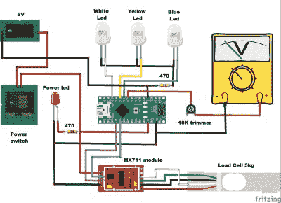

# Hackaday 奖 2022: Arduino 供电的电子秤具有真正的模拟显示屏

> 原文：<https://hackaday.com/2022/07/25/hackaday-prize-2022-arduino-powered-weighing-scale-has-a-real-analog-display/>

数字显示器有助于快速准确的读数，但是很多人更喜欢指针沿着刻度盘移动的物理运动。例如，许多智能手表用户选择模拟脸来显示时间，而配有数字仪表盘的现代汽车通常默认显示模拟速度表。顺应这一趋势，【Miro Pavleski】制造了一款带模拟显示器的数字称重秤,不仅外观简洁，还很好地展示了现代秤的工作方式。

 在内部，该设备就像一个典型的电子秤:仪器的心脏是一个称重传感器，它支撑着平台，并根据施加的重量成比例地弯曲。这种弯曲运动由一组以惠斯通电桥结构连接的应变仪来检测。HX711 读出芯片测量产生的电压，并将其转换为数字代码，然后发送到微控制器，本例中为 Arduino Nano。

鉴于典型的电子秤会简单地在 LCD 显示屏上显示结果数字，[Mirko]决定使用由 Arduino 模拟输出驱动的动圈式仪表。那个仪表原本是设计用来显示电流的，所以[Mirko]打印了一张新的背景图，用千克来代替。

与任何模拟传感器一样，校准和调零对于获得可靠的测量结果至关重要。当仪器通电时，它要求用户在秤上放置 100 克砝码，然后将其用作控制电压-重量比例因子的参考。您也可以减去您可能想要使用的任何容器的皮重，只需将它们放在平台上，然后按下电源按钮。

如果你打算设计自己的数字电子秤，[这个老项目](https://hackaday.com/2013/06/12/building-a-digital-scale-from-scratch/)是一个很好的起点。[这次大规模生产秤](https://hackaday.com/2016/12/05/body-cardio-weighing-scale-teardown/)的拆卸也充满了有趣的细节。我们甚至看到了[一个自制的秤，可以根据 ID](https://hackaday.com/2020/08/13/automatic-cat-weighing-machine-knows-which-pet-it-is-feeding/) 自动给猫称重和喂食。

 [https://www.youtube.com/embed/h-M2wuZypNA?version=3&rel=1&showsearch=0&showinfo=1&iv_load_policy=1&fs=1&hl=en-US&autohide=2&wmode=transparent](https://www.youtube.com/embed/h-M2wuZypNA?version=3&rel=1&showsearch=0&showinfo=1&iv_load_policy=1&fs=1&hl=en-US&autohide=2&wmode=transparent)

[hack adayprize 2022](https://prize.supplyframe.com)主办单位: