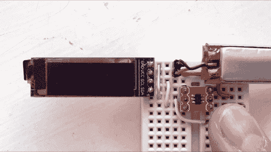

# Hackaday Prize 2022: RunTinyRun 是一款完全由太阳能驱动的便携式恐龙游戏

> 原文：<https://hackaday.com/2022/04/29/hackaday-prize-2022-runtinyrun-is-a-fully-solar-powered-portable-dinosaur-game/>

迄今为止，完全由太阳能供电的手持设备大多局限于超低功耗设备，如时钟、温度计和计算器。任何比这更复杂的东西通常都有一个电池和一些充电装置。完全由太阳能供电的电子游戏机肯定是遥不可及的。或者是？正如[ridoluc]所展示的，这样的装置实际上是可能的:[RunTinyRun 直接从太阳获得所有的能量](https://hackaday.io/project/175063-runtinyrun)。

公平地说，这并不是一款真正成熟的游戏主机。事实上，它甚至没有接近原来的游戏男孩。但 RunTinyRun 是一款便携式视频游戏，配有有机发光二极管显示屏，完全由绑在背后的太阳能电池板供电。如果你在阳光明媚的日子在户外玩，它会无限期地运行，如果不是，让它充电一两分钟应该可以玩三十秒钟。

它运行的游戏是谷歌恐龙游戏的克隆版，你可以计时按下按钮，让霸王龙跳过仙人掌。正如你所料，这款游戏运行在一个极其简约的硬件平台上:主 CPU 是一个 ATtiny10 六引脚微处理器，只有 1 kB 的闪存。这款游戏完全是用手工汇编编写的，仅占用 780 字节。一个 0.1 法拉的超级电容为整个系统供电，并通过升压转换器由 25 x 30 mm ² 太阳能电池充电。

RunTinyRun 是系统设计在功耗、代码尺寸和电路板面积严格限制下的完美范例。如果你正在寻找一款功能更强、但略显逊色的便携式游戏机，看看这款太阳能游戏机吧。

[hack adayprice 2022](https://prize.supplyframe.com)主办单位: