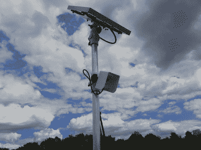

# 2022 年哈卡戴奖:使用红外温度计测量作物的水分胁迫

> 原文：<https://hackaday.com/2022/09/11/hackaday-prize-2022-using-infrared-thermometers-to-measure-crops-water-stress/>

如果你住在北半球的任何地方，你很可能经历过今年夏天发生的众多热浪之一。极端高温对人类和动物来说是危险的，但是植物，包括重要的农作物，也会受到影响。高温导致蒸腾和蒸发增加，如果以这种方式流失的水分得不到足够快的补充，植物将停止生长，最终枯萎死亡。

为了跟踪作物可用的水量，[Florian eller][建造了作物水分胁迫传感器](https://hackaday.io/project/187090-crop-water-stress-sensor):一种检查植物是否有足够的水分保持健康的设备。它通过测量树叶的温度来计算蒸发水平。如果叶子比周围的温度低，这意味着水分正在蒸发，植物显然有足够的水分。如果叶子的温度接近环境温度，那么植物可能缺水。

 【弗洛里安】的系统使用红外阵列进行测量，这基本上是一种低分辨率的热感相机，可以远程测量其视野内所有东西的温度。这个红外阵列指向一片田野，在那里它可以看到树叶和树叶之间的地面。这两者之间的温差可以用来计算作物水分胁迫指数(CWSI)，这是衡量植物水分充足程度的标准化指标。结果会显示在显示屏上，还会使用一个方便的红-黄-绿状态 LED 来指示，显示作物是否需要浇水。

该系统可以由太阳能供电，完全远程操作，而其数据可以通过 WiFi 接口读出。[Florian]正计划用 LoRa 接口更新设计，以获得更大的范围:最终目标是在整个农业地区建立一个由这些传感器组成的大型网络，并使用组合数据来提高对某些地区水资源短缺的认识。为了让任何感兴趣的人都能轻松制作传感器，所有设计文件都可以在项目页面上找到。

保持作物湿润是农业的关键任务之一，我们已经看到了几个旨在优化和自动化它的项目，从简单但有效的基于 ESP8266 的湿度传感器到完整的水培系统。