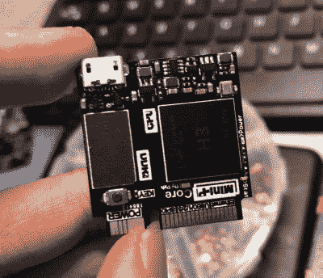
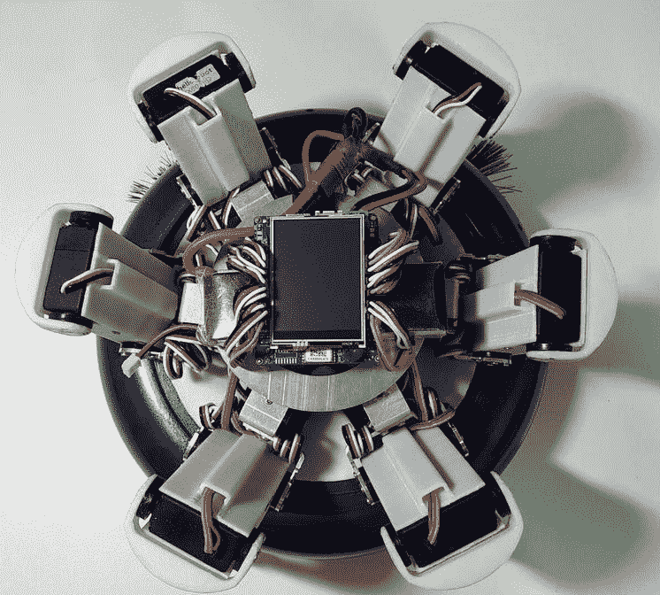
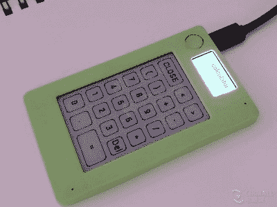
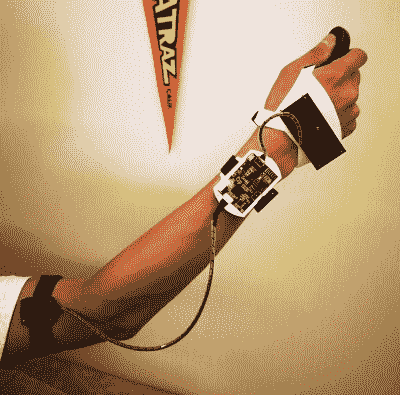
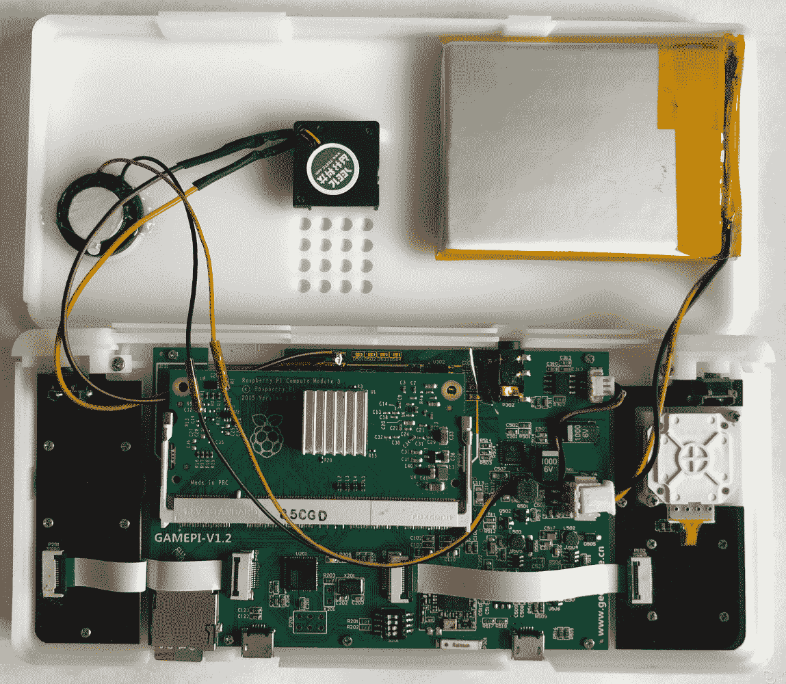
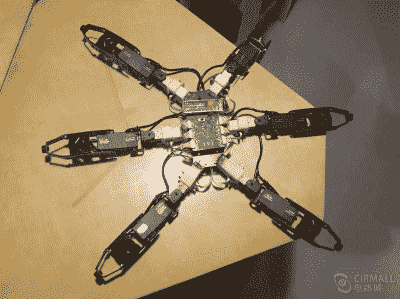

# Hackaday 奖中国决赛入围名单揭晓

> 原文：<https://hackaday.com/2019/10/15/hackaday-prize-china-finalists-announced/>

自 Hackaday 奖首次举办以来，它已经培养了来自世界各地的一系列惊人的项目，并使一些真正杰出的获奖者脱颖而出，展示了改变世界的可能性。今年，随着 [Hackaday Prize China](https://www.cirmall.com/hackadayprize_2019) (中文，这里有一个[谷歌翻译链接](https://translate.google.com/translate?hl=&sl=zh-CN&tl=en&u=https%3A%2F%2Fwww.cirmall.com%2Fhackadayprize_2019))的推出，这一活动被扩展到了一个新的领域，允许来自该国的工程师、制造商和发明家参与其中。我们很高兴地宣布决赛选手，获胜者将于 11 月 23 日^(3 月)在中国深圳揭晓。如果你在深圳地区，[邀请你参加颁奖典礼](http://www.cirmall.com/bbs/thread-159826-1-1.html)！

所有这六个[最终项目条目都被翻译成英文](https://hackaday.io/projects/hacker/463357)，以帮助跨越语言障碍分享项目信息。在每个项目页面的左侧边栏，您可以找到一个链接，返回到最初的中文项目条目。每本书都以迷人的视角展示了当我们的全球社区中的人们生活在零部件供应链的源头时，他们能生产什么。其中有一些健康的交叉项目，我们将不分先后地参观。让我们深入研究一下，看看这些都是怎么回事！

## 想做语音助手？首先，制作你自己的单板机

我们习惯了谷歌和亚马逊等公司的语音助手，但[dimension]通过创建自己的避开了这些[。这是一个双 PCB 设备，其中一个电路板包含显示和声音电路，通过 PCI-E 连接器连接到一个小型的自行设计的 CPU 电路板，称为 Mini-Pi。这是一个基于 H3 的全赢家 SBC，我们可以想象它在这个项目之外的应用，但对为项目创建 SBC 而不是使用现成 SBC 的细节的关注是非常出人意料的。该软件来自 Jasper 项目，一些读者可能已经熟悉了，显然很多努力已经投入到制作一个产品，而不是一个台式原型。](https://hackaday.io/project/167604-homemade-super-mini-voice-assistant-pico)

## 伪装的清洁机器人！

This robotic floor sweeper is part hexapod, part wheeled.

如果你有一个 Roomba 或类似的机器人家庭清洁器，你会意识到它的局限性。障碍可以击败它，任何挑战如楼梯或不平的表面都超越了它。一款功能更加多样的家用扫地机器人来自[Lìrèn] ，它采用了一种*变形金刚*式的混合形式，介于我们熟悉的轮式机器和六足步行机之间。一个额外的转折是，六足机器人可以从轮式清扫车上分离，以进入高度受限的空间，如家具下方。它的核心是一个 HiKey 开发板，我们认为它是基于华为麒麟 970 SoC 的。

What would a PDA have looked like using 2019 components?

## 重新发明的 PDA

早在 20 世纪 90 年代，移动计算的未来似乎就在 PDA，功能相对较低的小型平板电脑，拥有时间管理和其他生产力应用程序。PDA 的所有功能都转移到了智能手机中，这兑现了早期设备的承诺，但也许这样的设备仍然有一席之地。这是[qwert1213131]正在与[杰奇洛](https://hackaday.io/project/167607-jakiro)探索的一条道路，这是一款基于 ESP32 的设备，配有 eInk 触摸屏和小型有机发光二极管显示屏。这很有趣，因为通过在 20 年后重新审视这个想法，利用原始设计者根本无法获得的组件的优势，它可以带来一些在 PDA 中有用的东西，例如方便和简单，以及 ESP 的集成无线和计算能力以及 eInk 的低功耗持久性。

Three-sensor motion capture for your arm

## 我们其他人的动作捕捉

如果我们想到动作捕捉，很可能会想到演员穿着覆盖着灯光的紧身衣的场景，就像 CGI 艺术家使用的系统一样。但是动作捕捉领域跨越了众多的项目和技术，从被黑掉的任天堂强力手套向上延伸。这是[fantc]已经进入的领域，[单臂动作捕捉系统](https://hackaday.io/project/167608-minimum-arm-motion-capture-system)使用三个 MPU6050 惯性传感器耦合到 MSP430 系列 CPU。整个设置是一个紧凑的单元，用几个更小的传感器板绑在手臂上，通过蓝牙低能耗进行接口。看到这种方法被带到其他肢体上并配备更多传感器并不令人难以想象，或许可以在没有之前描述的一些昂贵设置的情况下创建全身运动捕捉。

## 这是一个掌上游戏机，但有更多的承诺！

This Pi Compute Module console board has so much potential!

乍一看，[反击]的[掌上游戏机](https://hackaday.io/project/167609-raspberry-pi-handheld-game-console)似乎没有什么特别的，毕竟，虽然它无疑是很好地建立，它不是唯一的这样的项目被发现。只有当它被打开的时候，我们才明白为什么它值得再看一眼。对于 Raspberry Pi 计算模块 3 来说，这是一个完整且执行良好的平台。这是因为它具有最忠实的 PlayStation 仿真所需的功能，但因为 Pi 本身是一种如此广泛支持和多功能的设备，我们可以立即看到这种设备在游戏世界以外的许多应用程序中的巨大吸引力。使用 Pi 将您绑定到一个正式的外形规格，计算模块提供了一个推出您自己的 Pi 的机会。如果我们将这款游戏机视为便携式电池供电应用程序的自带 Raspberry Pi 3，它的吸引力将远远超出几款 PlayStation 游戏。

The insect hexapod hardware isn’t the clever part

## 像昆虫一样行走

[Harry ethorange]带给我们[一个六足步行器，](https://hackaday.io/project/167601-hexapod-robot-based-on-the-gait-imitation-of-insec)如果它的步态不是来自于对昆虫运动的研究而不是圆周运动，那就没什么特别的了。他特别感兴趣的是这种昆虫在少于六条腿的情况下保持机动性的能力，他详细描述了他相当不人道的研究方法。学步车本身似乎是一个足够简单的设计，如果我们看到的典型 Arduino 风格的学步车是什么，我们可以想象步态改进有很大的空间。

黑客社区中的非中国人经常被来自那个国家的作品所吸引。但是我们知道，在那里的工程社区里有很多有趣的事情，而世界上的其他人通常没有机会去享受。开始时，一些孤独的声音让我们得以一窥他们的世界，现在开始扩展到中国硬件黑客社区的有趣工作分享，让世界各地不讲中文的硬件极客兴奋不已。我们希望这次比赛有助于延续这一趋势，如果这些项目的高质量是值得肯定的，我们期待着 Hackaday 奖中国在未来的回归。祝贺这些决赛选手，以及所有参赛选手！