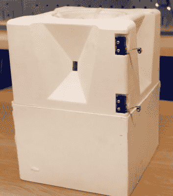

# 黑客制造完美陷阱，反击包裹窃贼

> 原文：<https://hackaday.com/2018/12/17/hacker-makes-a-flawless-booby-trap-strikes-back-against-package-thieves/>

[马克·罗伯]受够了丢失的包裹。他不断收到通知，说他的货物已经送达，但当检查他的门廊时，他什么也没发现。回顾闭路电视录像显示，随机路人悄悄走近他的门廊，偷走了他的包裹。是反击的时候了。在六个多月的时间里，[马克]和他的朋友们煞费苦心地设计、制作原型并重复了这个完美的包裹窃贼陷阱，最终形成了一个伪装成苹果 HomePod 的小装置。整个计划是惊人的过度设计，我们喜欢它。

该设备的主要特点是顶部有一个旋转的杯子，里面含有大量的闪光物质。当被激活时，它会向各个方向喷射闪光。你可以说它是无害的，因为它只是闪闪发光。不过话说回来，glitter 有一种方式会伴随你的余生——在最意想不到的时候出现。这无疑会给人留下情感上的印象。

激活相当巧妙；假包裹放在门廊上，直到加速度计检测到运动。此时，GPS 会检查包裹是否已经移动到[Mark]家周围的地理围栏之外。然后，一个信号被发送到四个智能手机，开始记录——是的，没错，里面有 4 个手机，每侧一个，以捕捉小偷的反应。

[马克]怎么能如此自信，他将能够恢复四部手机和他们的镜头？这是由 GPS 跟踪和一个由 3D 打印凸轮和 DC 电机驱动的屁喷罐来回答的，确保小偷不会想要这个包裹太久。这种致动器和闪光电机由定制的 PCB 控制，这也触发手机通过耳机插孔开始录音，并通过一些微型开关检测包装的打开。这是一个真正的杰作，它以一种既有趣又能给人留下印象的方式战胜了包裹窃贼。

(编者注 2:2018 年 12 月 20 日宣布，最初视频中出现的五个小偷中的两个是故意安排的，显然在[马克·罗伯]不知情的情况下。这是他对此事的声明。)

(编者注 1:【肖恩·哈金斯】在[上用额外的视频写了闪光炸弹是如何工作的，以及它是如何制造的。](https://youtu.be/IpMxOmUcfOI))

如果你喜欢陷阱，我们会保护你。看看这个[定时炸弹式的谜题](https://hackaday.com/2011/04/12/booby-box-its-a-trap/)，或者这个[箱子挑战，它被操纵来引爆](https://hackaday.com/2015/07/23/puzzle-box-is-rigged-to-blow/)。

 [https://www.youtube.com/embed/xoxhDk-hwuo?version=3&rel=1&showsearch=0&showinfo=1&iv_load_policy=1&fs=1&hl=en-US&autohide=2&wmode=transparent](https://www.youtube.com/embed/xoxhDk-hwuo?version=3&rel=1&showsearch=0&showinfo=1&iv_load_policy=1&fs=1&hl=en-US&autohide=2&wmode=transparent)

