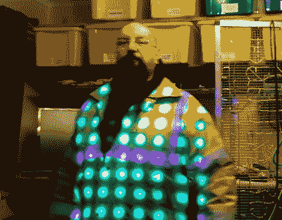

# 黑进一盏廉价的迪斯科灯来获得紫外线效果

> 原文：<https://hackaday.com/2020/06/15/hacking-a-cheap-disco-light-for-uv-effects/>

在迪斯科的早期，灯丝灯泡风靡一时。不管是钨丝灯、卤素灯还是其他不知名的灯，派对照明都需要大量的瓦特和热量。如今，led 的效率让一切都变得更便宜、更轻、更省电。[大克莱夫]决定钻进一盏来自中国的廉价月光花型迪斯科灯里，[一路上更换内部。](https://www.youtube.com/watch?v=j_blpwck_hM&feature=emb_rel_end)

The final effect particularly shines when used on fluorescent materials.

这种灯最初由一个 8×8 的 led 网格组成，由移位寄存器驱动，以实现简单的追逐效果。令人惊讶的是，里面的电源和其他硬件似乎至少试图满足英国的法规。然而，[大克莱夫]有其他计划，搅起一个替代印刷电路板包装 64 紫外线发光二极管。该视频内容丰富，展示了如何通过几个简单的无源元件，轻松地从电源驱动这些 led，而不需要过多的电路来降低到更常见的 DC 电压。

最终的结果是一个整洁的 UV 网格灯，在舞池的雾中看起来非常棒。我们以前也见过[大克莱夫]的拆卸——就像在奔驰车里发现的这个邪恶的 CAN 总线拦截器。休息后的视频。

 [https://www.youtube.com/embed/j_blpwck_hM?version=3&rel=1&showsearch=0&showinfo=1&iv_load_policy=1&fs=1&hl=en-US&autohide=2&wmode=transparent](https://www.youtube.com/embed/j_blpwck_hM?version=3&rel=1&showsearch=0&showinfo=1&iv_load_policy=1&fs=1&hl=en-US&autohide=2&wmode=transparent)

