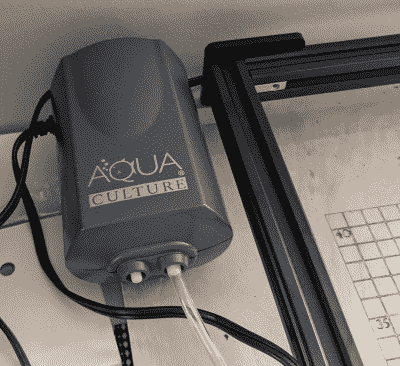
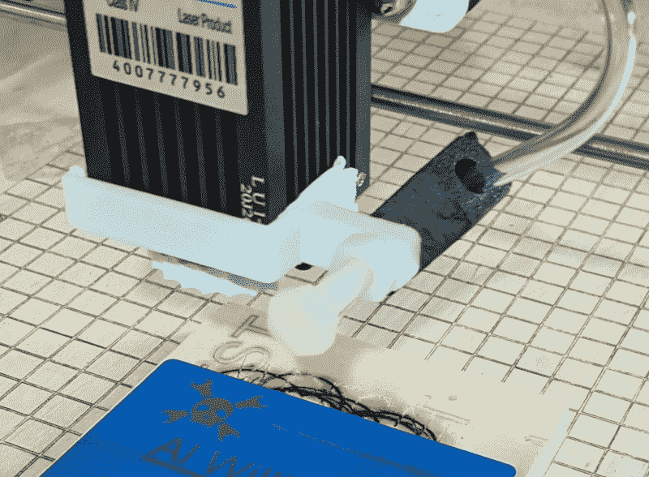
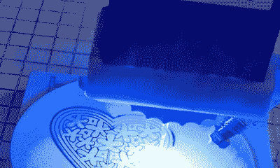
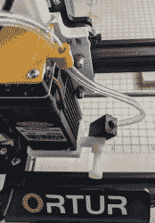

# 黑掉奥图尔激光的空中支援

> 原文：<https://hackaday.com/2021/04/21/hacking-an-air-assist-for-the-ortur-laser/>

从激光切割机获得良好的效果需要一点努力，以确保所有的设置都是正确的。但即使这样，如果材料和激光源之间的空气充满了烟雾和碎片，它也会干扰激光束，并破坏结果。解决方案是增加空气辅助，持续清理该区域。

今年早些时候，我买了一台 Ortur 激光雕刻机/切割机，并一直在对它进行黑客攻击，以提高库存能力。上个月我谈到了在机器下面放一块板，让激光轻松地上下移动。但我还是没有空中辅助。从那时起，我发现了一个伟大的方式来添加它，将适用于许多激光切割机设置。

我没有设计任何这些修改，但我确实改变了它们，以适应我的特殊情况。你可以在 [Thingiverse](https://www.thingiverse.com/thing:4770120) 上找到我对其他设计的非常简单的修改。你也可以找到原始设计的链接，你也需要它们来获得额外的部件和说明。能够从有才华的人那里开始工作，并以彼此的想法为基础，这很棒。

## 使人耳目一新的人

 在上一篇文章的结尾，我安装了一个空气辅助系统，但是切断了它的空气软管，因为我没有时间烧开水来弯曲空气管。不过，它确实让我轻松地上下移动激光头，非常有用。

这不是我尝试的第一个空气辅助设计。如果你看看 Thingiverse，你会发现很多不同的观点。有些有 [3D 打印喷嘴](https://www.thingiverse.com/thing:4693730)带气针或 3D 打印机喷嘴。有些只是将风扇空气对准零件。

我发现有些不适合或者效果不好。其他人会干扰 X 停止或干扰 Z 运动的激光，无可否认，这不会有一个股票机器的问题。其中一个设计有一个定制的激光器顶板，它有一个小软管导管，即使我没有保留那个空气辅助项目，我也没有移除定制的顶板，这被证明是幸运的，正如你将看到的。

自从我看到[DIY 3d tech]关于如何改进切割的视频后，我就对安装空气辅助装置非常感兴趣。在激光到来之前，我甚至为此买了一个小气泵，但它大部分时间都闲置着，因为没有一个好的方法来引导空气。

## 解决方案

最后找到了【DIY3DTech 的】设计，打印起来非常快捷简单。一个支架环绕着激光头，并安装了一个小管支架。你可以调整角度，一个 3D 打印机喷嘴被楔入管子的末端。这是一个简单的设计，但非常可调。

The air assist bracket is held with tape.

当然，有一个小问题。如果你的激光头不动，支架没问题。但是如果你可以上下滑动激光器，支架需要清除将激光器固定在 X 托架上的大橡子螺母。

起初，我试图放一些垫圈来移动激光器主体远离外壳，但这似乎不是一个好主意——我担心如果垫圈太多，它可能会不太稳定，我必须打捞一些更长的螺栓。相反，我在支架上做了一些手术，切除了有问题的部分，留下了边长约 3 厘米的 U 形。当然，这移除了固定螺丝，使它不能很好地夹紧。然而，一个小小的双面胶带很好地保持它。你也可以用一些热胶水。

You can see the 0.8mm M6 nozzle from a 3D printer directing air at this cut.

尼龙螺栓(可能更短)将黑色软管模块固定在白色支架上。它还可以夹住管子，所以不要一直拧紧，否则会夹住气流。一个尼龙螺母将它固定住。把喷嘴放在管子里是一个挑战。你可以稍微加热一下软管，但我没有。我只是用尖嘴钳在两个方向上拉伸管子，并将喷嘴拧入变宽的管子中。我没有密封它，但一滴热胶或硅胶可能是一个好主意。

空气辅助的另一部分并不是绝对必要的。我有[一个顶板](https://www.thingiverse.com/thing:4693730)从另一个空气辅助尝试仍然安装在激光器上，它有一个空气软管的小进料管，这个设计很好，所以我保留了它。它能让软管整齐排列，如果你不想让它到处乱放，你也可以把软管和其他电线捆在一起。

## 有用吗？

Magnified view of test cut.

有用吗？确实如此。现在切割薄胶合板只需要几道工序，而且看起来切割得更干净。附图为 2mm 胶合板上的小试件。使用两道激光完美地切割出轮廓，仔细看，似乎我甚至可以降低雕刻功率。不过，不用放大，它看起来很好。

顺便说一下，这些切割是用 Ortur 所说的 15 W 激光和标准镜头进行的。请记住，15W 是输入功率。实际输出功率可能就在 4W 北部。

空气从右边吹来的另一个副作用？你可以看到所有的烟都飘到了机器的左侧。

## 通风设备

The top plate isn’t necessary but helps with managing the hose.

说到烟，你确实需要通风，这是我还没有完成的一件事。我仍在试图弄清楚我到底想做什么。通风罩或带排气口的外壳看起来很理想，但安装起来很麻烦。现在，我有一个开着的窗户，有一个双窗风扇，用来吹风。

木头不会太难闻，但是皮革会。我也知道，胶合板中的一些胶水和皮革中的一些鞣制化学品会产生非常难闻的气味，所以这是这些机器的一个缺点。如果你认为印刷 ABS 有气味，你不会很喜欢开放式激光切割机。

不过，就目前而言，我对这台普通机器能提供的结果相当满意。如果你真的需要一个商业用途的激光切割机，你可能会去别处看看。但是，如果你想花一台普通的 3D 打印机的价格，并为你的工作室增加很多功能，你可能会比这些廉价的雕刻机做得更差。