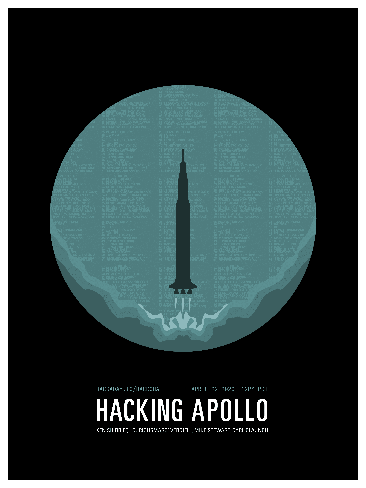

# 黑客阿波罗黑客聊天

> 原文：<https://hackaday.com/2020/04/20/hacking-apollo-hack-chat/>

加入我们太平洋时间 4 月 22 日星期三中午的 [Hacking Apollo Hack Chat](https://hackaday.io/event/170569-hacking-apollo-hack-chat) 与[、【curious Marc】Verdiell](https://hackaday.io/CuriousMarc)、 [Ken Shirriff](https://hackaday.io/kenshirriff) 、 [Mike Stewart](https://hackaday.io/thewonderidiot) 和 [Carl Claunch](https://hackaday.io/cclaunch) ！

当肯尼迪总统向一代科学家和工程师发出挑战，要求他们在 20 世纪 60 年代末之前将人送上月球时，他可能不知道自己在做什么。这项任务极其复杂，科学未经检验，工程也基本上未经尝试。几乎所有的东西都必须从零开始建造，整个行业都诞生于那些为了梦想成真而必须发明的技术。

这些新领域中最主要的是计算机科学，它在 20 世纪 60 年代开始时还处于萌芽状态。到 20 世纪 90 年代末，太空竞赛结束时，计算机已经从占满房间、消耗大量能量的机器变成了体积小巧、功能强大、足以载人往返月球的机器。随后的计算机都建立在阿波罗计划带来的创新基础上，研究那个时代的计算机并找出是什么让它们运转起来是我们技术文化的重要组成部分。

这就是这个逆向计算梦之队发挥作用的地方。他们一起检查了他们能找到的太空竞赛时代的每一件硬件，包括一台从垃圾堆里抢救出来的真正的阿波罗制导计算机(AGC)。更重要的是，他们通过一系列史诗般的技巧和纯粹的意志力，成功地将它恢复到工作状态。

Marc、Ken、Mike 和 Carl 将在 Hack Chat 上停下来，谈论让 AGC 再次工作的所有事情，以及任何其他突然出现的事情。准备好让你的阿波罗时代的硬件被人挠痒痒吧，这些人已经在里面呆过很多次了，他们亲眼目睹了登月和返回的第一手资料。

 我们的黑客聊天是 [Hackaday.io 黑客聊天群发消息](https://hackaday.io/messages/room/2369)中的社区直播活动。本周，我们将于太平洋时间 4 月 22 日星期三中午 12:00 坐下来讨论。如果时区让你烦恼，我们有[一个方便的时区转换器](https://www.timeanddate.com/countdown/generic?iso=20200422T12&p0=224&msg=hacking+Apollo+Hack+Chat&font=cursive)。

点击右边的那个发言气泡，你会被直接带到 Hackaday.io 上的黑客聊天群，不用等到周三；随时加入，你可以看到社区在谈论什么。

