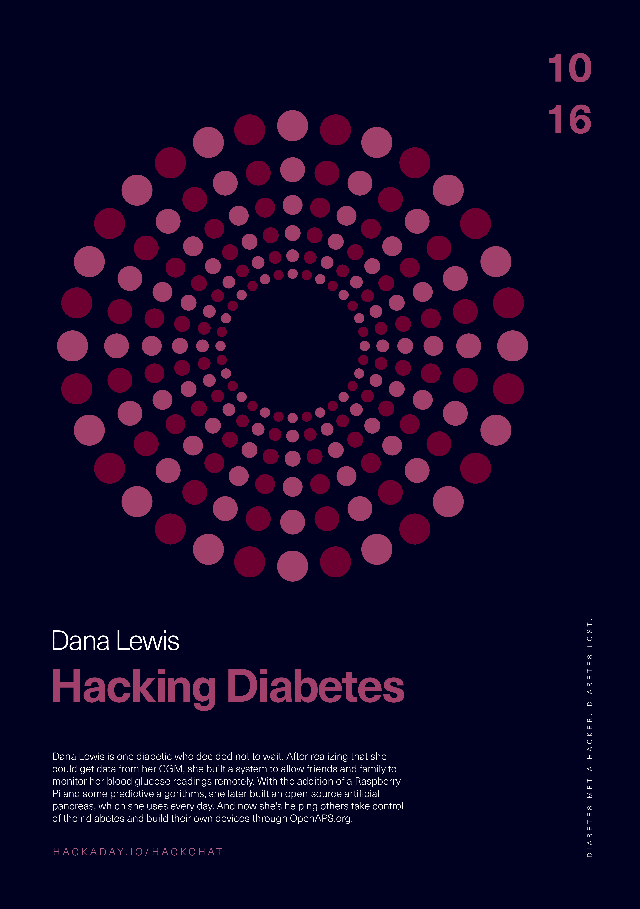

# 黑客糖尿病黑客聊天

> 原文：<https://hackaday.com/2019/10/14/hacking-diabetes-hack-chat/>

加入我们太平洋时间 10 月 16 日星期三中午与 [Dana Lewis](https://hackaday.io/hacker/449266-dana-lewis) 的[黑客糖尿病聊天](https://hackaday.io/event/166942-hacking-diabetes-hack-chat)！

当你的孩子被新诊断为 1 型糖尿病(T1D)时，每个人都会很快指出，“这是成为糖尿病患者的好时机。”在某种程度上，这是真的；多亏了基因工程胰岛素、更频繁甚至[持续的葡萄糖监测](https://hackaday.com/2018/12/03/why-is-continuous-glucose-monitoring-so-hard/) (CGM)和[胰岛素输注泵](https://hackaday.com/2016/12/19/closing-the-loop-on-an-artificial-pancreas/)，糖尿病患者现在可以避免长期血糖升高生活中的许多真正可怕的并发症，如心脏病、肾衰竭、失明和截肢。

尽管有这些进步，管理 T1D 可能是一项艰巨的任务。每一口食物、每一分钟的运动和每一次新陈代谢的挑战都必须被纳入胰岛素用量的计算中。糖尿病患者学会“像胰腺一样思考”，但这永远不够好，真正的人造胰腺的长期承诺似乎总是在未来五年内实现。

Dana Lewis 是一名决定不再等待的糖尿病患者。在意识到她可以从她的 CGM 中获得数据后，她建立了一个系统，允许朋友和家人远程监控她的血糖读数。通过添加一个树莓 Pi 和一些预测算法，她后来构建了一个她每天都在使用的开源人工胰腺。现在，她正在帮助其他人控制他们的糖尿病，并通过 OpenAPS.org 的[制造他们自己的设备。](https://openaps.org/)

加入我们的黑客聊天，Dana 顺便来讨论 OpenAPS 和她的人工胰腺。我们将了解她的背景——剧透:她开始这项工作时不是黑客——她面临什么挑战，OpenAPS 项目的状态，以及她认为人工胰腺将走向何方。

 我们的黑客聊天是 [Hackaday.io 黑客聊天群发消息](https://hackaday.io/messages/room/2369)中的社区直播活动。本周，我们将于太平洋时间 10 月 16 日星期三中午 12:00 坐下来讨论。如果时区让你烦恼，我们有[一个方便的时区转换器](https://www.timeanddate.com/countdown/generic?iso=20191016T12&p0=224&msg=Hacking+Diabetes+Hack+Chat&font=cursive)。

点击右边的那个发言气泡，你会被直接带到 Hackaday.io 上的黑客聊天群，不用等到周三；随时加入，你可以看到社区在谈论什么。

【Dana Lewis 图片来源: [GeekWire](https://www.geekwire.com/2017/dana-lewis/)

