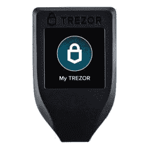

# 黑客攻击硬件比特币钱包:从 Trezor 中提取加密种子

> 原文：<https://hackaday.com/2021/02/04/hacking-hardware-bitcoin-wallets-extracting-the-cryptographic-seed-from-a-trezor/>

长期以来，人们普遍认为，保存加密货币最安全的地方之一是放在硬件钱包中。这些小巧便携的设备可以加密你的密钥，比把你的硬币放在软钱包或网络钱包里更让人放心。

当然，正如我们所知，没有什么是绝对安全的。

北海巨妖安全实验室提醒了我们这一事实，他们向我们展示了他们如何绕过一个流行钱包 Trezor 中的所有安全措施，转储并解密它的种子。

值得注意的是，黑客的确需要物理接触钱包——尽管只有大约 15 分钟的时间。我们所说的“物理访问”是指黑客彻底破坏了设备。北海巨妖团队从拆焊钱包的核心——STM 32 处理器开始。然后，他们把它放入接口板上的一个插座，开始出现故障。

黑客依靠一种被称为电压假信号的攻击。实际上，在设备启动序列中的精确定时时刻，电源电压会发生波动。这使得芯片的工厂引导加载程序能够读取其板载闪存的内容。存储器受读保护，但通过第二个电压毛刺可以一次访问 256 字节。这两种攻击都不是 100%有效，因此，如果设备无法启动或内存保持锁定，执行攻击的 FPGA 只会再次尝试。经过足够的迭代，北海巨妖团队能够完全转储芯片的闪存。

这里还有一个障碍—内存转储是加密的。输入蛮力。Trezor 设备允许的最大 pin 码长度为 9 位，但如果你假设普通用户的 pin 码只有 4 位，那么它可以在几分钟内通过自动脚本被猜出。即使是更长的 pin 也可以在几天或几周内完成——当然这是有可能的。这产生了种子，然后可以进入新的硬件钱包，以有效地窃取原始设备上的任何加密货币资产。

那么，除了一些很酷的硬件黑客技术，我们还能从北海巨妖安全实验室的工作中学到什么呢？首先，对于任何设计人员来说，STM32 都不适合高安全性应用。对于所有的最终用户来说，这并不意味着你需要扔掉你的 Trezor(尽管这不是我们见过的第一次钱包黑客攻击)。这意味着你应该让它远离其他人，你应该启用 BIP39 密码，北海巨妖说这可以防止攻击。也许最重要的是，这提醒我们所有人*没有什么是 100%安全的*。

 [https://www.youtube.com/embed/6pKuHYwrGkU?version=3&rel=1&showsearch=0&showinfo=1&iv_load_policy=1&fs=1&hl=en-US&autohide=2&wmode=transparent](https://www.youtube.com/embed/6pKuHYwrGkU?version=3&rel=1&showsearch=0&showinfo=1&iv_load_policy=1&fs=1&hl=en-US&autohide=2&wmode=transparent)

