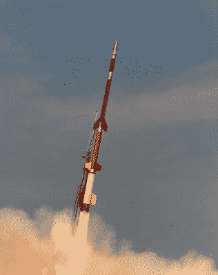

# 黑客入侵电离层，为了科学

> 原文：<https://hackaday.com/2019/05/10/hacking-the-ionosphere-for-science/>

想象一下第一个目睹极光的人会是什么样子。我们这个物种花了一段时间从它的赤道出生地迁移到极光常见的纬度，所以从地质学角度来说，这是一个相当新的事件。尽管如此，第一次看到被光污染破坏的天空中闪烁的微光和彩带肯定是可怕和激动人心的，就像其他自然力量的展示一样，它可能引发了神和魔鬼的故事。对我们大多数人来说，由于不知道极光究竟代表了什么而产生的神话和传说似乎有些古怪，但它是我们的祖先解释周围世界所需要的最好的模型。

然而，我们对极光的理解还需要更深入，因为我们现在知道它们不仅是一种美丽的大气现象，也是由我们的星球和恒星形成的庞大电磁系统的重要组成部分。理解它是如何工作的是一切事情的关键，从远距离通信到保持卫星在轨道上运行到长期天气预报。

但是一个人究竟如何研究极光呢？如此遥不可及、转瞬即逝的东西似乎很难研究。虽然这不是一门容易的科学，但直接研究极光是可能的，而且它涉及一些有趣的技术，实际上改变了它们，以某种方式使夜间的灯光秀更加美丽。

## 试探一下

A Black Brant XII sounding rocket taking off from NASA’s Wallops Island range. Source: NASA, public domain

尽管我们已经提高了对自然现象的认识，极光仍然是一个谜。当然，我们知道基本原理:当太阳风(从太阳向外流出的带电粒子流)的压力增加到可以穿透地球磁层的程度时，极光就会出现。当这种情况发生时，地表上方约 80 公里处的氧气和氮气被电离，在此过程中释放出可见光光子。光的数量和颜色是从太阳流入的能量的特征。

令人惊讶的是，直到最近才确定了极光的确切原因。在 1960 年之前，科学家们不知道电离是由于来自太阳的粒子流入，只有在有可能将仪器放入活跃的极光中时，才知道这一点。该实验是作为国际地球物理年(IGY)的一部分进行的，这是 1957 年和 1958 年由 67 个国家进行的一系列合作地球科学实验，其亮点是世界上第一颗人造卫星 *Sputnik* 。

在 IGY 实验期间，事实上从那以后，进入太空边缘的首选运载工具是探空火箭。探空火箭是小型火箭，至少与旨在将重型有效载荷送入轨道的火箭相比是如此。探空火箭通常是固体燃料的多级运载工具，有效载荷能力有限，通常限制在 50 到 150 公里的高度。它们的发射成本远低于轨道任务，但它们的弹道轨迹只给研究人员很少的时间来收集数据，通常是在火箭处于远地点时。

 [https://www.youtube.com/embed/weeEGY4SR38?version=3&rel=1&showsearch=0&showinfo=1&iv_load_policy=1&fs=1&hl=en-US&autohide=2&wmode=transparent](https://www.youtube.com/embed/weeEGY4SR38?version=3&rel=1&showsearch=0&showinfo=1&iv_load_policy=1&fs=1&hl=en-US&autohide=2&wmode=transparent)

## 按需极光

在过去的 60 年里，探空火箭一次又一次地证明了自己的高空任务，包括许多直接瞄准活跃极光的任务。最近的天蓝色任务是在挪威上空的极光上获得了一个壮观的靶心。极光区上升流火箭实验旨在探索电离层中粒子的垂直流动，并使用一种有趣的技术来实现这一目的。从挪威北部海岸的[安岛航天中心](https://www.andoyaspace.no/#)发射的[黑布兰特·Xi-A 探空火箭](https://en.wikipedia.org/wiki/Black_Brant_(rocket))配备了一个特殊的示踪剂释放包。在远地点，火箭释放出三甲基铝(TMA)，这是一种常用于半导体制造的有机铝化合物。TMA 与氧气反应，产生化学发光的云，从地面上很容易观察到。钡和锶的混合物也被释放出来，很快被电离，产生了类似的云。这些释放实际上创造了小的人造极光，供研究人员在随风飘荡时观察。

这两次发射产生了壮观的图像，被研究人员和附近的居民捕捉到了。

 [https://www.youtube.com/embed/F0fQCCuoGfs?version=3&rel=1&showsearch=0&showinfo=1&iv_load_policy=1&fs=1&hl=en-US&autohide=2&wmode=transparent](https://www.youtube.com/embed/F0fQCCuoGfs?version=3&rel=1&showsearch=0&showinfo=1&iv_load_policy=1&fs=1&hl=en-US&autohide=2&wmode=transparent)

 [https://www.youtube.com/embed/-_TgrjxpS-c?version=3&rel=1&showsearch=0&showinfo=1&iv_load_policy=1&fs=1&hl=en-US&autohide=2&wmode=transparent](https://www.youtube.com/embed/-_TgrjxpS-c?version=3&rel=1&showsearch=0&showinfo=1&iv_load_policy=1&fs=1&hl=en-US&autohide=2&wmode=transparent)

AZURE 只是一系列实验的一部分，这些实验旨在研究电离层内垂直风如何分布极光能量。还有更多的发射计划，所以挪威上空和其他探空火箭发射设施的烟花将持续一段时间，因为自然极光的美丽与火箭留下的痕迹相辅相成。