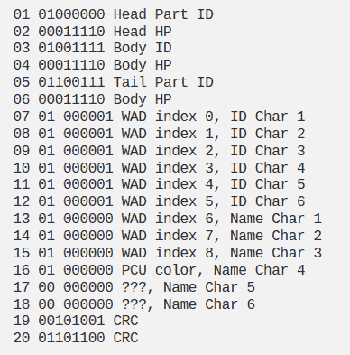

# 破解一款晦涩的手持游戏的射频协议

> 原文：<https://hackaday.com/2022/07/06/hacking-the-rf-protocol-of-an-obscure-handheld-game/>

当你想到老派手持游戏时，你可能会想到任天堂的 Game Boy line 或世嘉游戏装备。但是在这些现在的标志性系统之外，有一个庞大的古怪手持游戏亚文化在争夺青少年每周零用钱的一大块。其中许多确实很糟糕，坦率地说不值得记住，但有几个提供了可以说是超前于其时代的独特功能。

孩之宝(Hasbro)的短命游戏 P-O-X 就是这样一款游戏。正如[Zachary Ennenga] 所解释的，这款游戏在商店货架上没有花太多时间，因为它的核心概念是击败无法探测的外星入侵者，这些入侵者一心要摧毁我们的生活方式，事实证明，当它在 2001 年 9 月推出时，存在很多问题。但这并不意味着它没有一些很酷的想法，例如无线特设多人游戏功能，让你的游戏自动与附近的其他单位战斗。

从年轻时就对这一功能着迷，[扎克]开始研究这种相对便宜的儿童玩具是如何在即使是旗舰掌上游戏机仍然使用物理连接电缆进行多人游戏的情况下实现这一目标的。在他的探索过程中，一项[特别有用的专利](https://patents.google.com/patent/US20030040347A1/en)帮助了他，这项专利不仅给了他关于射频信号的频率、数据速率、调制和编码的线索，甚至还解释了游戏的逻辑和整体结构。文件中的许多内容似乎是孩之宝一厢情愿的想法，但通读营销演讲仍然发现了一些突出的技术细节。

A decoded P-O-X packet.

用 RTL-SDR、GNU 无线电、Inspectrum 和一点 Python 语言武装起来，[扎克]能够识别信号并开始解码过程。这就是事情变得真正有趣的地方，因为他的逆向工程过程的细节[广泛适用于各种未知的射频信号](https://hackaday.com/2019/06/04/your-table-is-ready-courtesy-of-hackrf/)。即使你和大多数人一样，对 21 世纪初失败的掌上游戏几乎没有兴趣，它也非常值得一读。他用来计算他的游戏正在传输的隐形敌人的名字和身体特征的技术，有一天可能会帮助你弄清楚如何[操纵你在后院安装的无线气象站](https://hackaday.com/2021/12/17/sdr-toolkit-bends-weather-station-to-hackers-whims/)的数据。

一旦他弄清楚了协议的主要部分，[扎克]就开始创建自己的数据包，并以一种真正的硬件能够识别的方式广播出去。他甚至想出了一些代码，可以自动与徘徊在他的标尺 1 范围内的游戏战斗，这在不可避免的 P-O-X 复兴时期可能会派上用场。

虽然这可能看起来像是在一个大多数人从未听说过的游戏中投入了很多努力，但我们会提醒你[一些曾经给这些页面](https://hackaday.com/2015/11/24/building-the-infinite-matrix-of-tamagotchis/)增光添彩的最伟大的黑客都有类似的追求。即使你是世界上唯一一个从你目前的研究和实验中直接受益的人，这个社区中仍然有很多志同道合的人，他们都很乐意在一旁为你加油。