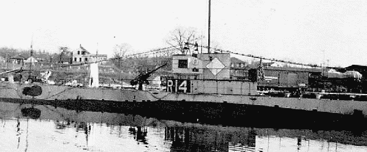
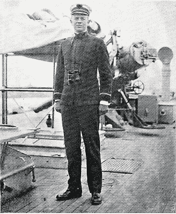
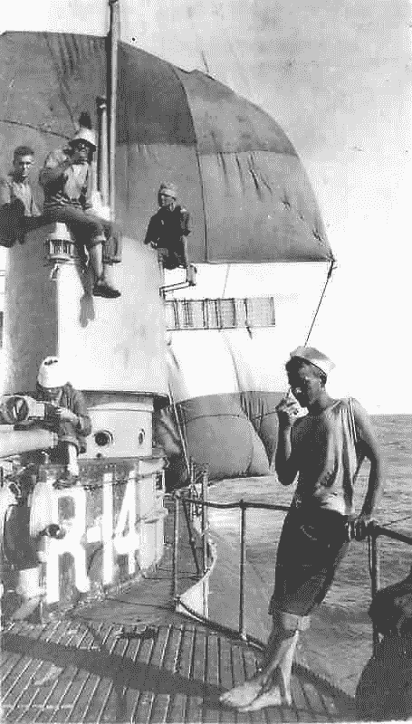

# 黑客何时算数:在潜艇里起航

> 原文：<https://hackaday.com/2018/10/17/hacking-when-it-counts-setting-sail-in-a-submarine/>

到 20 世纪初，海战经历了剧烈的技术变革。船只的引擎越来越好，速度越来越快，并配备了无线通讯设备，而海军航空兵也开始进入状态。然而，最引人注目的变化发生在海面下，勇敢的人把自己塞进钢管里，这些钢管是设计用来下沉的，通常是浮出水面的，他们用秘密和狡猾而不是蛮力进行攻击。潜艇正在成为世界海军的主要组成部分，尽管它是一种令人恐惧和憎恨的武器。

尽管水面舰艇上的水手和那些选择了潜航员生活的人之间有很多敌意，尽管战舰或巡洋舰与潜艇看起来有很大的不同，但他们都有一个共同点:与大海作战。水手和他们的船总是靠自己对付那些可以在瞬间将他们打死的力量。因此，长期以来，水手们会不惜一切代价安全返回岸边——即使这意味着把潜艇变成帆船。

## 海中之猪

*R-14* at the pier. Source: [Pigboats.com](http://pigboats.com/subs/r-boats2.html)

在现代人看来，第一代具有重要军事意义的潜艇非常原始。与当时的水面船只相比，它们很小，几乎没有装甲，航程有限，速度也不是特别快。他们在水下的时间也相对较少，大部分时间都在水面上活动，直到进攻的时候。在潜望镜出现之前，这意味着指挥官需要让他的潜艇浮出水面足够长的时间，以便在再次下潜之前将指挥塔弹出水面以获得方位。对于水面上的水手来说，这看起来像海豚的游泳，他们称之为“海猪”，所以他们把潜艇称为“猪船”

尽管他们的形象，美国海军的潜艇到第一次世界大战时已经相当复杂。这是 R 级船只的时代，用于海岸防御和港口巡逻。与当时大多数潜艇一样，这些潜艇采用混合动力推进:柴油发动机驱动发电机，为水下作业的大型电池组充电，电动马达转动螺丝。它们携带四个鱼雷发射管和一个安装在甲板上的 3 英寸舰炮用于水面攻击，可以在水面上以 13 节(25 公里/小时)的速度行驶，并携带足够的燃料覆盖 3700 海里(6900 公里)。

R-14 (当时潜艇还没有合适的名称)是该级 27 艘艇中的一艘。该艇建于 1918 年，基地位于夏威夷珍珠港，用于训练潜艇作战人员，并执行搜救任务。在一次这样的搜索任务中， *R-14* 将测试船只理论航程的极限以及船员的航海技术。

1921 年 5 月 2 日， *R-14* 被派遣去搜寻一艘失踪的船只，*号航空母舰康内斯托加*。这艘远洋拖船于 3 月下旬从加利福尼亚海岸的马雷岛起航，载着一艘满载煤炭的驳船前往美属萨摩亚。她本应停靠珍珠港，但一直杳无音信，所以 *R-14* 和其他潜艇组成的舰队被派去寻找她。

在几天毫无结果的寻找之后，R-14 回到了珠儿身边。5 月 10 日，当情况开始恶化时，她已经在夏威夷大岛东南 100 海里(190 公里)的地方了。该船的执行官兼代理指挥官亚历山大·道格拉斯中尉从他的工程人员处获悉，该船莫名其妙地没有燃料了。据大家所说，八天前离开珍珠港时，她的燃料仓里有 10，000 加仑的柴油，应该还有很多。但是她现在突然变得漫无目的了。

## 就这样吧

Lt. Roy Gallemore. Source: [Polk County Historical Quarterly](https://cdm17277.contentdm.oclc.org/digital/collection/dcterms/id/86/rec/74)

船长下令发出求救信号。呼叫被同样在搜救任务中的姐妹船 *R-12* 接收，并被转发到珍珠港。求救信息收到了，但是 *R-14* 一直没有收到确认。据他们所知，他们独自漂泊。

道格拉斯中尉评估了形势。电池只充了一部分电，但即使充满电，他们也无法把船开回珍珠号。他们只有五天的供应，他们似乎有一个坏了的收音机，不能指望任何帮助。事情看起来很糟糕，就像之前和之后的船长一样，道格拉斯中尉向他的总工程师寻求解决办法。

*R-14* under sail. Skipper Lt. Douglas is to the left on the conning tower. The mainsail is in the background. Source: [Pigboats.com](http://pigboats.com/subs/r-boats2.html)

罗伊·特伦特·加勒莫尔中尉在职业生涯开始时是美国海军学院的毕业生。也许是因为他年轻，也许是因为他最近在学院的经历，加勒莫尔想出了一个不寻常的主意:把潜艇变成一艘帆船。他们可以在船的上层建筑上安装桅杆和扶手，并用船员的吊床制作船帆。它不会很漂亮，也不会很快，但它会让他们再次前进。

道格拉斯中尉批准了这个非常规的想法，于是所有的人都开始工作。一些人把吊床缝在一起做帆，另一些人找到任何他们能找到的东西来装配它们。鱼雷装载起重机被带到甲板上进行组装；它可以作为由十二个吊床组成的前桅。上下铺的框架被拆开来做院子，杂色的组合被展开。船帆迎风，他们开始减速前进。它只有 1 节(1.8 公里/小时)，但对于统舱来说已经足够了，比无风时好多了。

船员们继续起航。六条毯子被缝合在一起，做成一面主帆，挂在指挥塔上明显无用的无线电天线杆上。这使他们的速度又增加了 0.5 节(0.9 公里/小时)，但 Gallemore 中尉还没有完成。他又订购了第三张帆，这次是八条毯子，装在船尾的第三根桅杆上。有了前帆、主帆和后桅， *R-14* 是一艘三桅方形帆帆船，是第一艘也是唯一一艘如此装配的潜艇。

## 徒劳

*R-14* 继续航行了四天，最快速度为 2 节(3.7 公里/小时)。不过这已经足够了——5 月 13 日，他们在夏威夷看到了库穆卡希角，两天后，他们利用电池动力成功进入希洛港。他们加满了燃料和淡水箱，维修了电池，然后起航回到他们的母港珍珠港，并于 5 月 17 日安全抵达。

多亏了加勒莫尔少尉的聪明才智和船员们的航海技术， *R-14* 经受住了考验。这比 T2 的康内斯托加 T3 要好得多；他们寻找的拖船于 2009 年在法拉隆群岛附近被发现，距离旧金山不远，距离潜艇搜索的地方有数千英里。很久以来，他们一直在执行一项毫无结果的任务，营救被海水淹没的船员，但是他们的航海技术和不惜一切代价的意愿使得 *R-14* 号和她的船员安全回家。