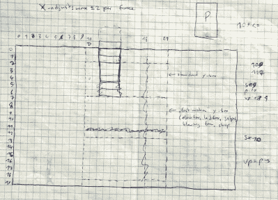

# 向国王致敬，宝贝:逆向工程公爵

> 原文：<https://hackaday.com/2019/06/08/hail-to-the-king-baby-reverse-engineering-duke/>

如果你是 20 世纪 90 年代 DOS 游戏的粉丝，你几乎肯定用过 DOSBox 在现代电脑上重播这些游戏。它允许你在一个虚拟环境中运行软件，这个虚拟环境可以复制一台与时代相适应的计算机。这对历史准确性来说很好，但如果你试图利用现代计算能力为这些经典书籍注入一些新的活力，这并没有多大好处。为此，你需要挖掘得更深一点。

 在过去的两年半时间里，[【尼古拉·伍德克】一直在为 1993 年的](https://lethalguitar.wordpress.com/2019/05/28/re-implementing-an-old-dos-game-in-c-17/) * [核弹公爵 II](https://lethalguitar.wordpress.com/2019/05/28/re-implementing-an-old-dos-game-in-c-17/) 做同样的事情。*最终结果是 RigelEngine，它是原始游戏二进制文件的开源替代程序，不仅可以在现代的 Windows、Linux 或 Mac OS 机器上运行，还可以在许多方面对原始游戏进行改进。一旦你知道游戏的原始源代码已经随着时间的流逝而丢失，他不得不盲目地做每件事，这一成就就更加令人印象深刻。

在一篇记录他迄今为止的进展的博客文章中，[Nikolai]解释了他用来确保他的重新实现尽可能精确到原始游戏的艰苦过程。他花了数不清的时间在 Ida Pro 中研究原始游戏的反汇编代码，手写出几页笔记和伪代码，试图了解幕后发生的事情。一旦游戏中的特定敌人或元素在 RigelEngine 中实现，他就会从他的版本中记录游戏，并逐帧与原始版本进行比较，这样他就可以微调体验。

那么两年多的工作和 25K 多行代码的最终结果是什么呢？由于近 30 年前游戏发布以来计算能力的惊人进步，[Nikolai]已经设法消除了加载屏幕的需要。他的引擎还能够一次在屏幕上显示无限数量的粒子效果，并且现在可以同时播放多种声音效果。在未来，他希望实现平滑的角色移动(在最初的游戏中，移动是以 8 个像素为增量)，并根据他们与杜克大学的距离来调整声音效果的音量。最终，一旦渲染缓冲区的一些问题得到解决，RigelEngine 应该能够用新的高分辨率纹理替换原始图形。

对于那些从小玩到大的人来说，很难夸大这些经典游戏的重要性。随着[约翰·罗梅洛仍在为原版《毁灭战士》](https://hackaday.com/2018/12/28/doom-retrospective-25-years-of-metal/)发布 DLC，黑客[拆解近 40 年的老游戏修复 bug](https://hackaday.com/2017/01/15/fixing-bugs-in-a-37-year-old-apple-ii-game/)，他们似乎没有任何被遗忘的危险。

 [https://www.youtube.com/embed/Z3gCS5LvC2s?version=3&rel=1&showsearch=0&showinfo=1&iv_load_policy=1&fs=1&hl=en-US&autohide=2&wmode=transparent](https://www.youtube.com/embed/Z3gCS5LvC2s?version=3&rel=1&showsearch=0&showinfo=1&iv_load_policy=1&fs=1&hl=en-US&autohide=2&wmode=transparent)

