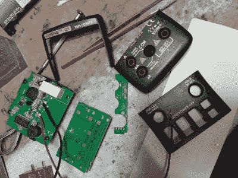

# 手持式万用表转换为台式使用

> 原文：<https://hackaday.com/2021/05/31/handheld-multimeter-converted-for-bench-top-use/>

几年前[Mechatrommer]得到了一个低成本的安能 Q1 万用表，并[将其转换成台式万用表](https://www.eevblog.com/forum/testgear/bench-dmm-from-portable-conversion-(aneng-q1-for-$50-all)/msg2509251/#msg2509251)。他首先尝试并失败了做一个液晶显示器的修改，并把它放在一边。它一直放在一个储存箱里，直到他需要另一个仪器来修理他的铷频标。发现现成的台式万用表实际上是现成的——它们对他的工作台来说太深了——他决定自己动手。

他把拆卸下来的安能 Q1 翻了出来，进行了一次比以前更彻底的改造，把万用表切成三份，然后把每一份装在一个新的外壳里。Q1 的耗电背光显示屏在电池供电的手持仪表中是个问题，但在台式设计中不是问题。[Mechatrommer]用主电源替换了电池组。接下来，他重新连接了所有被带锯中断的信号，现在仪表又恢复了活力。

最终的仪表足够令人满意(忽略侧面的输入插孔)，看起来像一个典型的自制测试设备。这个外壳有很多空的空间，他用来存放测试引线和三明治(我们在[达夫·琼斯]最近拆卸的便携式 Fluke 37 万用表中看到了类似的储藏室)。[Mechatrommer]想出了这个不寻常的转换项目。

如果你想了解更多，我们之前已经写过这些低成本万用表和更专业的万用表的区别。

感谢[阿德里安]的提示。