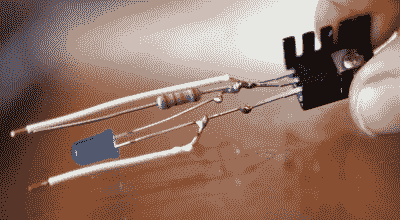

# 手持杀戮者激励棒可以轻松实现高压魔法

> 原文：<https://hackaday.com/2021/01/13/handheld-slayer-exciter-wand-makes-for-easy-high-voltage-magic/>

人们经常说，任何足够先进的技术都与魔法没有什么区别，当一个 DIY 设备让你轻轻一抖手腕就点亮了荧光灯泡，这肯定不难理解为什么。[Jay Bowles]的最新作品，[这个高压棒实际上是一个 Slayer 激励线圈](https://www.youtube.com/watch?v=WLwn_HTTNS8)，它能够将标准 9 V 碱性或可充电电池的输出提高到足够高的水平，以执行一些我们通常与更复杂的特斯拉线圈相关的无线电源技巧。

我们真的不能夸大它是多么简单，以建立一个自己的。当然，你仍然需要缠绕线圈，但如果你可以将 1/2 英寸的丙烯酸管插入电钻，你应该可以很快完成。一旦你用 32 号电磁线绕好次级线圈，你只需要几圈普通门铃线就可以组成初级线圈。

 认为手柄中一定藏着某种复杂的电子元件？远非如此。人造革包裹所隐藏的只是一个进行高速开关的晶体管，一个既充当电源指示器又充当电路二极管的 LED，以及一个电阻器。[Jay]以死虫的方式把它们放在一起，但是如果你想要更强大的东西，你可以在一块 perfboard 上做。

作为 STEM 教育的忠实信徒，[Jay]说魔杖被设计得尽可能对孩子友好，这样他就可以把它作为礼物送给他年轻的侄女和侄子。激励下一代肯定是我们在这些地区所尊重的事情，尽管我们认为如果有很多成年人在假期打开这样一个小玩意，他们不会失望。

如果你想玩一个杀戮者，但对整个哈利波特主题不感兴趣，你可能会对今年早些时候建造的更大更有能力的 T2 版本感兴趣。

 [https://www.youtube.com/embed/WLwn_HTTNS8?version=3&rel=1&showsearch=0&showinfo=1&iv_load_policy=1&fs=1&hl=en-US&autohide=2&wmode=transparent](https://www.youtube.com/embed/WLwn_HTTNS8?version=3&rel=1&showsearch=0&showinfo=1&iv_load_policy=1&fs=1&hl=en-US&autohide=2&wmode=transparent)

