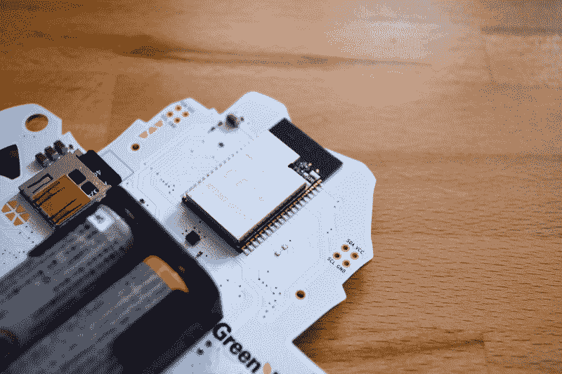
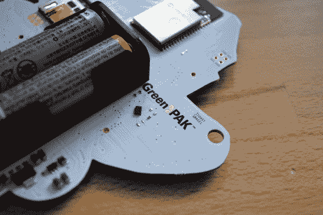
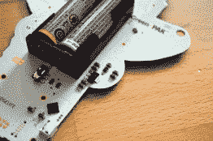
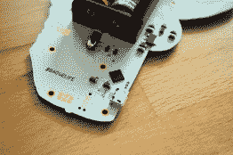
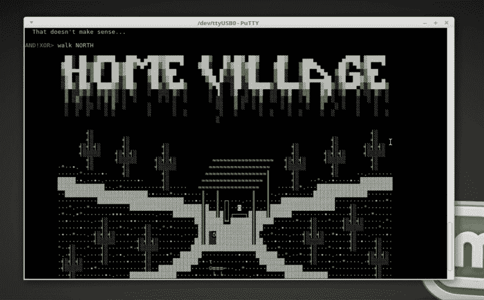
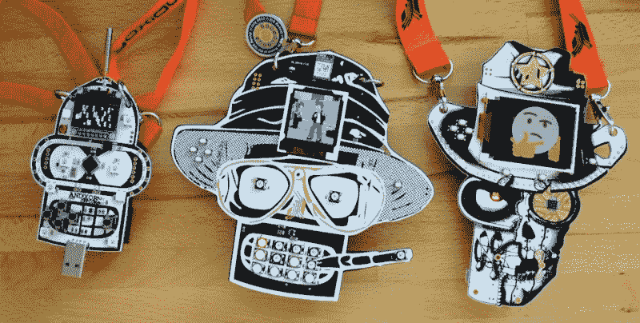

# 视频回顾:还有！XOR DEF CON 26 徽章

> 原文：<https://hackaday.com/2018/07/30/hands-on-andxor-def-con-26-badge/>

那个和！XOR 团队今年又一次超越了自己。他们最新的 DEF CON 26 非官方硬件徽章刚刚到达。这是硬件、软件和内置于两者的交互式挑战的令人愉快的创造。

他们称之为“物联网的狂野西部”，这个名字来源于美学以及徽章之间的通信功能。该徽章基于 ESP32-WROVER 模块，可为聚会带来 WiFi 和蓝牙，旨在在会议上形成一个无线僵尸网络。任何有徽章的人都可以努力提高他们的水平，并越来越多地控制僵尸网络。

查看[视频概述](https://youtu.be/fRIJB7pku-E)，然后在下面和我一起深入了解这个徽章所能提供的一切。

 [https://www.youtube.com/embed/fRIJB7pku-E?version=3&rel=1&showsearch=0&showinfo=1&iv_load_policy=1&fs=1&hl=en-US&autohide=2&wmode=transparent](https://www.youtube.com/embed/fRIJB7pku-E?version=3&rel=1&showsearch=0&showinfo=1&iv_load_policy=1&fs=1&hl=en-US&autohide=2&wmode=transparent)

几个月来，我一直在关注这个徽章的发展。该团队启动了 Kickstarter，成功筹集了 47，000 美元来制作徽章，几乎是前一年的四倍。我很高兴地看到，那些支持者现在在离骗局还有两周的时候收到了邮寄的徽章。

当在网上看这个设计时，它看起来很大，但拿在手里，它实际上是一个非常合理的尺寸。该板比去年的徽章窄得多——[查看我对那个](https://hackaday.com/2017/07/12/hands-on-new-andxor-unofficial-def-con-badge/)的评论——并且从三节 AA 电池减少到两节，所以它也轻得多。阻焊膜是白色的，带有黑色的丝网，使用阴影来增加细节。2017 年的 Bender 使用了哑光黑色饰面，这一款很有光泽，看起来很棒。镀金铜口音是一个很好的方式引人注目。我认为金色的使用相对于去年的设计是一个真正的改进，去年的设计不太明显。

## 本德的胆量

这个设计中使用的电子元件非常有趣。徽章的 [Hackaday.io 项目页面](https://hackaday.io/project/28389-andxor-dc26-badge)还没有物料清单，所以我不得不做一些猜测。有一个小小的加速度计，它的零件号我根本看不懂，但我想我已经找到了其余的。

主处理器是一个 ESP32-WROVER 模块。模块正在成为小型无线设备的事实上的标准，因为它们以前已经通过了 FCC，所以你的产品不需要。在屏蔽之下是一个 32 位双核处理器，它可以同时处理 WiFi 和 BLE，而天线则内置在模块伸出罐子的黑色部分。该团队选择的另外两种芯片使得该模块的 GPIO 处理变得更加容易。

  GreenPAK debounces and monitors the buttons  Power regulation  SL2102N USB chip

GreenPAK NVM 处理按钮。这是一种可编程设备，其操作类似于 FPGA 或 CPLD。它的任务是消除按钮的抖动。当检测到按下去抖按钮时，它会向 ESP32 监控的引脚发出中断，并通过 i2c 提供状态信息。另一个很酷的选择是 ISSI 的 IS31FL3736 LED 驱动器，它为 31 个 RGB LEDs 和单个红色 LED 提供服务，这是 Bender 的眼睛。该芯片扫描 12×8 矩阵，并通过 i2c 与处理器通信。外围芯片是硅实验室 CP2102N，它提供了与徽章的 USB 连接。

## 登录，向南走

我在去年的 DC 呆得太晚了，试图找到根源并解决一些关于班德徽章的困惑。今年的谜题似乎更好。徽章有一个“解锁”屏幕，作为记分牌显示你在徽章上发现的东西。最有可能的方法是通过串口。去年有一个蓝牙终端，今年是 USB，我认为它对用户更友好，而且它给徽章供电，而不是烧电池。

在视频中，我用终端玩了几秒钟，看看这个。除了您在*nix shell 中期望的命令之外，还支持基于文本的冒险游戏(想想 Zork)。在我的电脑上的终端窗口中播放这个，看到 ASCII 艺术出现，对我产生了非常有趣的影响。让这一切从一个定制的电子徽章上运行(而不是通过互联网远程登录)有一种拨号上网 BBS 游戏时代的怀旧感觉。

僵尸网络是我前几年没怎么探索的东西。它的基础包括徽章形成网状网络，并为您提供接管其他徽章的机制。我知道有些人对协议进行了逆向工程，并编写了代码来以非设计初衷的方式控制徽章。我们很想听听你关于过去几年僵尸网络的任何故事，所以请在下面留下评论！

## 这是定制硬件的绝佳时机

现在是评论的一部分，我对徽章制造者进行心理分析。令人捧腹的是，你可以从 DC24 的无辜、纯粹的 Bender，到 Bender on a Bender 的亨特·S·汤普森艺术，追踪徽章艺术的弧线，现在今年他看起来更不适合穿 IoT 的狂野西部。我从阅读项目日志中知道这是受*西部世界*的启发，但我忍不住将这与和的进化相比较！XOR 作为一群人。

过去三年投入的时间和创造力是史诗般的。有了第一枚徽章，他们并不知道他们将要面对的全部情况。现在，一路上的陷阱是意料之中的，但他们仍然推动自己接受新的有趣的挑战，并制造出大量的徽章。我真的希望他们选择保持这种状态，因为我们所看到的！XOR 是定制硬件领域的一个奇观，它出现得太少了。