# 动手:而且！XOR DEF CON 27 Badge 沟渠弯曲器，采用光管

> 原文：<https://hackaday.com/2019/07/29/hands-on-andxor-def-con-27-badge-ditches-bender-adopts-light-pipes/>

和的最新产品！XOR 团队出局了，它提供了硬件徽章所缺少的东西:光导管。不是开玩笑，DEF CON 27 版和！XOR 徽章将是最容易识别的，因为两个弧形的光导管材料在三维空间中闪烁着 RGB 亮度。但是如果你能把目光从这种奇怪的东西上移开，你会发现这个新设计有很多可爱之处。

## 离开本德

这是班德徽章吗？狂热崇拜#Badgelife 的粉丝们会记得热门剧集 *Futurama* 中的 Bender 角色是和的官方吉祥物！XOR 团队，因为他们开始制作徽章。这个徽章脱离了这种美学，设计达到了一个新的深度，带着防毒面具，穿着帽衫的角色更让人想起*的辐射*。

[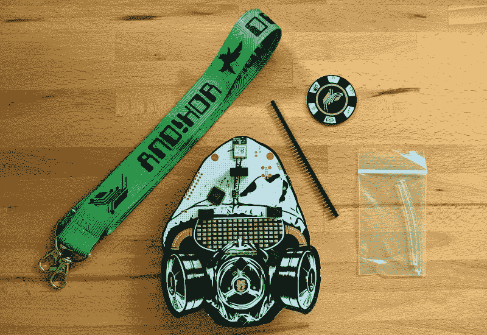](https://hackaday.com/wp-content/uploads/2019/07/ANDNOTXOR_DC27_whats-in-the-bag.jpg)

是的，有一个漂亮的护目镜形状的 RGB 矩阵，但真正吸引我眼球的是艺术和它在这块板上的处理方式。即使没有打开，这个徽章看起来也很棒。这幅画是凯文·彭特科斯(Kevin Pentecost)的作品，他是去年 DEF CON 上给他们画插图的团队的粉丝。

 [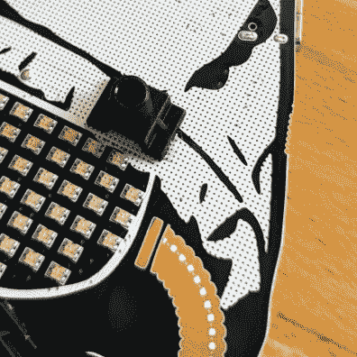](https://hackaday.com/2019/07/29/hands-on-andxor-def-con-27-badge-ditches-bender-adopts-light-pipes/andnotxor_dc27_light-pipe-and-silkscreen-detail-2/)  [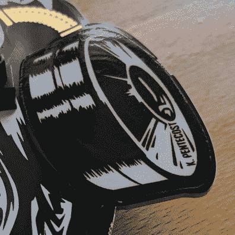](https://hackaday.com/2019/07/29/hands-on-andxor-def-con-27-badge-ditches-bender-adopts-light-pipes/andnotxor_dc27_glow-in-the-dark-stickers/) 

熟悉的黑色，白色和金色的 PCB 调色板在这里工作，但很容易弄错它是如何使用的。在这种情况下，白色是阻焊膜，由护目镜两侧露出的金色表示，护目镜上有白色反射标记。黑色丝网作为帽衫上非常精细的圆点矩阵，给眼睛带来有趣的色彩，并在手指下形成纹理。两者都有光泽，完美的画面完成。

但是仔细看，你会发现一个新的窍门在起作用:贴纸。防毒面具的两个滤毒罐是贴纸，其表面使其易于使用内置于下方电路板中的电容式触摸滚轮。同时，这为徽章带来了夜光磷光材料。

 [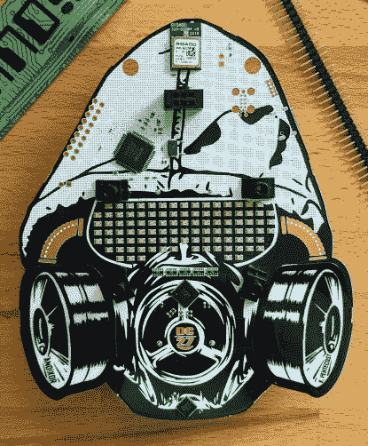](https://hackaday.com/2019/07/29/hands-on-andxor-def-con-27-badge-ditches-bender-adopts-light-pipes/andnotxor_dc27_straight-front/)  [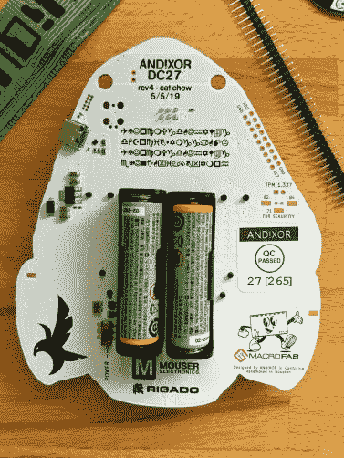](https://hackaday.com/2019/07/29/hands-on-andxor-def-con-27-badge-ditches-bender-adopts-light-pipes/andnotxor_dc27_straight-rear/) 

和的所有旧版本！XOR 徽章包括一个屏幕，有机发光二极管或液晶显示器。这一款远离了 RGB LED 矩阵。我将护目镜的设计与 2018 年的[DC 皮草徽章紧密联系在一起。这在当时是个好主意，现在也是。布局打破了矩形的单调，原因很明显，但仍然允许滚动字符，就像你使用单调的 LED 标志一样。在你可以有一个 7×17 矩阵的地方，你只损失了 17 个 led 到总共 102 个像素的艺术形状。真是两全其美。在这里，我一点也不想念屏幕——徽章怎么能和你智能手机上的东西竞争呢？这种竞争方式是任何智能手机都无法想象的。](https://hackaday.com/2018/08/21/all-the-badges-of-def-con-26-vol-2/#dcfurs)

我不喜欢徽章正面的两件事:附加连接器和 Rigado 模块，它们都靠近电路板顶部，打断了电路板其余部分的美丽设计。对此有一个简单的解决方案:用一个附加物把它们盖住。还有！XOR 发给我他们今年参与的所有三个模块，这是今年最有趣的发展之一。

## 当附加产品不再依赖于徽章时

向 Hyr0n 致敬，他不再称这些为“低劣的附加产品”,而开始称它们为“高级附加产品”。他们在设计上全力以赴，我们实际上谈论的是独立的迷你徽章，碰巧与插入其他徽章兼容。

   [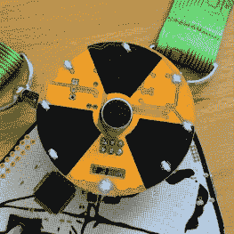](https://hackaday.com/2019/07/29/hands-on-andxor-def-con-27-badge-ditches-bender-adopts-light-pipes/andnotxor_dc27_sao-audio/)  [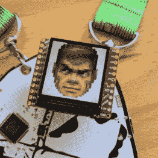](https://hackaday.com/2019/07/29/hands-on-andxor-def-con-27-badge-ditches-bender-adopts-light-pipes/andnotxor_dc27_sao-doom/) 

团队把三个插件都发给了我。有基本的 bender，音频反应骚(修订版 6)，和[的厄运骚](https://hackaday.io/project/164346-andxor-dc27-badge/log/165849-dc27-doom-sao-hurt-me-plenty)(修订版 1)从和！XOR 的最新成员，帕克·迪尔曼。(你可能从 Macrofab 播客中知道帕克[，这是他日常工作的一部分。)三者都在板上运行微控制器，同时通过 3×2 接头的 I2C 引脚提供对外部世界的访问，这是](https://macrofab.com/blog/podcast/) [SAO V1.69bis 标准](https://hackaday.io/project/52950-shitty-add-ons/log/159806-introducing-the-shitty-add-on-v169bis-standard)。

本德做了很好的工作，归还了球队的吉祥物，并提供了他们第一个徽章的经典饰品[。同时，还有一个隐藏的串行输出。如果您有东西来读取输出就好了。嘿，你很幸运！那个和！XOR DC27 badge 本身是一个硬件黑客工具，可以嗅探串行(我一会儿会讲到)。事实上，末日骚也能做到。除了返回一个屏幕到徽章，毁灭战士 SAO 还内置了一个串行嗅探器，可以读取 Bender 插件的输出。第三个插件有一个驻极体麦克风，并根据环境噪音闪烁其 LED。](https://hackaday.com/2016/07/25/hands-on-the-andxor-unofficial-def-con-badge/)

## 绕硬件一圈

[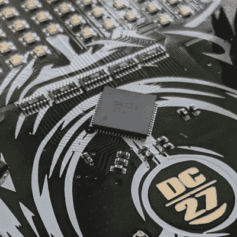](https://hackaday.com/wp-content/uploads/2019/07/ANDNOTXOR_DC27_oddly-satisfying-trace-routing.jpg) 让我们退一步，惊叹我们用屈指可数的集成电路和极少的无源器件能做些什么。驱动该系统的是里加多 BMD-340 模块，这是车队 2017 年徽章的一个熟悉的功能[。它运行一个 NRF52840 内核，并为这些徽章和会议上其他徽章之间的僵尸网络游戏提供无线连接。](https://hackaday.com/2017/07/12/hands-on-new-andxor-unofficial-def-con-badge/)

这种闪烁由一个 ISSI 芯片和五个电阻网络来处理。今年是 IS31FL3741。对于那些近距离观看的人来说，这个展示的路线包含了隐藏的美。徽章输入的用户使用 Azoteq IQS333 通过电容式触摸来监控两个滚轮和此处显示的 DC27 设计的中心垫。由于 Skyworks 升压转换器(AAT1217-3.3)，所有这些仅由两节 AA 电池供电。

这个徽章，还有 Doom SAO，正通过使用 USB-C 连接把我们带入 21 世纪。久经考验的 LM1117 调节来自该连接的输入功率。结实的 FTDI FT2232H 为此板提供两个独立的 USARTs。我一开始就错误地尝试了我的串行连接，得到了一个肥胖的无汉堡。那是因为交替现实游戏在 USB1 上，USB0 连接是为了内置的黑客工具。

[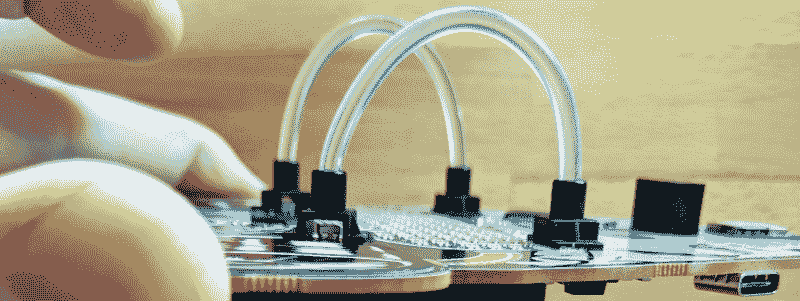](https://hackaday.com/wp-content/uploads/2019/07/ANDNOTXOR_DC27_light-pipe-receptacle.jpg)

我不完全确定我对这个徽章上的光导管有什么看法。在未来的设计中，这无疑是一个有用的技巧。每个塑料插座通过两个小孔扣在板上。横跨在电路板表面的 RGB LED 上，为柔性光导管材料提供了固定装置。正如你在文章顶部的图像中看到的，它们很好地将一些光从管的侧壁扩散出去，如果你观察管道的末端，光发射非常强。

## Lulz 潜伏在里面

我喜欢看到有人考虑让这些徽章在会议结束后值得保留。(我在骗谁，它们是艺术品，每个人都把它们放在身边。)换 DC27 徽章，还有！XOR 花时间尽可能多地利用 FTDI 芯片，最终获得了一个多功能的硬件黑客工具，可以通过 OpenOCD 使用串行、I2C、SPI 甚至 JTAG。

 [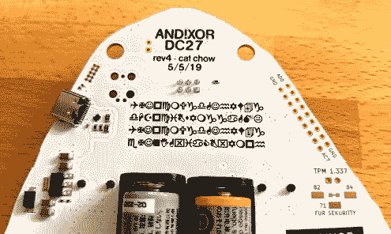](https://hackaday.com/2019/07/29/hands-on-andxor-def-con-27-badge-ditches-bender-adopts-light-pipes/andnotxor_dc27_rear-cypher/) Solve this cipher  DIP header for logic analyzer, etc. What a curious footprint just below that!

不想和硬件协议打交道？你可以用你的头去撞数字墙来尝试解决替代现实游戏。想想佐克，但他更刻薄。这是和的部分！XOR 宇宙，我总是希望我花更多的时间。当你进入徽章终端时，你可以通过点击 tab 键获得命令列表。(提示:打开大写锁定。)在那里，你可以发出命令，控制徽章本身，其中基于文本的故事游戏，或者与其他徽章无线播放的僵尸网络。

要想真正成功，你必须四处寻找切向的谜题来解决，比如徽章背面的密码。我还注意到启动时 DC27 在 led 上显示时有一种奇怪的闪烁，我敢打赌那里藏着数据。你会在发布视频、推特和其他地方找到线索。

## 神奇之处在于它们是如何组合在一起的

 [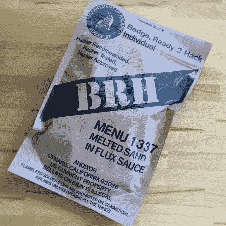](https://hackaday.com/2019/07/29/hands-on-andxor-def-con-27-badge-ditches-bender-adopts-light-pipes/andnotxor_dc27_packaging-front/)  [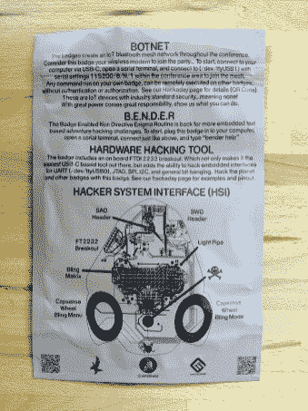](https://hackaday.com/2019/07/29/hands-on-andxor-def-con-27-badge-ditches-bender-adopts-light-pipes/andnotxor_dc27_packaging-rear/) 

All-in-all 这是一个可爱的硬件，但真正的魔力是在整个包的和！XOR 团队设法在今年和之前的每一年的冒险中齐心协力。我对他们在包装上的创造力感到惊讶——去年他们用粗麻布袋子装运，今年你会得到一个美军“即食餐”风格的袖子。每年都会有新的硬件出现，徽章一出来我就迫不及待地想看——去年我看了格林帕克 NVM 和 ISSI driver，今年是光管和贴纸。虚拟现实游戏是无与伦比的——而且！XOR 在无线协议方面做了如此伟大的工作，以至于多年来许多其他徽章制造商都采用了它们来加入僵尸网络游戏，徽章中基于文本的领域非常令人愉快，非常吸引人。

他们有大量的追随者，并且非常擅长在全年和整个骗局中推动暗示的耳语运动。他们围绕这个项目发布的媒体——从令人惊叹的图像和视频到出色而全面的文档——让我目瞪口呆。今年，他们正在尝试一些新的东西，只向支持者提供大约 25%的徽章，这些徽章已经销售一空。其他 75%的徽章费用由公司赞助支付，因此团队将在 DEF CON 27 和 B-Sides Las Vegas 免费发放徽章，优先考虑参加活动的社区性质的人员:演讲者、帮助他人的人员等。

所有这些加起来不仅仅是设计和销售徽章。这是一场有意义、有意义的运动。这个“东西”是什么，很大程度上取决于谁会出现和参与，我真的很喜欢这样。