# 动手:而且！XOR 非官方 DC28 徽章采用亚克力材质

> 原文：<https://hackaday.com/2020/08/07/hands-on-andxor-unofficial-dc28-badge-embraces-the-acrylic-stackup/>

依然火热的从焊党，[一个新的和！XOR 徽章](https://hackaday.io/project/173627-andxor-dc28-badge)刚刚落在我的桌子上，这是过去五年来一直过着#badgelife 的黑客团队提供的。这个设计最初是基于 *Futurama* 中的角色 Bender，现在已经变得让人认不出它是那个好战机器人的后代了。相反，我们有一个骷髅侏儒，他的脸被一个以齿轮为主题的面具遮住了一半。

[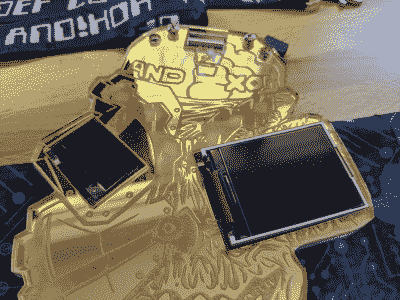 ](https://hackaday.com/wp-content/uploads/2020/08/ANDNOTXOR_DC28-acrylic-effect.jpg) [ 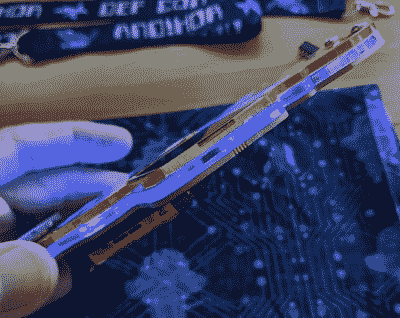](https://hackaday.com/wp-content/uploads/2020/08/ANDNOTXOR_DC28-side-acrylic-stackup.jpg)

乍一看，你可能甚至没有注意到角色设计，因为你太被硬件美丽的沉着分散了注意力。今年的徽章包括红色电路板上的双层丙烯酸树脂。任何在徽章设计中使用过亚克力挡板的人都会告诉你，材料和激光切割时间的成本非常高。在这种情况下，徽章的整体美感基于镜面金色的外观，艺术细节激光蚀刻在背面。这是一个独特的闪闪发光，甚至没有打开电源。

[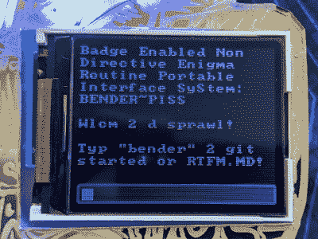 ](https://hackaday.com/wp-content/uploads/2020/08/ANDNOTXOR_DC28-160x128-LCD.jpg) [ 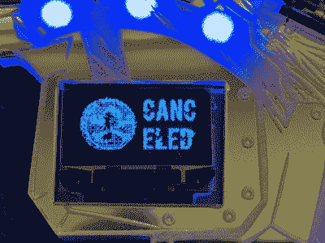](https://hackaday.com/wp-content/uploads/2020/08/ANDNOTXOR_DC28-standard-64x128-oled.jpg)

当你打开固定在徽章背面的三节 AAA 电池旁边的硬开关时，你会看到隐藏在面板蚀刻部分下的 RGB LEDs，以及 128×64 有机发光二极管屏幕和 160×128 彩色 LCD。较大的屏幕提供了菜单系统，通过骨骼侏儒像腰带一样佩戴的黑莓键盘进行导航。

[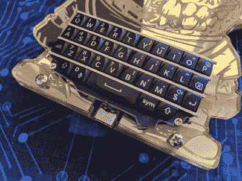 ](https://hackaday.com/wp-content/uploads/2020/08/ANDNOTXOR_DC28-front-keyboard-and-acrylic.jpg) [ 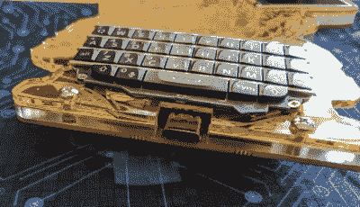](https://hackaday.com/wp-content/uploads/2020/08/ANDNOTXOR_DC28-front-usbc-and-acrylic-stackup.jpg)

黑莓键盘是今年的热门趋势，因为我们已经看到[黑莓 PMOD 键盘](https://hackaday.io/project/165511-bb-q10-keyboard-pmod)每次击中 Tindie 都会销售一空，以及像[LoRa QWERTY Messenger](https://hackaday.com/2020/07/30/join-your-own-private-lora-mesh-network/)这样的项目将它们用于美味的背光用户输入。为什么不呢？最初的硬件是全垒打，所以剩余的替换库存现在被硬件黑客接受是有道理的。

如果你不想用拇指的边缘输入任何东西，电路板底部的 USB-C 端口可以提供终端访问。一个非常好的接触是，徽章还列举了 USB 大容量存储，提供了访问自述文件以及加载新动画，图像和基本程序的方法。

 [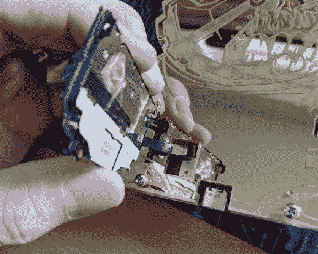](https://hackaday.com/2020/08/07/hands-on-andxor-unofficial-dc28-badge-embraces-the-acrylic-stackup/andnotxor_dc28-keyboard-removal/)  [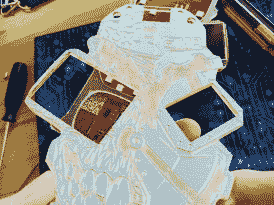](https://hackaday.com/2020/08/07/hands-on-andxor-unofficial-dc28-badge-embraces-the-acrylic-stackup/andnotxor_dc28-machined-acrylic-detail/)  [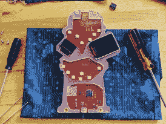](https://hackaday.com/2020/08/07/hands-on-andxor-unofficial-dc28-badge-embraces-the-acrylic-stackup/andnotxor_dc28-laid-bare/) 

组装这些东西一定很麻烦。键盘附有一些透明的粘性安装方块和两个拧入面板孔的小螺钉。这还不是最难的部分……电缆穿过一个孔，在叠层下面的某个地方形成一个环，然后卡入电路板上的一个连接器。四个螺钉凸台将丙烯酸固定在适当的位置，两个屏幕粘附在丙烯酸的间隔层上。把它拆开，我们可以清楚地看到激光蚀刻亚克力的下面。

[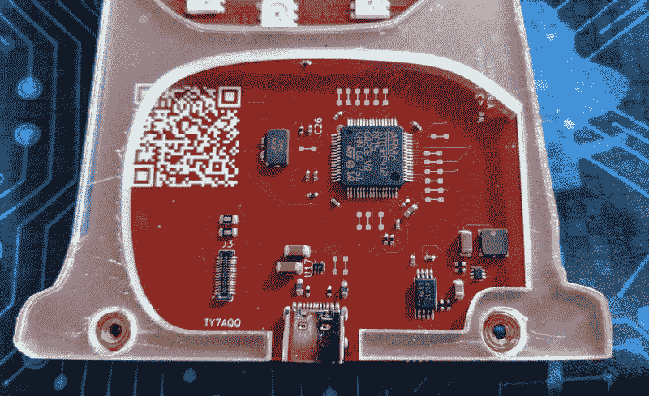](https://hackaday.com/wp-content/uploads/2020/08/ANDNOTXOR_DC28-ciruit-detail.jpg)

STM32F412RET6 是设计的核心。LED 数量远少于前几年，因此没有专门的 LED 驱动器。当时的选择是使用 APA-102 RGB led，由简单的 SPI 信号驱动。如果你想知道金色的可切割痕迹，[Zapp]说他在制作徽章原型时使用它们，以防组件需要重新布线。通常它们会被隐藏起来，但由于电路板被丙烯酸树脂覆盖，他把它们留在了生产电路板上。

那个结实的二维码？是的，它解析成一个粗略的网址:

```
https://secure.verylegit.link/private-key(3ad-shockwave-flash.jar.docm
```

进一步的调查显示，它导致 302“暂时移动”重定向，这是…你可能已经猜到了…到我们的朋友理查德·保罗·艾斯特利的视频。

## 游戏，文化，好东西

这些徽章的真正乐趣在于包裹在固件内部的谜题和互动活动。我还没有时间深入研究这些，但它们和前几年一样存在，包括一个公共的 Slack 频道，在那里可以进行朋友交流，以解开内心的挑战。在项目文档页面的[中提到了一些捕获标志的指导原则。](https://hackaday.io/project/173627-andxor-dc28-badge)

 [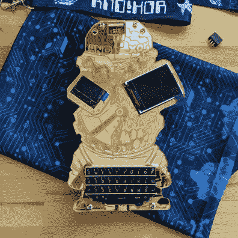](https://hackaday.com/2020/08/07/hands-on-andxor-unofficial-dc28-badge-embraces-the-acrylic-stackup/andnotxor_dc28-overview-front/)  [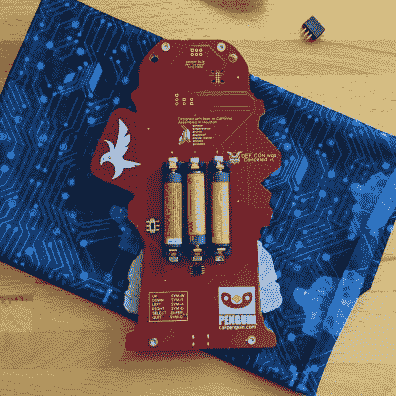](https://hackaday.com/2020/08/07/hands-on-andxor-unofficial-dc28-badge-embraces-the-acrylic-stackup/andnotxor_dc28-overview-rear/) 

那个和！XOR 徽章一直是收藏家最热门的非官方 DEF CON 徽章之一，今年也不例外。当然，这完全不同，因为 DC 实际上被取消了，我们都在社交上疏远了。当没有人在中心时，你如何分发数百个徽章？

像往常一样，他们生产了几百个这样的徽章。他们中的一些被卖掉了，但是大多数徽章是免费赠送的，由赞助这个徽章的公司赞助。免费徽章的分发方案非常棒，[将徽章的缓存发送给遍布北美各地的可信黑客](https://twitter.com/ANDnXOR/status/1289940130455724033)，然后将这些徽章分发给解决挑战或“做伟大黑客事情”的人。

[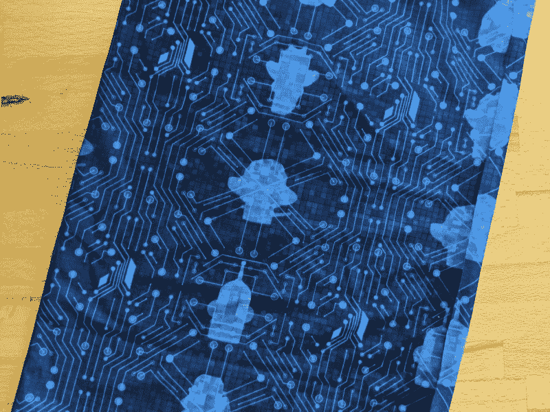](https://hackaday.com/wp-content/uploads/2020/08/ANDNOTXOR_DC28-sleeve.jpg)

在总结这篇评论时，我不能不提到徽章到达时是如何包装的。这种有弹性的袖子在防静电包周围提供了一点衬垫，可以用作疫情面具。但是仔细看，您会发现这是定制的印刷材料，包括和的轮廓！在此之前的 XOR 徽章。这是独一无二的，令人难以置信的棒，证明了团队致力于使他们的徽章的一切都棒，因为他们可以。

 [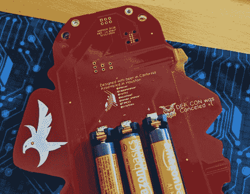](https://hackaday.com/2020/08/07/hands-on-andxor-unofficial-dc28-badge-embraces-the-acrylic-stackup/andnotxor_dc28-rear-top-detail/) Soldered screw bosses and tag connect [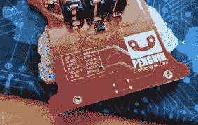](https://hackaday.com/2020/08/07/hands-on-andxor-unofficial-dc28-badge-embraces-the-acrylic-stackup/andnotxor_dc28-rear-instructions/) Instructions for keyboard navigation [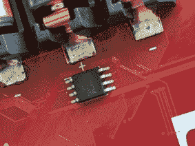](https://hackaday.com/2020/08/07/hands-on-andxor-unofficial-dc28-badge-embraces-the-acrylic-stackup/andnotxor_dc28-rear-winbond-ship/) Power controller on back of board