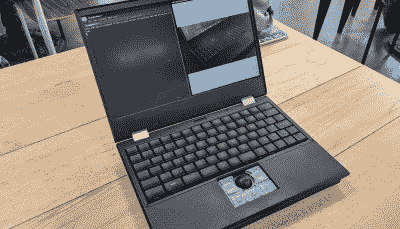
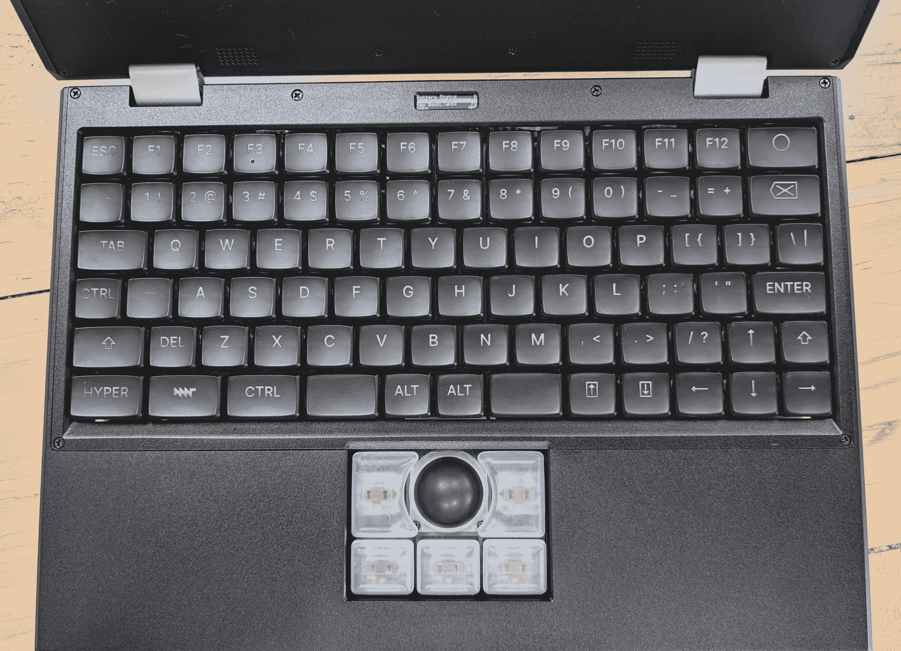
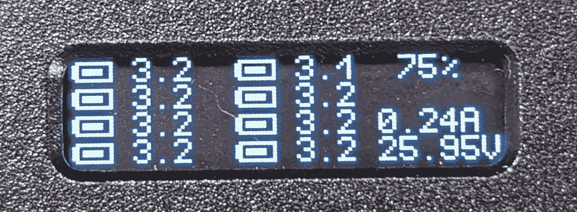
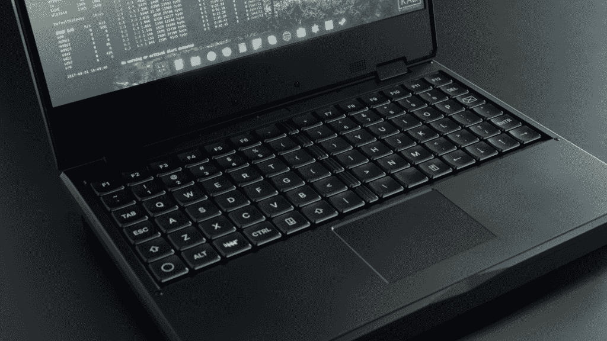
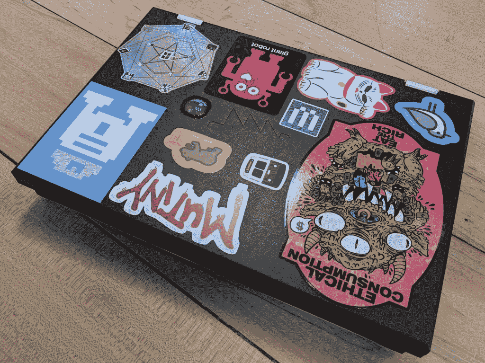
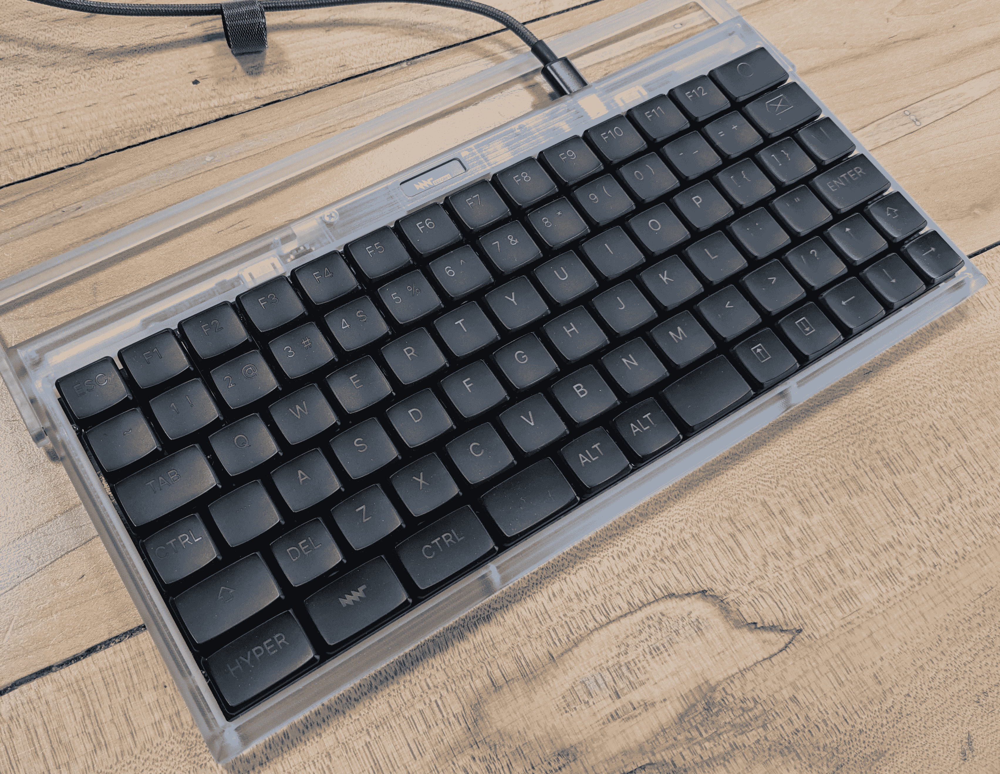

# 动手操作:MNT 改造笔记本电脑

> 原文：<https://hackaday.com/2021/08/26/hands-on-mnt-reforms-the-laptop/>

当我们在咖啡厅见到我们的 MNT 联系人时，他正静静地在笔记本电脑上工作。它乌黑而厚实，就像一本百科全书，与周围桌子上的银色 MacBook 外观的海洋不太合拍。在经历了所有的速度和馈送后，我们急切地拿出我们的 64 件驱动程序套件来打开它，看看是什么让这个奇迹滴答作响，但当笔记本电脑被翻过来时，很明显不需要任何工具。机器的整个底部是一个透明的丙烯酸矩形，显示出从裸露主板上的尖锐白色状态 led 到整齐排列的单个 18650 LiFePO4 电池单元的一切。从某种意义上说，这是对整个产品的总结:这是一台真正的笔记本电脑，你可以用它来完成工作，它的每个元素从设计到制造都是完全透明的。

The MNT Reform

这张照片中的设备被称为[改革，由德国柏林的 MNT](https://mntre.com/) 公司设计和制造(注意 MNT 代表 MNT，它不是首字母缩写)。改革是一个完全开源的笔记本电脑，今天发货，并通过[大众供应](https://www.crowdsupply.com/mnt/reform)分销。如果审美没有清楚地表明，改革是一个固执己见的产品，从头开始设计，以优化自由中的自由:从它的固体金属机箱到内部运行的无斑点 GNU/Linux 发行版。

我们在这里告诉你，我们已经举行了一次，它是真实的，而且建造得非常好。

# 确切的数字

让我们先把规格清单弄清楚。目前发货的 MNT Reform 由模块上的 [Boundary Devices Nitrogen 8M 系统提供支持，该模块包含一个四核 1.5 GHz ARM64 处理器(恩智浦 i.MX8M Quad)和 4 GB RAM。这被封装在一个模块中，该模块插入主板上的 SODIMM 插槽，旁边是标准的 M key m.2 2280 插座，用户可以选择 PCIe 作为 NVMe 驱动器，还有一个迷你 PCIe 卡插槽用于 WiFi 或蜂窝无线电。总之，这应该是一个可用于日常使用的硬件包，特别是快速的 PCIe 存储，尽管按照现代个人电脑甚至高端智能手机的标准，处理器会有点乏力。](https://boundarydevices.com/product/nitrogen8m-som/)

沿着笔记本电脑机箱的边缘露出的是 USB 中的三个 USB 3 端口——A 外形规格、全尺寸 SD 卡、1/8”TRRS 插孔、千兆位以太网和通过桶形插孔供电。如果我们今天从头开始设计一台机器，我们希望看到 USB-C 和电源传输取代桶形插孔，但这是一个小抱怨，正如俗话说的那样，资源是可用的，所以我们总是可以自己解决这个问题！

转到外部，我们可以报告说，MNT 改革的感觉与它在所有图片中的样子完全一样；就像机器的一块砖。这种特殊的单位已被亲切地挑选，但珠爆破，数控铣削底盘绝对是每一点都像我们所希望的那样建造良好。在传统的笔记本电脑评论中，轻薄笔记本电脑因其摇摆不定的弯曲屏幕和未能通过“单手打开测试”而受到严厉批评，该测试检查显示器是否可以在没有第二只手的情况下打开，以保持电脑的底座放在桌子上。改革在这两个部门都没有问题。屏幕脱离了它的磁铁，发出令人满意的砰的一声，在坚硬的铰链上平稳地打开超过 180 度，看不到任何抱怨或弯曲。

# 人类接口

由于没有摄像头或内置麦克风，操作员与 MNT 改革的主要界面是通过键盘和指点设备。正如敏锐的读者无疑已经注意到的那样，与你在最喜欢的电子产品零售商那里买到的铝片相比，这款便携式电脑相当厚。但是厚度在接口部分有一些实实在在的好处。

首先，我们将指出指点设备，这是一个模块化的 USB 外设，用户可以在购买机器时指定。除了 1337-hacker 选择完全不使用指点设备之外，这项改革还有两种配置可供选择；触控板和豪华轨迹球。

An exploded trackball schematic

我们没有亲眼见过触控板，所以只能猜测它是如何操作的。这是一种现成的电容，封装在玻璃下，让您的手指尽可能平稳地滑动。它支持多手指手势的标准范围，我们确信它非常好。但这是 Hackaday，所以我们绝对兴奋地在光荣的轨迹球上得到我们的数字。

轨迹球是一个强调美感的选项，改革是为了满足人们的需求。球和五个机械键被打包到与触控板相同的矩形表面区域，允许安装任何一个，但有足够的空间进行操作。这个球的直径为 2.5 厘米，在粘性和光滑度之间达到了恰到好处的平衡，粘性有利于手指抓握，光滑度便于滚动。值得注意的是，这个球足够大，很容易执行精确的移动而没有太多麻烦，这是我们以前在小轨迹球上遇到的问题。

指点器上面是键盘，这是什么键盘。作为发烧友，我们很高兴地看到，这里不同寻常的深底盘再次被用来包括真正的机械开关，以获得优质的打字感觉。这些不是全尺寸的按键开关，而是 Kailh Choc 低轮廓开关。即便如此，它们也提供了 3 毫米的行程，更接近传统全尺寸 Cherry MX 开关的 4 毫米，而不是苹果 2021 年键盘的 1 毫米。

键盘布局并不完全标准，但只要稍加输入，我们认为这不成问题。另一个值得注意的细节是键帽本身。Kailh Choc 开关使用特殊的键帽，典型的是现代笔记本电脑上流行的完全扁平的 chicklet 类型。再次与这种趋势背道而驰的是，这项改革有非常深的按键，我们发现这有助于我们的手指在快速打字时区分它们。不用说，在我们使用这台机器的短暂时间里，它是一个非常舒适的键盘。唯一反对它的是甲板中心的弯曲，当我们积极使用按键时，它会有一点弹性。但这只是在被明确指出是需要改进的地方后才变得明显。

Deep keycaps help fingers find focus

同样值得注意的是键盘上方的小显示屏。这是一种系统管理显示，或者更确切地说是主处理器监控微处理器的接口。它与键盘连接，允许用户查看某些系统信息，如电池状态，即使机器完全关闭。当然，它是完全可编程的，就像系统的其他部分一样。

为了总结这款设备，我们将主要省略它作为电脑使用的几分钟时间。挺好的。这是一台 Linux 电脑。如果你以前用过，你会知道这里会发生什么，它以自己的方式补充了它的平庸。默认情况下，每台机器都带有相对保守的 Debian 发行版和一个主线内核，因此对于日常使用，您不需要成为终端向导，切换到另一个操作系统应该很简单。

这项改革是针对特定受众的特定产品。这是无可厚非的沉重。感兴趣的买家将支付 999 美元以上购买一台，并以更低的价格自行组装:预组装单元起价 1550 美元。它的处理器足以满足日常使用，但落后于英特尔或 AMD 最新的 4.5 GHz 突发八核巨兽。但这些都不是重点。

# “可比”钻机

很难列出一份 MNT 改革的竞争对手名单。如果你足够幸运，在正确的时间进入了便携式电脑市场，那么就有了 Novena T1；来自[Bunny]和[Xobs]的类似开源、类似昂贵、类似矩形的计算设备。最近有来自 Pine64、[pine book](https://www.pine64.org/pinebook)和 [Pinebook Pro](https://www.pine64.org/pinebook-pro/) 的设备。这些也很容易维修，虽然里面没有足够的空间来增加东西。他们有比改革更贫血的处理器，最重要的是有开放的软件，但据我们所知，完全封闭的硬件。最后是网络甲板的[浪潮](https://hackaday.com/tag/cyberdeck/)(这是我们喜欢的！)，通常是耦合到电池、屏幕和键盘的树莓派的形式。即使有，也很少是商业产品，即使它们是，组成部分也同样是非自由的。

OLKB’s ortholinear concept render

仅此而已。除了 Novena，我们很难找到任何完全可比的设备，尤其是那些商业可用性和产量高于 1 的设备。我们相信如果我们遗漏了什么，你会让我们知道的。所以这给我们留下了 MNT 改革中的一只不寻常的野兽。从闪光中的碎片到铝中的原子，它都有缺陷。它是由柏林的一个四人团队手工制作的。它的厚度最好用整数英寸来衡量，而且相当昂贵。那么它为什么存在呢？

在某些方面，这些不寻常的特征让人回想起 MNT 改革的影响之一:逆向计算。这不是字面意义上的准将 64，而是精神上的。这台机器很大，邀请你在里面到处逛逛，有清晰的标签和容易进入的方法。它附带了一本厚厚的手册，从如何使用 Linux 命令行的友好说明开始，到整个机器的完整示意图结束。这是一个有用的工具，但也是一个你可以学习和成长的工具。这种开放性激励人们从它的例子中学习，并根据自己的需要进行调整。

建造一台完全开放的计算机，它的每一个设计元素都迎合一群狂热的黑客，这意味着改进不用多久就会开始出现。其中最引人注目的可能是大众喜爱的 OLKB 的新键盘设计[，它以制造各种具有直线布局的小型键盘而闻名，如](https://www.reddit.com/r/olkb/comments/ocf32y/ortholinear_laptop_making_a_keyboard_kit_for_the/)[普朗克](https://olkb.com/)。当然，这种新键盘只有在出货时才是真实的，但由于 OLKB 是一个历史悠久的实体，有着相对高容量出货键盘的历史，这似乎是一个安全的赌注。
除了新的键盘，我们还听说了模块上的多重替换系统，它应该以令人兴奋的方式改变可用的计算能力，并使改革在未来几年内可用。MNT 正在与合作伙伴合作，将由恩智浦 Layerscape LS1028A 驱动的模块和 8 或 16 GB 的 RAM 推向市场。MNT 的创始人 Lukas Hartmann 发布了一些非常诱人的渲染图，其中包含一个结实的 Kintex-7 FPGA，有一天它可能会托管从 RISC-V 内核到 Z80s 超级计算机的任何东西。

# 我们将何去何从？

The MNT Reform we had our hands on

这是一台真正的笔记本电脑，你今天就可以买到。它由高质量材料制成，可能会在信使包中经受日常地铁旅行的严酷考验，以及在公园工作时的灰尘。它运行软件，您可以全面检查其源代码并自行构建，如果颜色不符合您的喜好，机械 CAD 可用于制造您自己的外壳。处理器不是最先进的，但它是固定的，可以被替换，所以我们希望它继续发展和改进。

我们上面谈到的多样性实际上是我们这个时代 MNT 改革的成果。在我们生活的世界里，一个业余爱好者很容易就能获得专业级的制造能力，更不用说像 MNT 这样有动力的团队了。有可能为一个利基市场生产一个真正的非平凡的复杂的商业电子产品，这是令人震惊的。面对全球观众，我们丝毫不担心最初 450 台的销量。那么为什么不应该存在呢？

# 奖励回合:键盘时刻

The standalone MNT keyboard

参与 Hackaday 的读者可能会注意到，MNT 即将推出的另一款产品与 Reform 笔记本电脑非常相似。我们之前称赞的键盘已经长了腿，脱离了轨迹球，成为了一个独立的产品。我们有机会花了几分钟时间与一个预生产单位，并可以确认它完全一样令人满意的集成版本。事实上，除了固件更新之外，它与 Reform 笔记本电脑中的固件完全相同。同样超深的键帽，同样令人满意但有触感的 Kailh Choc 按键开关，同样可编程的有机发光二极管屏幕。在这种情况下，屏幕显然没有集成到主机中，所以它只能提供关于键盘配置的元数据，但 MNT 表示，你可以通过适当形成的 USB HID 包来绘制它。我们期待着第一个 [Mavis Beacon](https://en.wikipedia.org/wiki/Mavis_Beacon_Teaches_Typing) 集成。如果你正在寻找一个轻薄的机械键盘，并喜欢这种不寻常的布局，它可能值得一看。