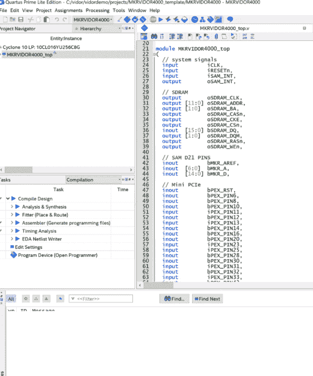
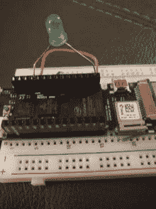
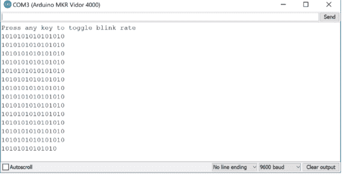

# 动手操作 Arduino FPGA

> 原文：<https://hackaday.com/2018/11/01/hands-on-with-the-arduino-fpga/>

使用 FPGA Arduino——Vidor——所需的所有工具现在都可以使用了！

我们之前报道过，一系列[法国博客文章](https://hackaday.com/2018/10/14/flash-arduino-vidor-fpga-instructions-hit-france/)最终展示了如何将所有部分组合在一起，对 Arduino MKR4000 Vidor 板上的 FPGA 进行编程。当然，我不满足于只阅读谷歌翻译，我必须打破板，尝试自己。

我创建了一个非常简单的 starter 模板，这是一个用 C 语言做比特流转换的工具，需要，并把它打包在一个地方。以下是如何使用我的初学者工具包，通过 Vidor 进行自己的 FPGA 设计。我假设你了解 FPGA 基础知识和 Verilog。如果你没有，为什么不先看看 [FPGA 训练营](https://hackaday.com/2018/08/06/learn-fpga-fast-with-hackadays-fpga-boot-camp/)？

你想做的第一件事就是拿走我的 GitHub 回购。你还需要 Arduino IDE(最新版本)和英特尔的 Quartus 软件。在里面，你会发现三个目录，其中两个包含原始 Arduino 文件的稍微修改的副本。但是在您开始深入研究之前，让我们先从高层次上了解一下这个过程。

## 基本概念

[](https://hackaday.com/wp-content/uploads/2018/10/quartus.png)Vidor 上的 FPGA 是一个 Intel/Altera 设备，因此我们将使用 Quartus 来配置它。通常，Quartus 处理一切，包括对设备编程，但我们不能用 Vidor 来处理。相反，我们将不得不告诉 CPU 我们希望如何配置 FPGA，它将作为我们 Arduino 程序的一部分来为我们做这件事(我真的讨厌说草图)。

Quartus(见下文)将获取我们的 Verilog 文件并创建一个表示配置比特流的 ttf 文件。这只是一个充满十进制数的 ASCII 文本文件。不幸的是，Vidor 的设置方式需要在字节级反转数字位。即 ttf 文件中的 01 需要 80 hex 发送到 FPGA。

Arduino 提供了一个 Java 类文件来完成这项任务，但我感到沮丧，因为这个类文件需要 Java 11，而我不想在我使用的每台机器上都安装它，所以我只是用 c 重写了它。尽管移植算法很容易。在 shell 子目录中，我有另一个使用 awk 的示例实现。

一旦有了这个数字流，就可以用一些样板文件将它包含在 Arduino 草图中，以启用 FPGA 并加载它。标准程序包括文件 app.h，它只是转换程序的输出。里面没有 C 代码，只有逗号分隔的数字，主代码会在编译时将这些数字放在一个数组中。除此之外，这是一个正常的 Arduino 程序，你可以做你喜欢的事情。上传它，你就可以一气呵成地完成 CPU 和 FPGA 的编程。

有一个警告。FPGA 代码有一个顶层模块，其中定义了许多 I/O 引脚和相应的约束。您应该非常小心，不要更改这些或改变引脚约束。例如，如果驱动一个已经是输出的引脚，可能会对电路板造成真正的损害。因为所有的管脚都是共享的，所以 Arduino 管脚也有同样的问题。如果你用 FPGA 驱动一个输出引脚，你不应该试图用 CPU 来驱动它。然而，正如您将看到的，让 FPGA 从 CPU 读取引脚是完全可以的，反之亦然。这很好，因为它为我们提供了一种在它们之间来回发送数据的方式。

## 继续编码

我想要简单的东西，我不想意外修改 Arduino 样板 Verilog。您可以实例化一个 Verilog 模块，但这需要将所有的 I/O 引脚传递到模块中，或者每次都修改原始代码，这两种情况我都想避免。

我的回答是在样板文件中使用 Verilog `include 指令。这样，您的代码可以访问主模块的所有内容，但您不必更改主模块。唯一的缺点是 Quartus 有一个智能编译特性，当只有一个包含文件改变时，它不能计算出来。所以我修改的时候不是重新编译。我在 Quartus 选项中关闭了这个特性，所以如果您选择我的示例项目，您不会有任何问题。

这是我的用户示例。v:

```

reg [27:0] hadcounter;
assign bMKR_D[6]=bMKR_D[5]?hadcounter[27]:hadcounter[21];

always @(posedge wOSC_CLK)
begin
   if (!rRESETCNT[5])
   begin
      hadcounter&lt;=28'hfffffff;
   end
   else
   begin
      if (hadcounter==28'h0) hadcounter&lt;=28'hffffffff; else hadcounter&lt;=hadcounter-28'h1;
   end
end

```

在真实的文件中，我留下了很多注释，解释了所有主模块中可以使用的内容。但以上是工作部分。我定义了一个 28 位的计数器。bMKR_D 阵列是 Arduino 的数字端口，我使用引脚 6 和 5 分别作为输出和输入。

assign 语句用英语说，如果 D5 为高，将计数器的第 27 位连接到 LED。如果为低电平，连接第 21 位。剩下的代码只是让计数器倒计时。我重新加载计数器，即使它会自然翻转，以防你想微调到不同的频率。

当计数器运行时，第 27 位切换相对较慢，但第 21 位会快一点——这就是计数器的工作方式。因此，通过改变 D5，你可以让 LED 闪烁缓慢或快速。

正如 Verilog 所说，这并不复杂，甚至也不有用，但它很简单，表明我们可以与 CPU 双向共享数据。如果您在 Quartus 中打开示例项目，您真正需要做的就是对 user.v 进行您喜欢的任何更改，添加您想要使用的任何其他文件，并双击编译设计任务(见左侧)。如果编译成功，您将在 output_files 目录中找到 ttf 文件。这是您需要用 Java 程序、C 程序或 awk 脚本处理的文件。无论哪种方式，都将输出收集为 app.h，并将其放在与 Arduino 代码相同的目录中。

## CPU 端

在草图方面，你需要留下模板代码，因为它打开了 FPGA 时钟。您会注意到它还包括 app.h，并使用一个名为 jtag.c 的文件与 FPGA 通信。我没有将 Arduino 代码分离到它自己的 include 中，因为您可能需要更改设置函数，并在全局空间中进行更改，但这是可以安排的(也许让 setup 调用 cpu_setup，让 loop 调用 cpu_loop 或其他)。

如果你想删除 blink-sketch 文件的演示部分，你可以去掉:

*   与 FPGAVal、SPEED 和 FPGALED 相关的定义和调用
*   串行调用和定义
*   循环中的一切功能

我将未修改的代码留在了 EmptySketch 目录中。请注意，在演示代码中，虽然速度是一个输出。这被设置为 D5，它是 FPGA 的一个输入。同理，FPGALED 对应于 D6，允许 CPU 读取 LED 输出的状态。

 [](https://hackaday.com/2018/11/01/hands-on-with-the-arduino-fpga/bmd/) bmd [](https://hackaday.com/2018/11/01/hands-on-with-the-arduino-fpga/vidorserial/) 

除非你想用示波器或仪表观察，否则你需要一个 LED 和一个降压电阻。我总是将一些内置 5V 降压电阻的 led 放在手边，即使在 3.3V 的电压下，它也足够亮。有了其中的一个，你就可以把电线直接插到板上的插座里。但是，不要用普通的 LED 来尝试！

运行草图后，您可以打开串行监视器或 9600 波特的任何终端。将会出现一条信息，告诉你可以按任意键来改变闪烁速率。当然，由于串行监视器不允许您准确地按键，您必须输入一些内容并按回车键(在监视器屏幕的底部设置“无行尾”)，但是在真正的终端上，任何字符键都应该这样做。

主要代码非常简单:

```

void loop() {
static int oldstate=-1;
static int linect=0;
int state;
if (Serial.read()!=-1)
  {
  FPGAVal=FPGAVal==HIGH?LOW:HIGH;
  digitalWrite(SPEED,FPGAVal);
  }
state=digitalRead(FPGALED);
if (state!=oldstate)
  {
  Serial.print(state);
  if (++linect==16)
    {
    Serial.println();
    linect=0;
    }
  oldstate=state;
  }
}
```

在环路中，如果出现串行数据，我们只需切换输出至 FPGA。我们还对每一遍的 LED 输出进行采样。如果与上次相比发生了变化，我们将新的状态写入终端，然后更新状态，这样就不会让屏幕上充斥重复的字符。当我们写得足够多，可以开始新的一行时，很多代码只是跟踪。

## 维多的 Hello World

我想在一个地方得到你需要的所有东西，一个简单易懂的例子，同时展示关键的工作部分。例如，使用共享 I/O 引脚来执行 SPI 非常简单，然后您就可以非常轻松地与 FPGA 交换数据。别忘了还有 Arduino IP(知识产权；FPGAs 的一种库子程序),如果你想用的话。

现在你只需要一个对 FPGA 有意义的项目想法。我们个人最喜欢的是逻辑分析仪。CPU 可以与 PC 对话，设置触发器，然后让 FPGA 尽可能快地完成寻找触发器和存储数据的脏活。如果你想要不那么雄心勃勃的东西，在 FPGA 上创建完全自主的 PWM 输出是非常简单的。我们可以看到这对于机器人或机器控制来说是很方便的，在这种情况下，您需要一个非常快速的输出序列，而无需 CPU 干预或开销。

当然，并不是每个项目都有意义。如果你只是想了解 FPGA，有很多项目你可以用 CPU 来做，但在 FPGA 中构建是足够容易的(经典的交通灯浮现在脑海中)。当然，有了 Vidor，你就有机会混合使用 FPGA 代码和 CPU 代码，这也是重点。