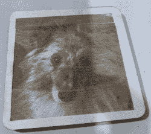

# 手动操作 Ortur 激光切割机

> 原文：<https://hackaday.com/2021/02/23/hands-on-with-the-ortur-laser-cutter/>

没有电脑，我写不了多少东西。在我职业生涯的早期，我用打字机写作。除非你非常接近完美——我没有——否则编辑打字稿是非常令人沮丧的。对我来说，现实世界中的对等物是 3D 打印机和数控机床。我可以想象出很多我用普通工具不够仔细构建的东西。尽管我七年级的商店老师尽了最大努力，我做的每件事结果都是牙签或数字 7。但是我可以把我的想法输入 CAD，然后由机器来完成剩下的工作。这就是为什么我很高兴在刚刚过去的圣诞节得到一台激光切割机。你可能会想，如果我有其他工具，为什么我还需要激光切割机。话说回来，如果你读 Hackaday，你可能不需要我解释你为什么需要一个新的小工具。我对激光有兴趣已经有很长一段时间了，但最近的发展使它更有吸引力。我想我会与你分享一些我发现开始使用 Ortur 激光切割机。这种刀具很容易组装，价格在 200-400 美元之间，取决于你用它能得到什么。我想我应该花些时间来分享我对此的了解。

## 为什么是激光？

如果你以前没有使用激光切割机或雕刻机的经验，你可能会认为这是一种非常特殊的工具。当然，奥图擅长雕刻一些东西(但不是所有的东西)。它也可以切割一些东西，但不如大型激光切割机切割的东西多。然而，有创造力的人会找到很多方法使用切割和雕刻来制作你可能想不到的东西。

例如，如果你在 YouTube 上冲浪，你会发现有人把喷漆放在瓷砖或画布上，然后烧掉一些或所有的油漆来制作真正有趣的艺术品。有时，他们甚至会使用多层颜料，通过在艺术品上烧出不同的深度来创造不同的颜色。另一种多色技术是在已经贴在零件上的胶带上切割出相当于定制模板的部分。然后，您可以喷涂油漆，移除胶带，应用新胶带，并切割另一种颜色的新模板。有些人蚀刻镜子的背面。这也是令人惊讶的方便，能够精确切割纸张和纸板。然而，通过一些练习和技巧，你甚至可以切割一些厚度的胶合板。

 [https://www.youtube.com/embed/qRp8YWcTVKI?version=3&rel=1&showsearch=0&showinfo=1&iv_load_policy=1&fs=1&hl=en-US&autohide=2&wmode=transparent](https://www.youtube.com/embed/qRp8YWcTVKI?version=3&rel=1&showsearch=0&showinfo=1&iv_load_policy=1&fs=1&hl=en-US&autohide=2&wmode=transparent)

我对直接或通过切割抗蚀剂然后使用传统蚀刻技术制作 PC 板非常感兴趣。人们也在这么做。根据你的激光功率，你可以切割相当多的东西，虽然用可见光激光，你不能切割透明的东西。你可以雕刻更多的东西，甚至金属，如果你使用一些额外的化学物质(如[芥末](https://hackaday.com/2021/01/02/laser-etching-stainless-steel-with-mustard/))。除了艺术线条和文本，您还可以从图片中生成半色调图像。如果你有足够强大的激光，你甚至可以用[制造玻璃](https://hackaday.com/2016/12/07/sintering-sand-with-a-laser-cutter/)，有点像。

当然，除了所有艺术化的东西，你也可以剪切材料，这是非常方便的。[electronio OBS]去年做了一个视频，用 15W 的激光对不同的材料进行了实验，这将让你对这种类型的激光能切割什么和不能切割什么有所了解。

 [https://www.youtube.com/embed/djRRxGXyACY?version=3&rel=1&showsearch=0&showinfo=1&iv_load_policy=1&fs=1&hl=en-US&autohide=2&start=742&wmode=transparent](https://www.youtube.com/embed/djRRxGXyACY?version=3&rel=1&showsearch=0&showinfo=1&iv_load_policy=1&fs=1&hl=en-US&autohide=2&start=742&wmode=transparent)

有些东西你不应该切，因为它们会释放有害气体，比如 ABS 或乙烯基产品。皮革雕刻和切割很好，但男孩不臭！我知道你也应该小心使用铬鞣革，因为鞣革化学物质会散发出难闻的气味。有些材料也很容易着火，比如聚苯乙烯泡沫塑料。

## 关于奥图

如果你想要一个激光，你的下一个问题是买哪一个。二氧化碳激光器是常见的，但它们相当昂贵，而且众所周知需要很大的努力——包括一桶冰水和通风——才能使用。半导体激光器既便宜又容易使用。这些通常是可见的，正如我提到的，这意味着你不能用它们来切割像透明亚克力这样的东西。你可以买到一些非常便宜的激光雕刻机，但其中许多可能不会切割很多。

话说回来，权力不是一切。广义来说，你可以用激光来换取能量。也就是说，10 瓦的激光一次通过可能需要几秒钟，而 1 瓦的激光四次或五次通过可能需要 30 秒。这并不总是简单的，因为当激光烧焦材料时，它会产生一个障碍，阻止你从下面获得同样多的能量。尽管如此，如果你愿意花更长的时间并重复通过，有时你可以用更低的功率做同样的工作。

Ortur Laser Master 2 价格合理，激光功率有三种选择:7W、15W 和 20W。这有点欺骗性，因为功率实际上是模块的输入功率。例如，15W 单元产生不到 5W 的输出功率，但它仍然能够做比你想象的多得多的事情。

该设备可以与一个名为 LaserGRBL 的免费 Windows 软件一起工作，该软件可以与机载 GRBL 控制器进行对话。理论上，任何发送 g 代码的东西都可以工作。我用的是 Linux，所以我选择了 LightBurn，它非常棒，非常值得你花 40 美元买它。它也可以在多个平台上运行，但遗憾的是不能在 Raspberry Pi 上运行，所以我不得不拖着一台笔记本电脑与 Ortur 一起工作。你也可以去看看激光网。

还有其他便宜的激光雕刻机和切割机，但我对 Ortur 的尺寸和功能印象深刻。也有很多附加的设计和良好的软件支持。

## 装配

该装置需要一些组装，尽管它的大部分是预先组装的。你建立一个铝挤压框架，然后滑动 X 车厢。有一个 32 位控制器板和一些步进电机。32 位主板是一大卖点。你用激光器做的一些工作需要 PWM 来调制光束的功率。大多数 8 位主板将允许您从 0-255 步进功率，因此每一步大约是全强度的 0.4%。一个 32 位的板可以让你进行大约 1000 次满量程除法运算，每一步的误差约为 0.1%。

该机构类似于没有 Z 轴的绘图仪或 3D 打印机。由于激光不接触任何东西，它不需要 CNC 设置的鲁棒性。当然，如果你已经有了一台激光打印机，你也可以将激光安装到 3D 打印机或 T2 数控机床上，这并不是一个坏的选择，尽管大多数设置都有一些限制(例如，没有光束强度调制)。

了解如何制造该机器的最佳方式是观看该公司的视频说明(见下文)。视频中有一些不清楚的地方，我做了一些[笔记，可能对你有所帮助](https://docs.google.com/document/d/1aJPIKfMx7Ur_ad674ZeSWMdrsCks3VEN-A8xlimvojY/edit?usp=sharing)。YouTube 上也有大量第三方构建视频。

 [https://www.youtube.com/embed/vhqyy1dn17E?version=3&rel=1&showsearch=0&showinfo=1&iv_load_policy=1&fs=1&hl=en-US&autohide=2&wmode=transparent](https://www.youtube.com/embed/vhqyy1dn17E?version=3&rel=1&showsearch=0&showinfo=1&iv_load_policy=1&fs=1&hl=en-US&autohide=2&wmode=transparent)

## 首次切割

当你完成一个单元的时候，削减一些东西的冲动是压倒性的。然而，确保你有眼睛保护和充足的通风。你应该准备一瓶水和一个灭火器(你可以在下面的视频中看到我的一个灭火器)。激光照射下东西会着火，所以要做好准备。如果你确实有一点火焰，先试试水，因为灭火器会弄得一团糟。

 刀具附带的眼镜似乎已经足够了，一些人已经通过发射激光来测试它们。然而，我选择了一些质量更好的眼镜。你的眼睛比你用廉价眼镜省下的几块钱更值钱。

确保你有最新的固件。我的单位早于 2021 年 1 月的更新，风扇没有运行，除非激光也在运行。我猜这会缩短激光二极管的寿命。有了更新的固件，有了更智能的风扇管理以及一些其他修复。更新就像拖放文件一样简单，但出于某种原因，它只在 Windows 下工作。Linux 看到了 USB 驱动器，将进行复制，但它不坚持。至少没把切割机砖化。

不管固件如何，在你剪切之前，你需要正确设置焦距。如果你和我一样，你大概在想:“专注？你不用聚焦激光。”好吧，看来你确实聚焦了一束廉价的激光。

 [https://www.youtube.com/embed/KFGPXsOP40M?version=3&rel=1&showsearch=0&showinfo=1&iv_load_policy=1&fs=1&hl=en-US&autohide=2&start=11&wmode=transparent](https://www.youtube.com/embed/KFGPXsOP40M?version=3&rel=1&showsearch=0&showinfo=1&iv_load_policy=1&fs=1&hl=en-US&autohide=2&start=11&wmode=transparent)

## 专注就是一切

为了给工件提供所需的能量，半导体激光器通过一个透镜，将光束聚焦到一个点上。那个点就是所有切割或雕刻的地方。这意味着你要处理的部分必须在那个焦点上。经过透镜后，光束看起来像一个沙漏，你离沙漏越远，你做的切割就越少。

Ortur 的激光器不会上下移动，但镜头可以拧进拧出几毫米，也可以推入推出，这取决于你使用的是哪一个。一旦你有一些东西在切割机下，你可以把一些黑色的建筑纸放在上面，用它来可视化的焦点。你正在使用的软件将有一个按钮，以低功率打开激光。使用眼镜将有助于减少溢出，你可以很容易地在黑纸上看到光束的主要部分。

有些人使用 USB 显微镜或其他放大设备来获得最佳焦距。然而，我不喜欢股票的聚焦方法。镜头环很难转动，即使你 3D 打印自己的戒指，也很难旋转镜头。它也没有给你太多的范围。

幸运的是，有许多 3D 打印解决方案可以在 Ortur 上创建一个移动的激光头。我下次给你看我正在用的那个。现在，假设你要自己对焦。这也限制了你可以切割或雕刻的东西的高度，尽管有些人把机器放在积木上，以便在下面腾出更多空间。一个紧密的焦点会让你更快地切割或雕刻，并使切割线更精细。然而，即使你有点偏离，你通常也能得到一些结果。这是一个好主意，你可以用胶带把你的作品粘住或者夹住，这样如果你需要的话，你可以不用移动任何东西就可以做第二遍。

你可以买到不同的激光镜头。15W 机器配备的镜头焦距约为 55 毫米。然而，还有其他镜头——G8 很受欢迎——焦距不同。每个镜头都有不同的特点，比如它们能聚焦多紧，以及它们有多少个元件(更多的元件意味着更少的整体功率)。

传送到您的部件的功率是光束功率、聚焦质量和花费时间的组合。即使是激光改变方向所需的时间也可能导致更深的烧伤或切割，这就是为什么大多数软件都提供过扫描功能，当激光改变方向时，使激光关闭并远离切割线。

如果你仔细聚焦，你应该可以在一张硬纸板上得到相当好的雕刻。一定要在下面垫些东西，因为你可能会划破并留下永久的痕迹。我把切割器安装在一块胶合板上，并故意在板上画了一个网格。下次我会告诉你更多关于那些添加的内容。

有时候，你故意想要散焦一点，以获得更宽的线条。[Geordie_h]谈到了这个技巧，以及其他一些针对更商业化的切割工具的专业技巧，但仍然适用于 Ortur 和其他类似的激光器。

## 下次

说到下次，还有很多要说的。除了安装设备并使激光头移动之外，我还想增加空气辅助——我仍在努力。这清除了切割产生的烟雾和细小的灰烬，使激光在切割时能够击中新鲜的材料。

 由于某种原因我的机器经常会因为长时间的插队而熄火，从上网看，我并不孤单。更换 USB 电缆似乎有所帮助。它可能需要一个稍微强大的电源或框架接地。不过，也可能是我笔记本电脑的电源设置。时间会证明一切。当制作需要大量时间的图像时，这尤其是一个问题。你可以看到我的洛基照片在顶部有一点错位，在这样的失败后我重新开始，没有完全对齐。

Ortur 让我想起了早期的 3D 打印机。它可以工作，但是需要一些工作来让它工作得更好。但是，至少对我来说，这是有趣的部分。