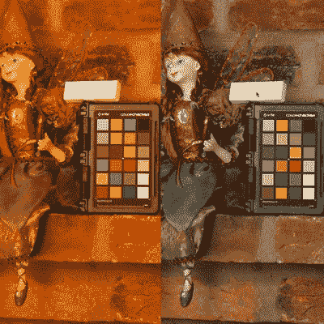

# 五金店白平衡参考

> 原文：<https://hackaday.com/2018/08/21/hardware-store-white-balance-reference/>

我们生活在一个拍照非常容易的时代:拿出你的手机(假设它不在你手中)，对准某个东西，然后点击屏幕。今天，即使是基本的智能手机中的相机硬件和软件也足够好，你不需要花太多心思来获得像样的照片。但是如果你想做得更好而不仅仅是体面呢？

 理想情况下，你应该在高温灯光下拍摄照片，但如果做不到这一点，你可能需要在后期处理过程中调整白平衡来进行补偿。但是为了精确地调整白平衡，你需要在图像中有一个纯白的参考点。[由于 FastRawViewer 博客](https://www.fastrawviewer.com/blog/diy-white-balance-reference)上的人们的勤奋研究，我们现在有了一种廉价且广泛可用的纯白色参考材料来源:聚四氟乙烯管带。

好吧，我们知道你在想什么:找到一个白色物体有多难？嗯，如果你说的是真正的白色，那就很难了。沿着当地五金店的油漆通道走一走，看看到底有多少“白色”。觉得你的拍摄对象穿的衬衫真的很白？你认为你可以用他们手中光滑的白色智能手机作为参考吗？再想想。

拿一块橡皮，用几层聚四氟乙烯胶带把它包起来，你就可以制作一个便宜到可以一次性使用的白色参照物。这很好，因为保护你的白色参照物并保持其清洁本身就是一个挑战。但有了聚四氟乙烯带参考，你就可以在照片拍摄完成后扔掉它。

将这种廉价的白色参考与我们过去介绍过的一些 DIY 摄影照明设置结合起来，你将会得到更好的图像来记录你的所有项目。当你完成的时候记得把它们提交给我们。

【感谢基思·奥尔森的提示。]