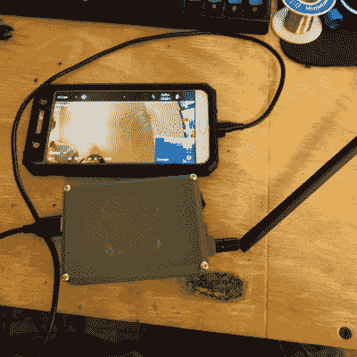

# 高清视频和遥测链接使用标准 WiFi 硬件

> 原文：<https://hackaday.com/2018/12/27/hd-video-and-telemetry-link-uses-standard-wifi-hardware/>

[GlytchTech]决定为他的无人机实验实现自己的数字数据链(DDL ),通过使用 Raspberry Pi Zero 和一些开源软件，他成功地创建了[一个基本上独立的系统，使用 Android 手机作为显示器来提供高清视频和遥测](http://glytch.tech/Custom-DDL-For-Digital-HD-Video-And-Telemetry/)。

USB tethered Android phone used as a display and touch interface.

该链接以稍微不同寻常的方式使用标准 WiFi 硬件来创建一个数字数据链接，其行为更像一个模拟系统，优先提供低延迟视频，并在信号质量变差时优雅地下降。树莓 Pi Zero、阿尔法 NEH WiFi 卡、外置天线、电池和 3D 打印外壳构成了一个独立的单元。需要两个:链接的每一端一个。一个单元安装在无人机上并与飞行控制器接口，另一个单元用于地面站。

一个配套的 android 应用程序允许几乎任何旧的 Android 手机充当视频馈送、遥测数据的屏幕显示和触摸屏界面。

该软件是 [DroneBridge](http://wolfgangchristl.de/not-just-another-drone-project/) (GitHub [仓库](https://github.com/seeul8er/DroneBridge))，它实现了使用 WiFi 无线电的 Wifibroadcast，但没有通常的 WiFi 功能。Raspberry Pi 是通常的平台，但也有一个 ESP32 端口。该软件的功能甚至更多，但目前为止还能很好地满足[GlytchTech]的需求，他能够用它来改进他最初的[*Watch _ Dogs*](https://hackaday.com/2018/05/27/watch-dogs-inspired-hacking-drone-takes-flight/)黑客无人机。