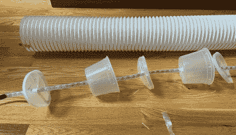

# 头灯给予发光的物质享受

> 原文：<https://hackaday.com/2021/03/07/head-lamp-gives-glowing-creature-comforts/>

我们能说什么呢？现在是 2021 年，我们可能都在生活中使用一种精神病萤火虫灯来点亮心情和/或为坐着和凝视提供一个新的焦点。厌倦了每个节日都在货架上拖出那个令人毛骨悚然的小精灵  ？[【liability labs】“头灯稍微不那么可怕，而且功能性更强](https://www.instructables.com/HeadLamp-1/)。真的，选择是无限的。

这条吓人的蛇的大脑是一个电磁 Pixelblaze LED 控制器，一个强大的 Wi-Fi 功能的小电路板，带有一个实时网络编辑器。[LiabilityLabs]回收了 20 个乳白色塑料容器及其盖子，通过将 led 灯条固定在灯管中心来帮助漫射光线并避免热点。发光家伙的尾巴上有一个瞬间按钮，让[LiabilityLabs]轻松地在不同的颜色模式之间循环。

无论你需要一个吉祥物为你的溪流通道，知己，或一个令人耳目一新的彩虹橡胶鸭子解决问题，头灯是灵活的。休息之后，请欣赏一些简短的动画。

想要没有恐惧的光明吗？这款迷人的光纤灯很容易制造。

 [https://www.youtube.com/embed/QiOecNYGq5I?version=3&rel=1&showsearch=0&showinfo=1&iv_load_policy=1&fs=1&hl=en-US&autohide=2&wmode=transparent](https://www.youtube.com/embed/QiOecNYGq5I?version=3&rel=1&showsearch=0&showinfo=1&iv_load_policy=1&fs=1&hl=en-US&autohide=2&wmode=transparent)

 [https://www.youtube.com/embed/f_atB6WZjGc?version=3&rel=1&showsearch=0&showinfo=1&iv_load_policy=1&fs=1&hl=en-US&autohide=2&wmode=transparent](https://www.youtube.com/embed/f_atB6WZjGc?version=3&rel=1&showsearch=0&showinfo=1&iv_load_policy=1&fs=1&hl=en-US&autohide=2&wmode=transparent)

