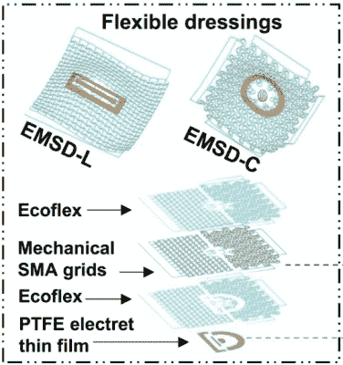
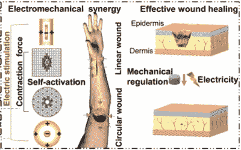

# 用电的力量治愈伤口

> 原文：<https://hackaday.com/2022/05/04/healing-wounds-with-the-power-of-electricity/>

曾几何时，即使是简单的割伤或擦伤也可能是死刑判决。在细菌理论和今天对医学的科学理解出现之前，传染病肆虐，夺走了许多人的生命。

虽然我们现在已经用消毒剂、敷料和抗生素武装好了，但科学家们仍在继续研究新的独特方法来改善伤口的治疗。事实证明，一点点电流实际上可能有助于伤口愈合得更快。

## 嗖！

The bandages come in two designs for treating circular or linear wounds. Credit: [Research paper](https://www.science.org/doi/10.1126/sciadv.abl8379)

过去的研究已经发现，电流的应用实际上可能有助于伤口愈合过程。在 2003 年发表的一篇论文[中，研究人员发现，通过在伤口区域施加电场，伤口愈合速度加快了 13-50%。使用各种不同的电刺激方法，以及伤口附近的不同极性和场强，在该领域的各种试验已经取得了成功。](https://pubmed.ncbi.nlm.nih.gov/14711011/#:~:text=Some%20experiments%20indicate%20that%20when,healing%20from%2013%20to%2050%25.)

致病因素似乎集中在人类角质细胞对电刺激的反应。这些皮肤细胞的迁移可以由电场引导或指引，与该区域中某些生长因子的存在相一致。

迄今为止，大多数研究都需要使用昂贵的研究设备将电场施加到伤口部位。来自中国电子科技大学的最新研究旨在将这一原理应用于更实际的场合。

这项研究涉及到电活性伤口敷料的创造，这种敷料可以像典型的粘性绷带一样容易地使用。[首席研究员瑶光在接受](https://www.newscientist.com/article/2305979-electric-wound-dressing-could-help-injuries-heal-faster/#ixzz7RiVOYa8o) *[新科学家](https://www.newscientist.com/article/2305979-electric-wound-dressing-could-help-injuries-heal-faster/#ixzz7RiVOYa8o)*采访时指出，“无创、高效、经济且方便的方法一直是治疗皮肤创伤的理想方法。”

The new dressings apply an electrostatic field to the wound site, with the negative electrode directly over the wound, and a positive electrode surrounding the area. The shape memory alloy layer also helps squeeze the wound closed. Credit: [Research paper](https://www.science.org/doi/10.1126/sciadv.abl8379)

按照研究小组的设计，这种敷料由四层组成。第一层由带电的聚四氟乙烯塑料组成，当与皮肤接触时会产生静电场。第二层是柔性硅橡胶，而第三层以形状记忆合金为特征。这一层有助于推动伤口闭合，以进一步帮助愈合过程，并由皮肤温度引发行动。最后一层弹性凝胶位于顶部。

值得注意的是，众所周知的机电协同敷料有两种版本。用于线形伤口的 EMSD-L 具有矩形负电极和围绕外部的矩形环形正电极。同时，用于圆形伤口的 EMSD-C 具有圆形负电极和在外部的相应圆环正电极。

在试验中，将敷料应用于 50 只大鼠。每个人都有一个 10 毫米长的线形伤口或 8 毫米直径的圆形伤口。为了控制的目的，一些老鼠被给予新的敷料，而另一些老鼠被给予传统的敷料或不使用任何敷料。电敷料的效果最好，8 天后圆形伤口的愈合率为 96.8%。相比之下，标准敷料的闭合率约为 75%,而未包扎伤口的大鼠仅为 45.9%。来自直伤口组的结果同样有利于新的敷料设计。

姚指出，该团队希望生产出适应各种伤口类型的产品。“我们正在优化用于更多形状伤口的设备设计，包括不规则形状，”他说。人体试验也有可能进行。

早期的结果是积极的，当涉及到给伤口充电以帮助它们更快愈合时，似乎真的有一些东西。虽然你可以在简单的剪纸上使用它们，但它们的真正价值可能在更严肃的医疗环境中。伤口管理是医学的一个完整分支，它可以被许多事情复杂化，从细菌到独特的遗传条件。用一点点静电来帮助伤口愈合可能会对世界各地的大量患者产生重大影响。