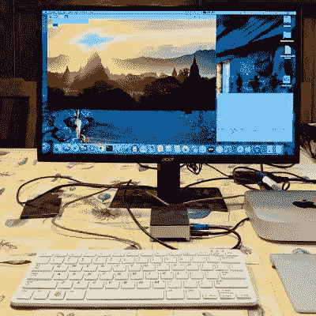

# 重度树莓 Pi 用户？随身携带一个 HDMI 转 USB 捕捉设备

> 原文：<https://hackaday.com/2020/12/21/heavy-raspberry-pi-user-keep-an-hdmi-to-usb-capture-device-around/>

这里有一个来自[Andy]的简单提示，他的 Raspberry Pi 项目经常与他一起外出工作:他建议[在一个人的 Raspberry Pi 实用腰带](https://andyfelong.com/2020/07/hdmi-video-capture-via-usb-adapter/)上添加一个小型 HDMI 转 USB 视频捕获设备。只要周围有一台计算机，它就提供了一种简单且无需配置的方式来查看 Raspberry Pi 的显示器，不涉及本地网络，也不需要随身携带备用的 HDMI 显示器和电源。

Raspberry Pi’s display, viewed on a Mac as if it were a USB webcam. No configuration required.

查看 Pi 屏幕的通常方式是插入 HDMI 显示器或远程连接，但是[Andy]发现他并不总是了解他工作的网络的详细信息(假设网络可用),并且在任何情况下用位置的网络详细信息配置 Pi 都是一件麻烦的事情。随身携带 HMDI 显示器和电源也是他觉得不需要的东西。另一方面，在他的工具包里放一个小的 HDMI 转 USB 适配器让他大赚了一笔。

它的工作方式很简单:该设备将 HDMI 视频源转换为类似 USB 网络摄像头的视频流，几乎可以在任何台式机或笔记本电脑上观看。只要[安迪]能接触到某种计算机，他马上就能看到 Pi 的显示。

他的许多项目(如[这个自动云相机定时拍摄](https://hackaday.com/2020/04/16/automatic-timelapses-made-educational-and-easy/))使用 Pi 相机模块，因此快速查看屏幕对于检查焦点、预览视频等非常有用。这样做对他来说真是恰到好处。我们不禁认为，这些小板子中的一个可能是一个很有吸引力的东西，可以嵌入到[定制的网络平台构建](https://hackaday.com/2020/06/09/lunchbox-cyberdeck-is-a-tasty-build/)中。