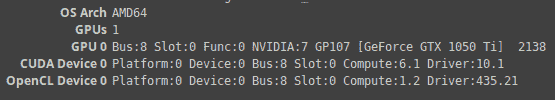
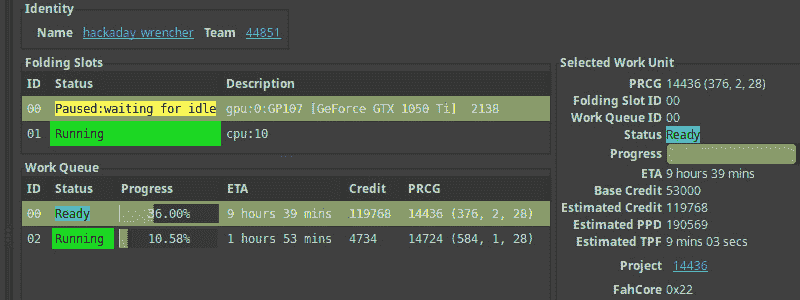
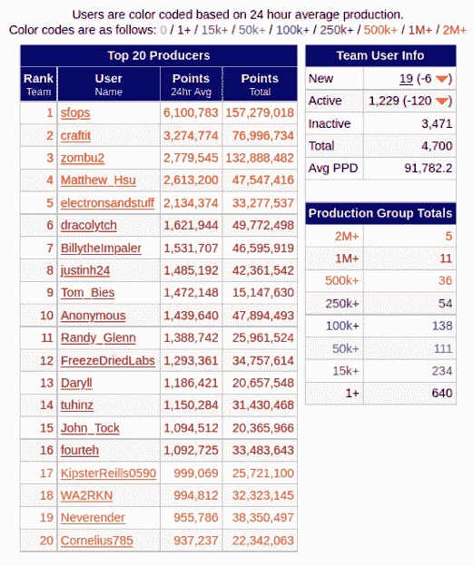

# 帮助我们在冠状病毒问题上投入更多的周期

> 原文：<https://hackaday.com/2020/05/10/help-us-throw-more-cycles-at-the-coronavirus-problem/>

Hackaday 社区已经响应号召，将他们的计算机投入工作，折叠冠状病毒中发现的蛋白质。Team_Hack-a-Day [本月到目前为止排名世界第 44 位](https://stats.foldingathome.org/teams-monthly)，我看到我们在 24 小时排行榜上排名高达第 19 位。

想加入战斗吗？捐赠一些你不使用的计算周期来对抗 SARS-CoV-2。你可能不是流行病学家或疫苗研究人员，但你可以通过 Folding@home 项目为他们提供所需的数据，让他们的工作变得更容易。

正如 Dan Maloney 在他关于蛋白质折叠的优秀文章中解释的那样，理解病毒中令人难以置信的复杂的蛋白质折叠行为将是找到治疗方法和可能的疫苗的关键。Folding@home 通过互联网连接了无数台计算机，现在是世界上最大的超级计算机，由超过 350 万个 CPU 和超过 50 万个 GPU 组成。研究人员可以免费获得由此产生的数据。

让我们来看看启动和运行是多么容易，GPU 如何为一个设置增压，并查看 Team_Hack-a-Day 的统计数据。

## 设置很简单

您的电脑可以在 10 分钟内安装完毕:

*   [安装指南](https://foldingathome.org/support/faq/installation-guides/)
    *   还有[个备用下载位置](https://foldingathome.org/alternative-downloads/)可用
*   选择您想要用于公开显示的排行榜的任何别名
*   使用团队编号 **44851**
*   可选:[设置您自己的密钥](https://apps.foldingathome.org/getpasskey)

就是这样！但是如果你有一个强大的显卡，你会得到更多的处理费用。我终于在系统上运行了我自己的 GPU，它将我的影响扩大了五倍。

## 有点可疑的 Linux GPU 设置指南

我有一个 Nvidia GeForce GTX 1050 Ti 显卡，我不在这台机器上玩游戏(除非你把《我的世界》算在内)，所以我还不如好好利用它折叠蛋白质！不幸的是，我找不到向导，设置花了我一段时间。希望通过记录我的经验，我可以帮助其他人更快地启动和运行他们的系统。



Folding@home 可以通过开放 OpenCL 或 CUDA(仅限 Nvidia 卡)使用 GPU。我不知道我到底需要哪些软件包，所以我只是安装了它们。这就是为什么我称之为可疑的安装指南，你可能不需要所有这些软件包——对我来说，这个安装占用了大约 1.5 GB 的额外磁盘空间。注意，我已经安装了`nvidia-driver-435`,并在剩下的部分使用了这个命令:

```

sudo apt install \
    ocl-icd-libopencl1 \
    ocl-icd-opencl-dev \
    ocl-icd-dev \
    nvidia-opencl-dev \
    nvidia-cuda-toolkit

```

我重启了折叠@home 客户端:`sudo /etc/init.d/FAHClient restart`。然而，这并没有启用在配置–>插槽菜单中添加 GPU 的功能。我首先需要编辑配置文件本身，并将“gpu”值改为 true:

```

  &lt;!-- Folding Slot Configuration --&gt;
  &lt;gpu v='true'/&gt;  &lt;!-- If true, attempt to autoconfigure GPUs --&gt;

```

我再次重启客户端，然后使用 FAHControl 程序的 Configure –> Slots 窗口中的 add 按钮启用 GPU。或者，您应该能够直接编辑配置文件，并重新启动客户端以使其生效:

```

  &lt;!-- Folding Slots --&gt;
  &lt;slot id='0' type='GPU'&gt;
    &lt;idle v='true'/&gt;
  &lt;/slot&gt;
  &lt;slot id='1' type='CPU'/&gt;

```

请注意，在这个配置中有一点额外的魔力。在等待了大约 90 分钟后，我的 GPU 被分配到它的第一个工作单元(吴)并开始折叠，此时我的计算机变得完全无法使用。幸运的是，空闲设置是解决这个问题的方法——它指示客户端在计算机使用时暂停折叠。你可以配置每个插槽，所以这里我有我的 CPU 折叠所有的时间，我的 GPU 只折叠当我不使用我的电脑。

[](https://hackaday.com/wp-content/uploads/2020/05/folding-at-home-gpu-idle.jpg)

您可以通过右键单击 FAHControl GUI 中的插槽并选择“空闲时”来设置空闲行为。我的 CPU 每天可以折叠大约 60，000 点，我的 GPU 每天可以折叠超过 200，000 点。弄清楚这个设置大大提高了我为这项工作贡献力量的能力！

## [](https://folding.extremeoverclocking.com/team_summary.php?s=&t=44851) 团队之首 _ 每日黑客排行榜

看看那些弃牌的人和[为 Team_Hack-a-Day](https://folding.extremeoverclocking.com/team_summary.php?s=&t=44851) 出的巨额数字。最顶层是[sfops]，Hackaday 母公司 Supplyframe 的运营团队。他们已经将闲置的服务器资源用于折叠，并且已经占据第一的位置至少六周了。[zombu2]在那段时间也是前五名！

我们很乐意看到其他人投入到这项事业中，也迫不及待地想在下面的评论中听到你的故事。但正如我在 GPU 设置部分提到的，我的日常驱动程序每天能够提供 25 万个点。我们真正需要的是人多力量大，所以请考虑把你自己的电脑也加入进来。感谢每一个参与其中的人！

加入我们，让您的计算机挖掘真正重要的东西:用于关键医学研究的海量数据集。[走](https://stats.foldingathome.org/team/44851) [组队](https://stats.foldingathome.org/donor/71623225)！