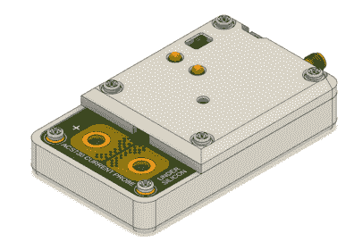
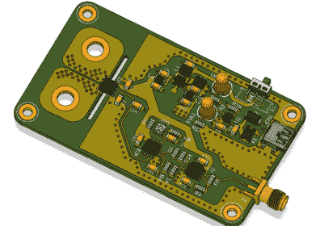

# 示波器的高电流测量探头

> 原文：<https://hackaday.com/2021/04/11/high-current-measurement-probe-for-oscilloscopes/>

一个像样的电流测量传感器应该是每个黑客工作台上必不可少的一部分。它能够以合理的精度测量 DC 以及低频和高频。如果它还能承受高总线电压——如市电或电动汽车工作中的高总线电压，还能获得额外的积分。[Undersilicon]找不到一个符合所有条件的，所以他制造了一个基于 ACS730 的交流/DC 电流探头，能够在最高 1 MHz 的频率下测量高达 25 A 的电流。

Allegro Microsystems 提供种类繁多的[电流传感器 IC](https://www.allegromicro.com/en/products/sense/current-sensor-ics/zero-to-fifty-amp-integrated-conductor-sensor-ics#guide)。 [ACS730](https://www.allegromicro.com/en/products/sense/current-sensor-ics/zero-to-fifty-amp-integrated-conductor-sensor-ics/acs730) 具有 1 MHz 的-3 dB 带宽和 500 kHz 的-1 dB 带宽。由于它是电流隔离的，因此可用于高达 297 Vrms 的交流电源应用，对于 DC，最高可达 420 V。由于他打算将其用作示波器附件，模拟输出非常适合该应用。一对精密运算放大器提供调整至 100 mV/A 的电压输出。该板采用 1000 mAh LiPo 电池供电，可使传感器运行约 15 ~ 20 小时。电源部分由一个用于 LiPo 的充电电路和一个用于运算放大器的分轨双路输出电源转换器组成。

当测量的电流为零时，ACS730 具有 2.5 V 输出，并针对 40 mV/A 进行调整。这提供了从-0.5 V(针对-50 A)到+4.5 V(针对+50 A)的输出电压摆幅。这正是 [AD823ARZ](https://www.analog.com/media/en/technical-documentation/data-sheets/AD823.pdf) 双通道 16 MHz、轨到轨 FET 输入放大器介入的地方。一对用于从 5 V 电源获得 2.5 V 基准电压，同时缓冲 ACS730 的模拟输出。第二对减去 2.5 V 失调，并应用 2.5 的增益以获得 100 mV/A 输出。运算放大器的双电源来自一个 [TPS65133](https://www.ti.com/product/TPS65133) 分轨转换器，5V，250mA 双输出电源。最后，LiPo 充电由 [MCP73831](https://www.microchip.com/wwwproducts/en/MCP73831) 单电池锂离子/锂聚合物充电管理控制器处理。

    

直流电的初步测试显示了相当精确的性能。但他在测量低于 1 A 的电流时观察到一些噪声，这需要一些调试来找出来源。[【under silicon】已经为 PCB 和 3D 打印外壳](https://drive.google.com/file/d/14_Hp3iuTNa1wZ3X5krazeH0hD3ZzRZPW/view?usp=sharing)提供了 CAD 文件，让您能够获得自己制作外壳所需的一切。如果你在寻找更重型的东西，你可能会对[这款封装在混凝土中的+/-50 A、1.5 MHz 传感器](https://hackaday.com/2020/10/08/current-sensor-makes-intriguing-use-of-concrete/)感兴趣。