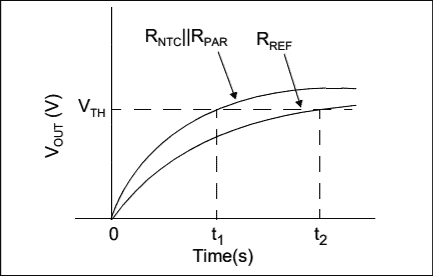
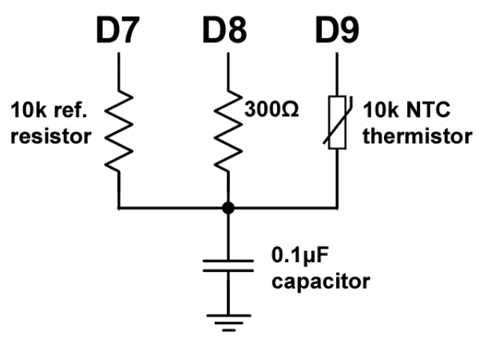

# 带数字引脚的高精度模拟 IO

> 原文：<https://hackaday.com/2019/07/22/high-precision-analog-io-with-digital-pins/>

读取环境温度很容易，对吗？快速搜索一下就会发现无处不在的 DHT11，它有一个记录良好的协议，并为每一个可以想到的微控制器和平台提供了库。将它插入你的 Arduino 和 boom，温度(和湿度！)读物。但是简单的解决方案并不能满足所有的需求，有时事情需要变得更加深奥。

The technique summarized by an image from Microchip Appnote AN685

多年来，我们一直在关注[爱德华]建造无障碍水下传感硬件的英勇努力。当我们最后一次听到他的消息时，他正在努力提高他的 Arduino 对不起眼的 NTC 热敏电阻的测量精度。现在目标是一样的，但他有一个更令人惊讶的计划，完全抛弃 ADC，用数字 IO[采样一个模拟热敏电阻。这实际上是一个基于直觉观察的非常简单的技巧，微控制器更擅长测量时间而不是电压。](https://thecavepearlproject.org/2019/03/25/using-arduinos-input-capture-unit-for-high-resolution-sensor-readings/)

The basic circuit

该电路至少有四个元件:一个参考电阻、热敏电阻和一个带放电电阻的小电容。要进行检测，您需要配置一个定时器来计数，并配置一个边沿中断来捕捉定时器输入切换时的值。一个检测周期包括通过放电电阻对电容放电，启动定时器和中断，然后通过测量值对电容充电。从定时器捕获的值将与中断触发时电容充电到逻辑高电平阈值以上所用的时间相关。通过比较基准电压源的充电时间和热敏电阻的充电时间，可以计算出它们的相对电阻。通过在不同温度下进行几次校准循环([Edward]建议至少相隔 10 度)，您可以将测量系统固定在真实温度上。

对于所有血淋淋的细节，包括如何节省每一焦耳能量的技巧，请查看[Edward]的帖子和他引用的[微芯片应用笔记 AN685](http://ww1.microchip.com/downloads/en/appnotes/00685b.pdf) 。除了这个系列之外,[Edward]的洞穴珍珠项目已经产生了数量可观的 Hackday 帖子。更多精彩的硬件文章，请查看单个传感节点的通用[硬件构建，或者根本没有外部部件](https://hackaday.com/2018/02/16/underwater-logging-for-science/)的[“温度传感器】【爱德华】！](https://hackaday.com/2019/02/26/the-no-parts-temperature-sensor-in-your-arduino/)