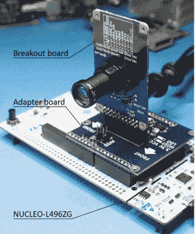

# 用廉价线阵 CCD 搭建的高速光谱仪

> 原文：<https://hackaday.com/2020/11/21/high-speed-spectrometer-built-with-cheap-linear-ccd/>

如果你曾经梦想建造一个合适的光谱仪，看起来 ESPROS epc901 CCD 传感器绝对值得你关注。它快速、灵敏、易于使用，而且价格仅为 24 美元，不会让你倾家荡产。只有一个问题:在您的项目中实现它意味着要么使用裸露的 2×16 0.5 mm 间距 BGA 器件，要么为开发套件支付近 1400 美元。

 谢天谢地，[阿德里安·斯图德]提出了一个折中方案。虽然你仍然需要回流 BGA 以将其安装，但他的[开放式硬件分线点和用于 ESPROS epc901](https://github.com/astuder/epc901) 的适配器板使传感器更容易使用。

这不仅仅是一个硬件解决方案，他还为基于 STM32L4 的 Nucleo 开发板提供固件代码和一些 Python 脚本，使从传感器中提取数据变得容易。固件甚至包括一个简单的命令行界面来控制你可以通过串行访问的硬件。

随着传感器的成功争论，[阿德里安]与[弗兰克·米尔伯恩]合作[围绕它建造一个负担得起的光谱仪](https://www.element14.com/community/community/project14/sensors/blog/2020/11/11/spectrography-using-the-epc901-high-speed-line-image-sensor)。该设计利用了一个 3D 打印室、一个简单的商业衍射光栅和一系列宽度从 0.5 到 0.0254 毫米的入口狭缝，这些狭缝被激光切割成一片不锈钢。

在休息后的视频中，您可以看到完成的光谱仪用于确定 led 的波长，以及高速相机模块如何能够研究 CFL 灯泡随时间的光谱变化的演示。[Adrian]告诉我们，他和[Frank]愿意接受关于他们下一步应该将新分光计指向哪里的建议，所以如果你有任何有趣的想法，请在评论中告诉他们。

[这些年来，我们已经看到了数量惊人的光谱仪](https://hackaday.com/2016/08/27/hacklet-122-spectrometers/)，其中一些最新的光谱仪在[方面真的突破了极限，即 DIY 科学家能够在家庭实验室中做什么](https://hackaday.com/2020/05/12/open-source-raman-spectrometer-is-cheaper-but-not-cheap/)。虽然它们仍然相当小众，但这些工具正缓慢但肯定地进入更多好奇的黑客手中。

 [https://www.youtube.com/embed/ugbBkjkdcSU?version=3&rel=1&showsearch=0&showinfo=1&iv_load_policy=1&fs=1&hl=en-US&autohide=2&wmode=transparent](https://www.youtube.com/embed/ugbBkjkdcSU?version=3&rel=1&showsearch=0&showinfo=1&iv_load_policy=1&fs=1&hl=en-US&autohide=2&wmode=transparent)

 [https://www.youtube.com/embed/jecNiJbrWtI?version=3&rel=1&showsearch=0&showinfo=1&iv_load_policy=1&fs=1&hl=en-US&autohide=2&wmode=transparent](https://www.youtube.com/embed/jecNiJbrWtI?version=3&rel=1&showsearch=0&showinfo=1&iv_load_policy=1&fs=1&hl=en-US&autohide=2&wmode=transparent)

