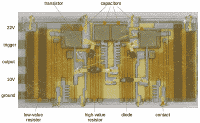

# 高科技镇纸展示了 60 年代的薄膜电子产品

> 原文：<https://hackaday.com/2021/07/12/high-tech-paperweight-shows-off-working-60s-era-thin-film-electronics/>

[Ken Shirriff]对 GE 在太空竞赛最激烈的时候创造的一个迷人的高科技镇纸的分析既有知识性又有趣。这种设备是为了展示通用电气的薄膜电子技术而设计的，虽然它本身就足够吸引人，但它还有一个附加功能:只要拿起镇纸，它就开始发出类似卫星的有节奏的嘟嘟声。它制作精良，在当时无疑是一件令人印象深刻的新奇作品。像往常一样，[肯]潜入到底是什么使它滴答作响，并分享了重要的历史。

 

带标签的薄膜模块，感谢【肯】的复古电子侦探工作。点击放大。

镇纸的透明区域是一个薄膜电路，伴随着一个早期卫星的模型。该模块实现了一个触发器，扁平导线将它连接到左侧隔间内的一些附加组件，其中包含一个电源和必要的部件，以便在拿起它时产生蜂鸣声。

薄膜电子通过在衬底上沉积材料来形成电阻和电容，从而减少了对单个元件的需求。由此产生的重量和空间节省可能是相当可观的，而且薄膜模块的特写看起来肯定像集成电路的前身。左侧隔间的内部包含倾斜开关、电池、充当小扬声器的老式耳机和连接到薄膜模块的一小块组件。该模块包含两个由单结晶体管(ujt)制成的振荡器；一个用来产生哔哔声，另一个用来控制每次哔哔声的持续时间。该设备的结构和整体设计很容易辨认，尽管一些部件现在已经过时。

如果你想更详细地了解这款设备的工作原理，包括电路图和历史背景，请务必点击第一个链接，并注意最后的注释和参考资料。另一件很清楚的事情是[嵌入透明塑料形状的功能电子设备](https://hackaday.com/2021/05/16/magic-pyramids-blink-eternal-with-the-power-of-the-sun/)永远不会过时。