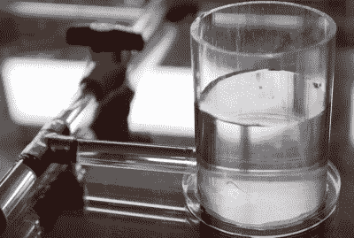

# 高压实验管道用水供电

> 原文：<https://hackaday.com/2020/05/15/high-voltage-experiment-pipes-power-with-water/>

用水来传递能量的想法并不新鲜。事实上，这是彻头彻尾的古老。自从人们对他们在亚历山大开放的新图书馆感到兴奋以来，自来水已经被用来为我们的发明提供动力。但是，如果有一种方法可以利用水提供动力，而不是依靠地球上最受欢迎的饮料的电特性，会怎么样呢？

这正是杰伊·鲍尔斯开始用他的最新实验来探索的。因为水(我们知道，不是*纯净的*水)导电，所以它可以作为传统铜线的替代品。你为什么想做这种事？因为与电线不同，水可以很容易地变形为任何需要的形状，并且可以移动和控制，没有比球阀更复杂的了。

 为了测试这个概念，【杰伊】用简单的丙烯酸管组装了一个配水系统。一个蓄水池被连接到他的一个高压发生器上，铜帽被放在管子的末端作为设备的直接连接点。

但由于电容耦合，他使用的荧光灯实际上不需要物理连接来点亮。正如休息后的视频所示，系统周围的灯可以通过打开和关闭各自的阀门来独立控制；没有任何身体接触。

当然，与传统布线相比，这种想法有很多缺点。铜线在冬天和春天不容易冻结泄漏，也不会产生爆炸性氢气泡。所以可以肯定地说，你家里的电线可能永远不会被一管带电的水所取代。但是[Jay]对于如何以非传统的方式使用这项技术确实有一些有趣的想法。例如，他描述了如何通过一条小溪辐射的能量为户外照明供电。

即使这项技术的实际应用有些有限，但毫无疑问，这是一个令人着迷的想法。他认为自己是第一个在这些特定环境下演示动力传递的人，因此决定将这个概念称为“鲍尔斯传递”。我们希望看到有人在他们的项目中使用这个原则，我们也愿意打赌[Jay]也会这样做。

正如他最近的臭氧杀菌实验一样，我们可以想象这个想法将会遇到一些争论。但这是重点。[Jay]并不声称拥有所有的答案，并希望这些视频能引起人们的思考和讨论。正如他们所说，没有热情就没有伟大的成就。

 [https://www.youtube.com/embed/C-C-Wjh2TxE?version=3&rel=1&showsearch=0&showinfo=1&iv_load_policy=1&fs=1&hl=en-US&autohide=2&wmode=transparent](https://www.youtube.com/embed/C-C-Wjh2TxE?version=3&rel=1&showsearch=0&showinfo=1&iv_load_policy=1&fs=1&hl=en-US&autohide=2&wmode=transparent)

