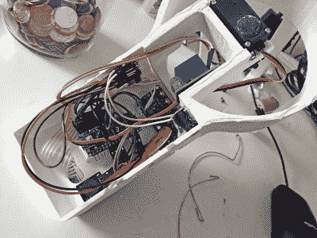

# 高电压保护低面额

> 原文：<https://hackaday.com/2019/09/06/high-voltage-protects-low-denominations/>

你如何让人们远离你的零钱罐？如果你没有说[带有 3D 打印虹膜机制和高压火花隙](https://hackaday.io/project/167302-arduino-coin-jar)，那么很明显你不是【Vije Miller】。这可能是最好的，因为我们不确定我们是否真的想生活在一个有这两样东西的世界里。

经常阅读 Hackaday 的读者会知道，[Vije]有一种利用机电欺骗的方式，给生活中最平凡的方面注入一点刺激，偶尔也带来一点危险。他的最新项目是一个自动零钱罐，它使用一个密码键盘来验证用户，而其他人则在 PIR 传感器检测到他们接近时获得火花间隙的业务端。

 休息后，你可以在视频中看到罐子的演示，他展示了罐子阻止…自己接近它的能力。嘿，没人说这是为了阻挡真正的 T4 入侵者。尽管我们确实认为类似的小工具可能是一种有趣的方式，可以让孩子们在晚餐前远离饼干罐，尽管我们强烈建议在部署它之前从项目中删除高压组件。

[Vije]能够将他在 Thingiverse 上找到的可打印虹膜设计应用于瓶口，并使用底座中的伺服系统旋转整个组件并将其打开。内部的 Arduino Nano 处理从 pinpad 读取的数据，控制步进器，当然，每当 PIR 传感器检测到有人试图变可爱时，就会启动火花发生器 1000 毫秒。仅仅是电弧的声音就足以让一些人重新考虑实际零钱的价值。

这个零钱罐的高压组件中使用的一些设计元素受到了[Vije]在制造他的等离子动力厕所空气清新剂时吸取的教训[的影响。有一句话我们打赌你今天绝对想不到会读到。](https://hackaday.com/2019/08/02/fail-of-the-week-toilets-and-high-voltage-do-not-mix/)

 [https://www.youtube.com/embed/q-mlmlAzbiM?version=3&rel=1&showsearch=0&showinfo=1&iv_load_policy=1&fs=1&hl=en-US&autohide=2&wmode=transparent](https://www.youtube.com/embed/q-mlmlAzbiM?version=3&rel=1&showsearch=0&showinfo=1&iv_load_policy=1&fs=1&hl=en-US&autohide=2&wmode=transparent)

