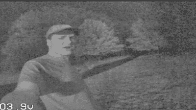

# 高灵敏度摄像机是一个很好的夜视范围

> 原文：<https://hackaday.com/2020/11/12/highly-sensitive-camera-makes-a-great-night-vision-scope/>

传统的军用级夜视装备的历史可以追溯到第二次世界大战，依靠光电倍增管来帮助士兵在黑暗中看东西。这种设备在几年间逐渐进入民用市场，然而其他更简单的技术也可以工作。[[Happy _ Mad _ Scientist]用一个非常灵敏的相机代替，快速制作了一个简单的夜视单筒望远镜。](https://www.instructables.com/DIY-Pocket-sized-Night-Vision-Monocular-Eagle-Scop/)

Due to the high noise, still photos don’t do it justice. The [video quality is highly impressive](https://www.youtube.com/watch?v=DmLigkW6FlA&feature=emb_title) for a system running with no IR illumination.

有问题的相机是 run cam Night Eagle 2(T1)，以其 0.00001 勒克斯的感光度而闻名。只有黑色和白色，它能够在没有外部照明的情况下在月光和星光下提供视觉。在这个项目中，它被连接到一个单片显示器上，设计用于无人机 FPV 设置。锂电池和充电电路连接起来，所有东西都塞在一个紧凑的 3D 打印的盒子里，最终的结果是一个便携式的口袋大小的夜视设备，价格不到 200 美元。

[Happy_Mad_Scientist]指出，在星光条件下，它比其他依靠红外照明在黑暗中看东西的夜间气枪玩家更有优势。我们可以想象，在没有环境光的时候，尤其是在室内，它与明亮的红外头灯配合使用会表现得很好。

如果你的品味更符合军用规格，那么[考虑一下拆卸高端挪威设备](https://hackaday.com/2020/04/08/teardown-of-oddball-night-vision-shows-off-retro-futuristic-vibe/)。休息后的视频。

 [https://www.youtube.com/embed/DmLigkW6FlA?version=3&rel=1&showsearch=0&showinfo=1&iv_load_policy=1&fs=1&hl=en-US&autohide=2&wmode=transparent](https://www.youtube.com/embed/DmLigkW6FlA?version=3&rel=1&showsearch=0&showinfo=1&iv_load_policy=1&fs=1&hl=en-US&autohide=2&wmode=transparent)

