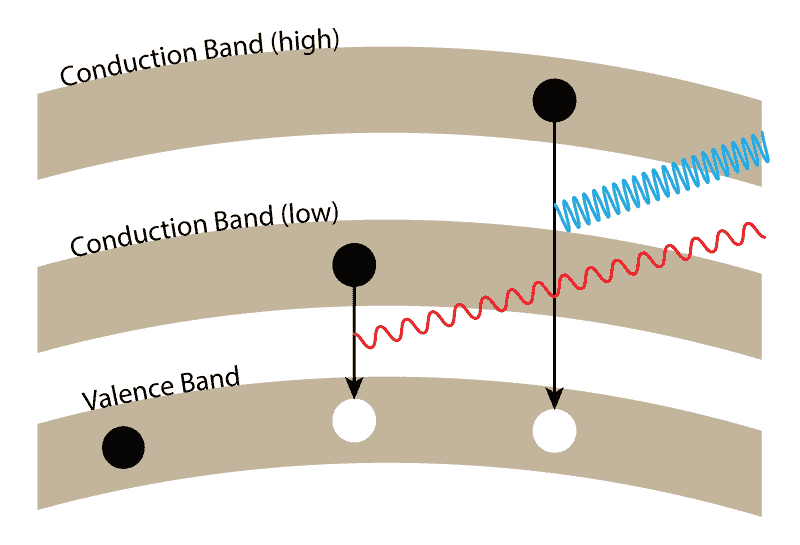
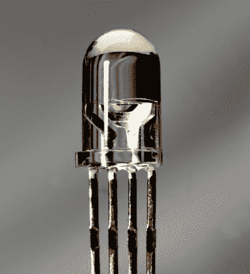
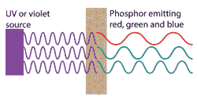
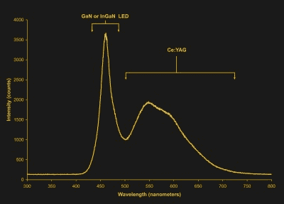

# 白光 led 的历史

> 原文：<https://hackaday.com/2018/10/29/history-of-white-leds/>

与白炽灯泡相比，led 每瓦特输入功率产生的流明要多得多——它们的发光效率更高。当然，这意味着白炽灯泡在产生热量方面更有效率，随着白天变短，夜晚变冷，在某个地方，一些跳跃到 LED 照明的人有一个加班加点的炉子。有人可能会想知道我们是如何来到这里的:一个由深奥的无机半导体照亮磷光体的世界。

二极管在特定条件下发光的事实已经为人所知 100 多年了；第一个发光二极管是 1907 年在马可尼实验室的猫须探测器中发现的，这是第一种二极管。这一发现只是一个科学上的好奇，直到德州仪器的另一项发现揭示了从砷化镓衬底构建的隧道二极管发出的红外光。这种红外 LED 随后被 TI 申请了专利，一个项目开始制造这些红外发光二极管。

但是红外光是肉眼看不见的，对任何指示或照明都没有用。1962 年，通用电气公司制造了第一个可见光谱 LED，1968 年，孟山都公司生产了第一个商用(红色)LED。那一年，惠普开始生产 led，使用孟山都公司使用的砷化镓磷酸盐。这些惠普 LED 出现在 20 世纪 70 年代惠普计算器中使用的非常小的七段 LED 显示屏上。

从 20 世纪 60 年代早期的红外 led 到 20 世纪 60 年代晚期的红色 led，20 世纪 70 年代出现了橙红色、橙色、黄色以及最后的绿色 led。这些发展有一个趋势，它与电子能隙有关。要使二极管发光，你必须先把能量注入电子。这种能量使电子从价带的自然状态跳到导带。这种能量不足以将电子保持在导带中，所以它最终会落回到它留在价带中的空穴中。在这样做的时候，它以光子的形式再次释放能量。

将电子移动到导带所需的能量越多，以光子形式释放出来的能量就越多，以更高频率的光的形式。红外 LED 出现在红色 LED 之前，绿色 LED 出现在红色 LED 之后的原因是，很难爬上这些带隙，找到能够发射更高频率光的 LED 基板。

红外、红色甚至绿色 led 都很“简单”，但蓝色 led 需要更大的带隙，因此需要更多的奇异材料。1994 年，Nichia 公司使用铟镓氮化物首次破解了制造高亮度蓝色 LED 背后的难题。与此同时，赤崎勇和名古屋大学的天野浩史开发了一种用于 led 的氮化镓衬底，他们因此获得了 2014 年诺贝尔物理学奖。对于红色、绿色和蓝色 LED，阻止任何人制造白色 LED 的唯一方法是将所有这些颜色放在同一个封装中。

### 红色、绿色，但主要是蓝色发光二极管

An RGB LED. By mixing the red, green, and blue colors, this LED can emit white light

第一个白光 led 并不是明确的白色 led。相反，红色、绿色和蓝色 LED 封装在一个 LED 外壳中。然而，如果你混合红色、绿色和蓝色的光，你会得到白光，这实际上只是得到不同颜色光子的正确比例的问题。

这仍然是 RGB LEDs 的标准，有些人甚至已经尝试改善这些 led 可以产生的颜色范围。人眼对绿色频率的光极其敏感，通过在封装中添加第四个 led——最好称为“祖母绿”,或比我们习惯的绿色 LED 稍微更蓝的绿色——你可以制作更宽颜色范围的 LED，或者如果你喜欢，更白的白色。

这是开发白色 LED 的第一种方法，虽然你在五金店买到的 LED 灯泡内部没有单独的红色、绿色和蓝色 LED，但这仍然是一种非常受欢迎的用 LED 创造更多颜色的方法。这些新像素，WS2812s 或 APA101s，都有红色，绿色和蓝色的 led 塞在一个外壳内。一些更先进的可单独寻址的 RGB LEDs 甚至增加了第四个 LED，用于白光。但是这些单个的白光 led 是如何制造的呢？

Full conversion white LED

第一个白色发光二极管，没有三个单独的发光二极管，是用荧光粉的魔力制成的。磷光体是一门众所周知的科学，最常见于荧光灯泡的照明应用中。荧光灯泡本身不会产生白光，它们通过激发汞蒸汽产生紫外光。然而，通过在荧光灯泡的内部涂上一层粉末，这种紫外线可以被转换成红色、绿色和蓝色的光。结果是一个荧光灯泡照亮了你的车库或车间。

这也可以用 led 来实现。将紫外或紫色 LED 封装在涂有荧光粉的外壳中，就可以制成白色 LED。这就是所谓的全转换白光 LED。

Image by【deglr 6328】，via [Wikipedia](https://commons.wikimedia.org/wiki/File:White_LED.png)

然而全转换 LED 的效率很低，所以到了 90 年代中期才出现了制造部分转换 LED 的竞赛。这种类型的 LED 会用蓝光照射磷光体，磷光体会将一部分蓝光转换成包含红色和绿色波长混合的黄色光。向混合物中添加更多的红色荧光粉会产生“暖白色”led。

1996 年，日亚公司宣布生产白光 led，剩下的就是历史了。在过去的二十年里，这些 led 的功率、效率和亮度都有所提高。现在，或者在不久的将来，家庭照明的默认选择将不会是白炽灯泡，而是大功率的发光二极管，其消耗的能量仅为老式爱迪生灯泡的一小部分，将更多保持房屋温暖的任务转移到加热器上。