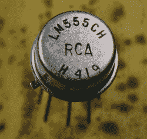
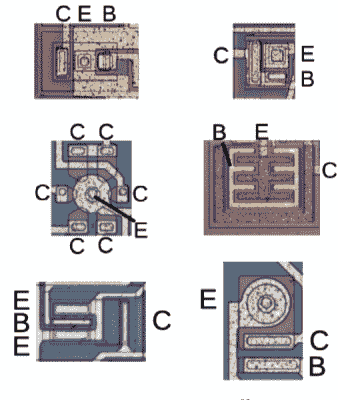

# Ken Shirriff 解释了他的逆向工程硅技术

> 原文：<https://hackaday.com/2018/12/05/hold-for-publishing-plan-ken-shirriff-explains-his-techniques-for-reverse-engineering-silicon/>

说到逆向工程硅，没有比肯·希尔里夫更好的人选了。他是解读多晶硅和金属层含义的专家。他对无处不在的 555 定时器进行了逆向工程，他研究了老派音频芯片的内部，[他在他的运算放大器](https://hackaday.com/2018/06/27/ken-shirriff-found-butterflies-in-his-op-amp/)中发现了蝴蝶。那里有一堆乱七八糟的微小电线和硅层，肯就在那里，准备拆卸。

在今年 Hackaday 超级会议的演讲中，Ken 向大家介绍了逆向工程硅的技术。令人惊讶的是，这并没有听起来那么难。是的，你仍然需要滴酸来接触 IC 的内部(当然，你总是可以找到一个卡在金属罐里的 555，但你不能说是“滴酸”)，但即使是这个星球上最复杂的设备也仍然是由几个基本组件组成的。你有 n 掺杂硅，p 掺杂硅，和一些金属。就是这样，如果你像 Ken 一样知道自己在寻找什么，你就拥有了弄清楚这些集成电路是如何制造的所有工具。

 [https://www.youtube.com/embed/TKi1xX7KKOI?version=3&rel=1&showsearch=0&showinfo=1&iv_load_policy=1&fs=1&hl=en-US&autohide=2&wmode=transparent](https://www.youtube.com/embed/TKi1xX7KKOI?version=3&rel=1&showsearch=0&showinfo=1&iv_load_policy=1&fs=1&hl=en-US&autohide=2&wmode=transparent)

A metal can 555, the easiest chip to decapsulate

当给芯片解封时，你可能会问的第一个问题是如何将硅从芯片中取出。对于一些 555 定时器来说，这很容易。事实上，你仍然可以买到 555 装在 TO-99 金属盒里，用珠宝商的锯子、锯子，甚至 dremel，金属盒会马上脱落，露出里面多汁的硅牛轧糖。

对于其他芯片，你需要做更多的工作。在移除大部分材料后，Ken 使用一种名为 Armor Etch 的产品来移除一些二氧化硅。盔甲蚀刻显然来自工艺品商店，用于在玻璃器皿上蚀刻鸟类轮廓或“现场欢笑爱情”字样。要去除金属层，就几滴盐酸的事。当然，Ken 的演讲只是对解封装的一个调查，最好的信息来自 John McMaster 的 wiki。芯片被解封后，它被安装在一个装有 XY 载物台和网络摄像头的金相显微镜上，这是肯花了几百美元从易贝那里买来的。

Different configurations of transistors in layers of silicon and metal

但是一旦你把芯片放在示波器下，你怎么逆向工程电路。只有少数几个部分——晶体管、电阻和电容——进入硅层，但即使是晶体管，也可能因工艺或制造商不同而大相径庭。幸运的是，肯已经做了一段时间了，他对这些东西的样子很有眼光。

晶体管看起来像圆形、方形或其他有趣的几何图案。然而，电阻器通常只是金属层下面的长长的硅线。将所有这些联系在一起，你可以开始看到模式的出现。如果你发现两个晶体管的基极连接到对方的集电极，你很可能得到一个触发器。如果你看到晶体管的行和列，你可能有某种数据准备解码。

毫不夸张地说，肯·希尔瑞夫是他所做的最好的人之一。他致力于让每个人都能理解半导体设备的内部结构，这表明:每次 Ken [在他的博客](http://www.righto.com/)上发布他的最新发现，它都会很快被推上黑客新闻的首位，并在 Twitter 的酷部分传播。这个演讲很好地展示了 Ken 用来理解这些芯片镜头的技术，是每个对现代半导体器件有一点兴趣的人必看的。