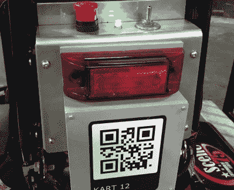

# HoloLens 将视频游戏卡丁车赛带入生活

> 原文：<https://hackaday.com/2020/01/03/hololens-brings-video-game-kart-racing-to-life/>

在现实世界中，我们很难重现大量的电子游戏体验。你会很快发现，在现实世界中跳到蘑菇上并不像在*超级马里奥*中那样有吸引力，我们甚至不会去尝试在你当地的多车道上重现*青蛙过河*的危险。但是电子游戏风格的卡丁车比赛？我们拥有实现这一目标的所有技术，只需要有人将所有的部分组合在一起。

这正是[【伊恩·查纳斯】在他的最新项目](https://hackaday.io/project/169267-real-life-mario-kart)中试图做的事情。使用微软的 HoloLens 增强现实耳机、电动卡丁车、433 MHz 无线收发器和一些 Arduinos，他创造了最接近*马里奥赛车*的东西，美国有血有肉的凡人可能很快就会体验到。

 每位车手佩戴的全息镜片耳机覆盖了必要的图形元素，比如皮卡和武器效果，同时也让其他车手拥有了超一流的卡通头像。但当然，这只是故事的一半。如果它们对实际比赛没有任何影响，看到这些皮卡和小玩意对你没有任何好处。

为此，[Ian]想出了一种方法，通过安装在每辆卡丁车上的电子“背包”来控制卡丁车的性能。因此，加速皮卡实际上使卡丁车跑得更快，如果一名司机被射向他们的武器击中，他们就会减速。

反正就是高配版。显然幕后有很多事情在进行，其中一些在 Hackaday.io 页面上有详细介绍。有趣的一点是，HoloLens 需要视觉标记来确定自己的方向，在休息后的视频中，可以看到黑白海报点缀在轨道旁边的墙上。随着项目的进展，[Ian]希望这些可以以创造性的方式伪装起来(例如看起来像观众或方格旗)，使整体体验更加身临其境。

根据[Ian]的说法，下一步是找到愿意帮助将这个一次性项目提升到你可能在游乐园实际看到的东西的合作伙伴。我们祝他好运，如果没有别的原因，仅仅是因为我们真的想自己玩这个游戏。与此同时，[我们将不得不满足于赛车黑客动力轮](https://hackaday.com/2015/09/06/better-racing-with-power-wheels/)。

 [https://www.youtube.com/embed/X5yNTfBnubI?version=3&rel=1&showsearch=0&showinfo=1&iv_load_policy=1&fs=1&hl=en-US&autohide=2&wmode=transparent](https://www.youtube.com/embed/X5yNTfBnubI?version=3&rel=1&showsearch=0&showinfo=1&iv_load_policy=1&fs=1&hl=en-US&autohide=2&wmode=transparent)

