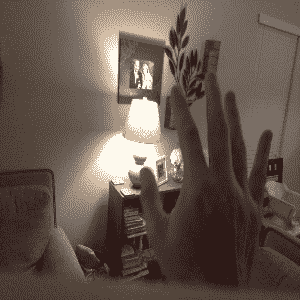

# 使用人工智能眼镜的家庭自动化一目了然

> 原文：<https://hackaday.com/2019/08/15/home-automation-at-a-glance-using-ai-glasses/>

曾经有一段时间，你不得不从沙发上站起来换电视频道。但是后来有了遥控器，让我们不用动腿了。后来，我们从亚马逊和谷歌等公司获得了电子助手，让我们只需通过声音就能控制家用电器，所以现在我们甚至不用拿起遥控器。引领消费者凝胶化的下一个时代，[Nick Bild]创造了 [ShAIdes:一副人工智能眼镜，允许你通过看着它们来控制设备](https://github.com/nickbild/shaides)。

 当然，更严肃地说，基于视觉的家庭自动化对于那些行动不便的人来说可能是一项非常有益的辅助技术。只要看着你想要控制的设备并向它的方向挥手，系统就知道要激活哪个设备。在休息后的视频中，你可以看到[尼克]轻松地控制灯具和他的扬声器，看起来几乎像魔术一样；任何足够先进的技术的定义特征。

那么它是如何工作的呢？安装在太阳镜上的 Raspberry Pi 摄像头模块可以捕捉视频，并将其发送到 NVIDIA Jetson Nano。这里，两个独立的图像分类卷积神经网络(CNN)模型被用于识别可以在背景中控制的对象和前景中的手势。当两者都匹配时，系统可以发出适当的信号来打开或关闭设备。在 Nano、相机和电池组之间，使其全部可移动，[Nick]说硬件成本大约为 150 美元。

但实际上，硬件只是这样一个项目中的一小部分。这就是为什么我们很高兴看到[Nick]如此详细地讲述软件如何运行，以及最重要的是，他是如何训练这个系统的。仅手势识别子例程就处理了近 20000 张图像，因此它可以可靠地检测到伸入画面的手臂。

如果用一瞥和一挥手来控制你的家还不够神秘的话，你总是可以[添加一根红外棒来获得真实的*哈利波特*体验](https://hackaday.com/2019/04/09/making-a-birthday-party-magical-with-smart-wands/)。

 [https://www.youtube.com/embed/7UYi-exvHr0?version=3&rel=1&showsearch=0&showinfo=1&iv_load_policy=1&fs=1&hl=en-US&autohide=2&wmode=transparent](https://www.youtube.com/embed/7UYi-exvHr0?version=3&rel=1&showsearch=0&showinfo=1&iv_load_policy=1&fs=1&hl=en-US&autohide=2&wmode=transparent)

感谢*我们得到的许多*提示。