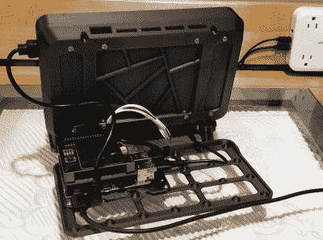

# 赛博朋克风格的家庭自动化终端

> 原文：<https://hackaday.com/2021/09/22/home-automation-terminal-with-cyberpunk-style/>

由杰夫·埃伯尔设计的 OLKB 终端没有电池，不能折叠(即使它看起来可以折叠)，只有在你可以拿起它并把它移动到其他地方的意义上，它才是便携的。因此，可以说它本身并不是一个真正的网络平台，但它看起来确实是一部分。如果你需要在一个灯光昏暗的黑客巢穴中疯狂地输入代码，这应该很适合你。

[Jeff]已经提供了你自己重新创建这个光滑的小机器所需的一切，尽管他警告说，一些硬件决策只是基于他当时手头的东西，可能存在更好或更便宜的选择。例如，如果你不想使用 Raspberry Pi 4，你可以很容易地把它换成其他单板计算机。虽然如果你想改变一些更好的集成，如液晶面板，它可能需要修改 3D 打印组件。

The rear electronics tray offers plenty of room for expansion.

[Jeff]用于 OLKB 终端的超薄机械键盘，在某种程度上为整个设计定下了基调，实际上是一个与[Victor Lucachi] 完全分开的[开源项目。VOID30 是一款 3D 打印的 30%手工线型键盘，在 Arduino Pro Micro 上运行流行的 QMK 固件。他实现了一些调整，即使用配备 USB-C 的 Arduino 克隆，但在其他方面与 upstream 相同。所以，如果你不打算买一个床边的赛博朋克终端，但喜欢它光滑的键盘，你很幸运。](https://github.com/victorlucachi/void30)

在软件方面，[Jeff]将 OLKB 终端接入了他更大的家庭助理系统。这为他提供了整个网络的吸引人的状态显示，并且只需在终端的 7 英寸触摸屏上轻轻一点，他就能够直接控制家中的设备。也就是说，在一天结束时，它只是一个树莓派，所以它真的可以运行你想要的任何东西。

虽然 cyberdeck 构建可能现在非常流行，但我们确实欣赏那些将相同的设计原则带到桌面上的项目。从[奥利奥尔·费雷尔·梅西亚]华丽的[仿复古设计](https://hackaday.com/2021/01/11/retro-terminals-bring-some-style-to-your-desktop/)到[现代化的老式硬件](https://hackaday.com/2018/12/05/1970s-lab-equipment-turned-retro-pi-terminal/)，*真正可以轻松升级和维修的*个人电脑不必局限于[那种你可以用吉他背带随身携带的东西](https://hackaday.com/2020/12/05/arm-and-x86-team-up-in-no-compromise-cyberdeck/)。