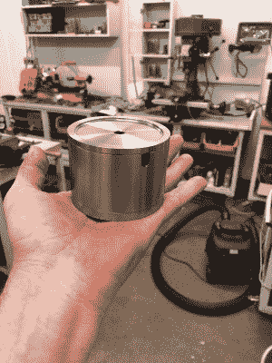

# 国产扫描电子显微镜显示出一些潜力

> 原文：<https://hackaday.com/2022/03/21/home-made-scanning-electron-microscope-show-some-potential/>

扫描电子显微镜是我们大多数人并不总是真正需要的小众仪器之一，但仍然喜欢偶尔使用。虽然我们之前报道过一些自制的尝试，但是很多都失败了，除了 Hackday 上的这个项目。IO 由用户 *Vini 的实验室，*似乎仍在积极开发中。SEM 的原理非常简单；用聚焦的电子束轰击一个特别准备的样品，电子束以光栅模式被操纵。使用多种技术中的一种来获取信号，例如二次电子(SE)背散射电子(BSE)或简单地进入样品的透射电流。然后，该信号可用于形成样本的图像或收集其他属性。

Condenser assembly

该项目显然处于早期阶段，正如作者所说，这是一个非常昂贵的建设，但已经有一些机械零件准备组装。聚光器消像散器的驱动电子设备的工作已经开始。该仪器的这一部分采用快速发散的原始电子束的中心部分，使其通过阳极，并使用几组八极线圈组和一两个孔径，仅选择束的中心部分，以及校正束中的任何散光。通过调整通过每个线圈的相对电流，产生了四极磁场，抵消了射束的不对称性。

扫描控制和信号采集由单个专用卡处理，该卡利用 Raspberry Pi Pico 模块的 PIO 功能。Pico 可以驱动扫描操作，并通过外部 FTDI USB3.0 设备将四个同步通道采集的样本数据发送回主机。在卡上使用 PCIe 连接器和配对边缘连接器，提供了一种可靠且经济高效的物理连接。从项目页面可以看出，很多机械设计已经完成，加工已经开始，所以这是一个在未来几个月，甚至可能几年都要关注的项目！

我们已经见过一些 SEM 黑客，这里有一个来自[本·克拉斯诺] 和[的由 teensy 驱动的 SEM 黑客，这里有另一个尝试](https://hackaday.com/2016/12/02/nascent-project-open-source-scanning-electron-microscope/)。对于这样一个概念简单的设备，具有如此巨大的用途，没有更多这样的项目似乎有点疏忽。